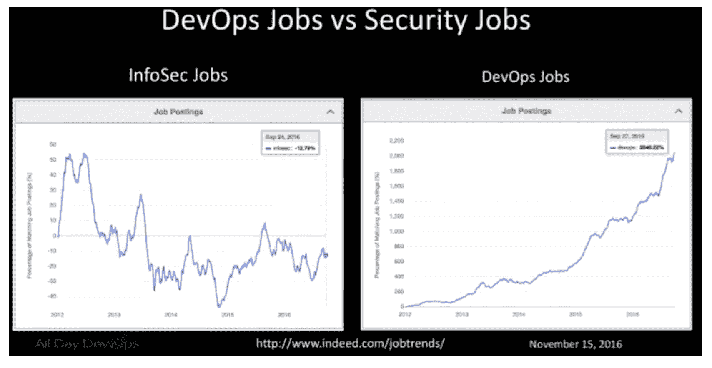
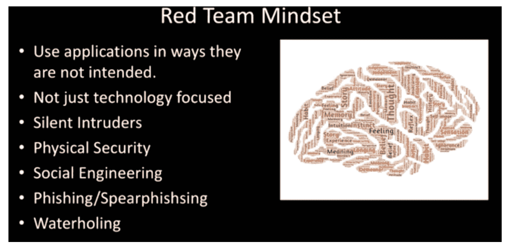
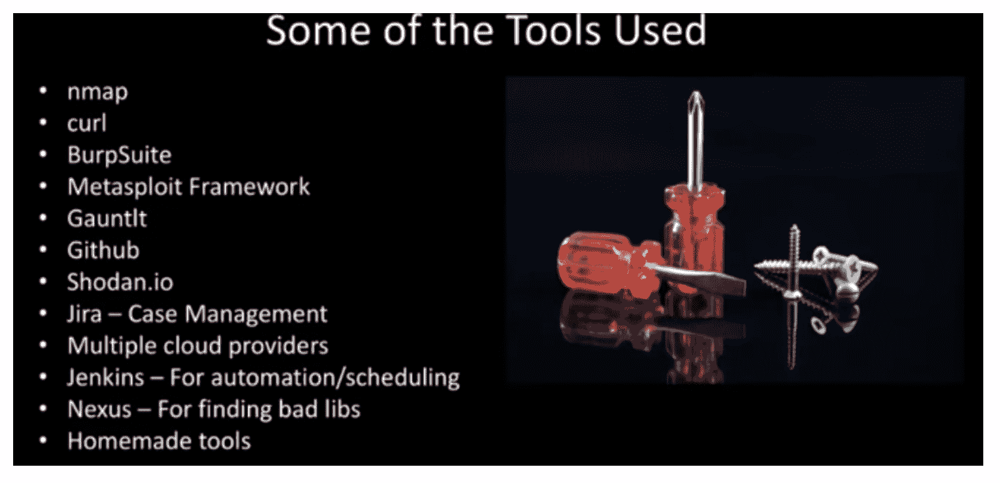

# 从准将 64 到德夫塞科普斯

> 原文：<https://devops.com/security-commodore-64-devsecops/>

我们都知道这个故事:一个农场，一个孩子，一个 Commodore 64，和一个最大速度为 300bps 的调制解调器。几个意想不到的电话账单之后，年轻的 Ian Allison 正在研究如何利用这个系统，这样他就可以继续使用他新发现的通往科技世界的大门。据 Ian 说，那是他开始为他的计算机安全职业生涯建立技能基础的地方。

在最近的[全天 devos](http://www.alldaydevops.com/)会议*，* Ian ( [@iallison](https://twitter.com/iallison) )，现在在 Intuit，讲述了他作为“那个”安全家伙的历史。你知道，有人认为开发人员不关心安全性或截止日期，真的，只是简单的“愚蠢”但是，别担心，他现在开悟了，意识到我们都有相同的目标:每个人都想建立一个安全的系统。

Ian 意识到“安全不了解开发人员或运营人员是如何工作的。安全解决了安全问题，但这让其他人各得其所。”当他的职业道路将他引向一个叫做 DevSecOps 的地方时，他开始了他的启蒙；也就是说，在 DevOps 中，安全性扮演着更重要的角色。

Ian 指出，传统的信息安全依赖于合规性、法规、设备和边界(垃圾)。然后，他意识到他自己和他的同行的观点的自私性:补救是留给开发人员的，他们得到的反馈是 200 页的扫描报告，它只解决安全性和合规性的问题。它不能帮助开发人员达到他们共享的安全系统的目标。

DevOps 为安全部门创造了更好地了解我们的基础架构、运营和开发工作的机会。DevOps 不仅快速、精简和高效，而且如果做得好，它还具有协作性和同理心。将速度与协作和同理心结合起来，DevSecOps 就能开花结果。

伊恩面对的现实是:扫描器找到的是绝对的最低值；糟糕的默认配置甚至对 SaaS 供应商来说也是一个大问题；手工测试可以发现隐藏了多年的缺陷；攻击者更有技巧和动机。

你如何实现它，并使它变得更好？

*   允许开发团队承担他们决策的风险。
*   不再有安全例外或签署。
*   安全是每个人的责任。
*   像攻击者一样测试你自己的东西。

在 Intuit，Ian 希望在开发、运营和安全团队之间建立更强有力的桥梁。为此，他成立了一个[红队](https://en.wikipedia.org/wiki/Red_team)来:

*   使用与攻击者相同的策略。
*   唯一的范围是“不要停止生产”
*   需要像攻击者一样适应和进化。
*   证明风险确实存在。
*   应该是写自己的功勋。
*   应该有正在进行的模拟攻击者的活动。

红队从小而精开始，专注于云计算。它像一个敏捷的 DevOps 团队一样工作，使用一些工具手动工作。最终，该团队发现、报告并修复了数千个扫描器没有发现的漏洞。

Ian 在他的[全天 DevOps 会议环节](https://youtu.be/YJ9F9SDfik0)(仅 30 分钟)中讲述了更多细节和经验教训。来自[全天 DevOps 会议](http://www.alldaydevops.com/)的其他 56 个演示文稿也可以在网上免费下载[点击这里](http://www.sonatype.com/all-day-devops-on-demand?__hstc=31049440.fff56b041308a66b74cf93c40ea2030a.1456347809383.1485535294436.1485539851201.581&__hssc=31049440.3.1485539851201&__hsfp=1394008546)。

本博客系列回顾了 11 月举办的全天 DevOps 会议，该会议共有 13，500 多名注册与会者。上周我讨论了，“[用 Ansible](http://blog.sonatype.com/system-hardening-with-ansible) *进行系统加固。”*下周，看看我对 Erlend Oftedal 的一次精彩会议的评论:“没有服务器:不变的基础设施和无服务器架构*”*

— [德里克·威克斯](https://devops.com/author/derek-e-weeks/)