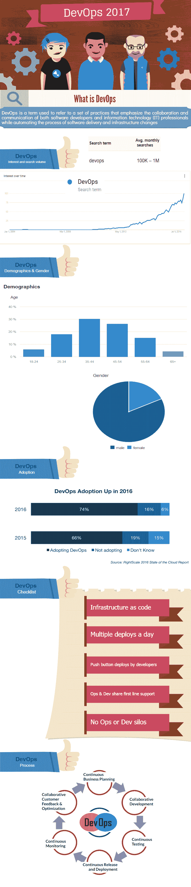

# 2017 年 DevOps 采用情况和趋势

> 原文：<https://devops.com/state-devops-adoption-trends-2017/>

DevOps 已经走过了一段漫长的路，我们看到近几年的采用率有了巨大的增长。为了超越你的竞争对手并在增长曲线中领先，它已经成为软件驱动的组织的一个基本要素。DevOps 已经占据了软件开发领域的中心位置，没有离开的迹象。

下面是 DevOps 的信息图，以及我们今年在 DevOps 中看到的一些趋势:

**来源:**

[http://www . right scale . com/blog/cloud-industry-insights/new-devo PS-trends-2016-state-cloud-survey](http://www.rightscale.com/blog/cloud-industry-insights/new-devops-trends-2016-state-cloud-survey)

[https://www.storybase.com](https://www.storybase.com)

[slideshare.net](http://pt.slideshare.net/johnpviner/devops-be-careful-what-you-wish-for)

[https://en.wikipedia.org/wiki/DevOps](https://en.wikipedia.org/wiki/DevOps)

[Google.com](https://www.google.com)

## 7 DevOps 趋势

1.  DevOps 将成为主流，并获得大量关注；因此，2017 年将是“开发年”
2.  与 DevOps 一起，三个 C——持续集成、持续部署和持续交付——将获得巨大的动力。
3.  将发布许多新的 DevOps 自动化工具，改变我们进行软件开发的方式。
4.  “集装箱化”也将成为焦点。
5.  许多软件公司将转向微服务架构。
6.  自动化和持续测试将变得更加流行——也更加重要。
7.  包括 Docker、AWS、GitHub 和 JIRA 在内的必备工具和平台将在开发者专区变得更加流行。

## 要知道的名字

以下是您需要关注的顶级 DevOps 专家的姓名:

<colgroup><col width="149"><col width="218"><col width="250"><col width="94"><col width="375"></colgroup>
| **名称** | **推特简介** | **他/她是谁** | **Klout 得分** | **网站** |
| 帕特里克·德博伊斯 | [https://twitter.com/patrickdebois](https://twitter.com/patrickdebois) | 以#devops 心态弥合创意与技术之间的鸿沟；永恒的研究者和务实的执行者；cto @ townheroes 开始于@devopsdays | Fifty | [http://www.jedi.be/blog/](http://www.jedi.be/blog/) |
| 阿维·卡瓦莱 | [https://twitter.com/avinci](https://twitter.com/avinci) | 首席执行官@ beshippable，野生动物摄影师，苏格兰爱好者 | Fifty | [https://app.shippable.com/](https://app.shippable.com/) |
| 克里斯·布伊塔尔特 | [https://twitter.com/krisbuytaert](https://twitter.com/krisbuytaert) | 一切都是怪异的#Devops 需要寿司问题，开源，基础设施作为代码，顾问，演讲者，作者，#devopsdays，#cfgmgmtcamp 的组织者 | Fifty-three | [https://about.me/krisbuytaert](https://about.me/krisbuytaert) |
| 吉恩·金 | [https://twitter.com/realgenekim](https://twitter.com/realgenekim) | DevOps 爱好者，Phoenix 项目合著者，Tripwire 创始人，Visible Ops 合著者，IT 运营/安全研究员，约束理论 Jonah，狂热的 UX 粉丝 | Sixty-four | [http://www.realgenekim.me/](http://www.realgenekim.me/) |
| Jez Humble | [https://twitter.com/jezhumble](https://twitter.com/jezhumble) | 《持续交付，精益企业，DevOps 手册》的合著者；首席技术官 devops-research.com，伯克利大学讲师。PGP:https://keybase.io/jezhumble | Sixty-three | [https://continuousdelivery.com/](https://continuousdelivery.com/) |
| 加雷斯·拉什格罗夫 | [https://twitter.com/garethr](https://twitter.com/garethr) | 软件开发人员，偶尔的系统管理员，通用网络，编程和技术极客和 Devops 周刊的馆长。@puppetize 的工程师。@gdsteam 校友 | fifty-six | [https://www.morethanseven.net/](https://www.morethanseven.net/) |
| 丹尼斯·杜比 | [https://twitter.com/ddubie](https://twitter.com/ddubie) | 战略内容创建者@CAInc，专注于应用经济、开发运维、移动性、ITSec 的编辑/作者/技术人员。和管理。，云；前网络世界/IDG 科技记者。 | Fifty | [https://www.ca.com/us/rewrite.html](https://www.ca.com/us/rewrite.html) |
| 桑吉夫·夏尔马 | [https://twitter.com/sd_architect](https://twitter.com/sd_architect) | # devo PS # Agile # Cloud # tech sales # CTO # Architect # Author-# DevOpsForDummies # Blogger # Inventor # distinguished engineer。 | fifty-two | [https://sdarchitect.blog/](https://sdarchitect.blog/) |
| Donnie Berkholz | [https://twitter.com/dberkholz](https://twitter.com/dberkholz) | 开发与 IT 运营研究总监@451Research。生物物理博士。开源 OG。新兴技术、精酿啤酒和零世界问题 | Fifty-nine | [https://451 research . com/analyst-team/analyst/Donnie+Berk holz](https://451research.com/analyst-team/analyst/Donnie+Berkholz) |
| 纳森·哈维 | [https://twitter.com/nathenharvey](https://twitter.com/nathenharvey) | 厨师社区发展副总裁 | Fifty-seven | [http://nathenharvey.com/](http://nathenharvey.com/) |
| 达蒙·爱德华兹 | [https://twitter.com/damonedwards](https://twitter.com/damonedwards) | 开发运维、IT 运营和改善企业运营方式是我的专长。我在甲板上工作。 | forty-nine | [https://www.rundeck.com/](https://www.rundeck.com/) |

我们希望 DevOps 在 2017 年成为摇滚明星，继续统治软件行业。

— [可团队运输](https://devops.com/author/teamshippable/)