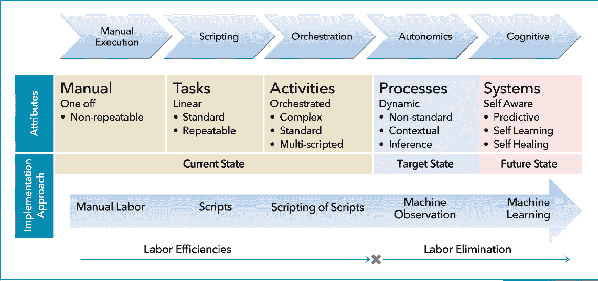
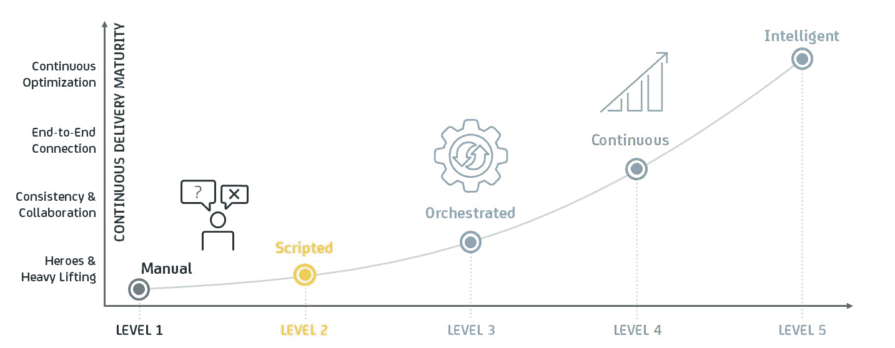
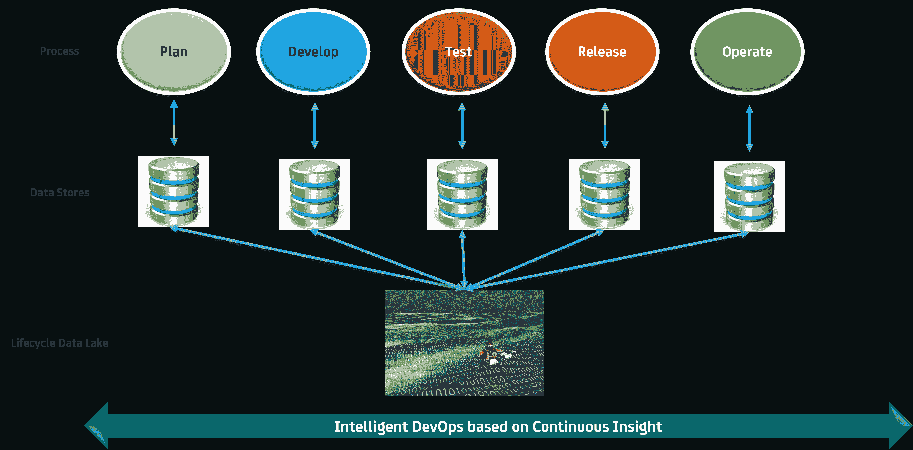

# 面向新时代数字系统的智能开发工具

> 原文：<https://devops.com/intelligent-devops-digital-systems/>

***利用分析和自治的力量实现开发运维转型***

在之前的[博客](https://www.linkedin.com/pulse/intelligent-quality-transforming-digital-assurance-using-shamim-ahmed?trk=mp-author-card)中，我写了质量保证如何利用大数据分析和自治的力量转变为[质量智能](https://www.linkedin.com/pulse/intelligent-quality-transforming-digital-assurance-using-shamim-ahmed?trk=mp-author-card)。

在这篇博客中，我们将讨论未来的 DevOps 解决方案如何通过利用这些新兴的数字技术(如自治和分析)变得更加智能。

预测分析、自主计算(autonomics)、人工智能和机器人流程自动化(RPA)等技术已经在许多其他业务中推动了前所未有的自动化水平。这三项技术相结合，正在推动下一代自动化，也就是通常所说的“智能自动化”

智能自动化超越了手动任务的基本自动化和编排，纳入了自适应自学，从而实现了完全自主的系统。下图(承蒙 [IRPA](http://www.irpanetwork.com/) )展示了自动化向完全自治发展的过程。[谷歌汽车](https://www.google.com/selfdrivingcar/)(和其他类似的解决方案)是智能自动化系统的一个很好的例子，它能够从环境中学习并相应地调整行为。

## **传统 DevOps 中的自动化**

数字系统由新时代技术驱动，如社交、移动、大数据、分析、云、物联网(IoT)、人工智能、增强和虚拟现实、基因组学等。这些技术给现代系统的构建和部署带来了巨大的变化和复杂性。利用这些技术将自己转变为认知企业的企业需要新的、智能的底层流程和技术方法来支持它们。这样的过程和技术不仅仅需要敏捷；他们需要适应并能够对频繁变化的环境做出动态反应。

让我们看看当前 DevOps 技术的一些例子，以及它们需要如何发展以支持动态数字系统。传统开发运维解决方案中的自动化通常仅限于脚本和流程编排，如上所示。由于从复杂性到技能和组织挑战的各种原因，自动化的采用水平各不相同。这种脚本的维护本身有时就是一个瓶颈，因为应用程序和环境变化很快，脚本需要手动更新，并且经常会过时。相比之下，新时代的敏捷数字企业需要能够动态适应和按需自我修复的自动化。

此外，经典的 DevOps 自动化技术通常由静态的预定义规则驱动。例如，通过管道的不同阶段提升应用构建的标准通常是静态定义的。这是对新时代系统的限制，在新时代系统中，标准需要是动态的，并且可能根据多种情况而变化。自动化系统需要能够查看过去的数据，不断从当前数据中学习，并对正确的行动过程做出*适应性智能预测*。

面向[物联网](https://en.wikipedia.org/wiki/Internet_of_Things) (IoT)系统的 DevOps 与面向传统软件系统的 devo PS 有很大不同。消费物联网中生产部署的目标环境地理位置分散，通常不受配置控制，可能具有不可靠的网络连接，甚至可能很脆弱。此外，物联网系统会产生大量数据，这需要强大的数据挖掘和自学习(自适应)技术，而传统的生命周期自动化工具无法提供这些技术。

同样，[客户体验(CX)](https://en.wikipedia.org/wiki/Customer_experience) 是数字系统的一个关键新指标，超越了传统的 DevOps 指标，如发布速度和质量。CX 数据是非结构化的、模糊的、海量的和易变的。CX 驱动的 DevOps(或 CX-Ops)是一个新兴学科，它需要大数据分析和认知方法(如[自然语言处理](https://en.wikipedia.org/wiki/Natural_language_processing)或 NLP)来从这些数据中解码有意义的见解。

因此，随着数字企业的发展，企业需要更大的敏捷性和灵活性，支持此类系统的 DevOps 功能也需要转型。

## **下一代智能自动化前景**

在我们开始讨论智能开发运维之前，我们先来看看行业中普遍采用的不同类型的自动化系统。以下类型的自动化被描述为“智能自动化连续体”的一部分:

*   “有作用的系统”:这些是基本的自动化系统，它们复制人类的击键动作和静态的(预定义的)基于规则的活动。他们还利用了反映过去趋势和模式的描述性分析。这种系统的例子包括语音和图像识别。

*   “思考系统”:这些系统使用算法和智能来寻找数据的意义，使用[诊断分析](https://www.google.com/url?sa=t&rct=j&q=&esrc=s&source=web&cd=4&ved=0ahUKEwjt7OGsqIXNAhURxCYKHRszC6UQFggsMAM&url=http%3A%2F%2Fwww.informationbuilders.es%2Fintl%2Fco.uk%2Fpresentations%2Ffour_types_of_analytics.pdf&usg=AFQjCNG_5AqDOhcBc9jiVSxfS7yIB4XpTg&sig2=BBHglnSV1mg8zSXYqf6hDA)处理以判断为导向的任务，并根据模式提出建议。这种系统的例子包括自然语言处理和推荐引擎(例如垃圾邮件过滤器)。

*   “学习系统”:这些系统理解上下文，解释并根据环境动态适应；他们通常利用预测性和[规范性分析](https://www.google.com/url?sa=t&rct=j&q=&esrc=s&source=web&cd=4&ved=0ahUKEwjt7OGsqIXNAhURxCYKHRszC6UQFggsMAM&url=http%3A%2F%2Fwww.informationbuilders.es%2Fintl%2Fco.uk%2Fpresentations%2Ffour_types_of_analytics.pdf&usg=AFQjCNG_5AqDOhcBc9jiVSxfS7yIB4XpTg&sig2=BBHglnSV1mg8zSXYqf6hDA)来独立解决问题。这种系统的例子包括自动驾驶汽车和神经网络。

## **一瞥智能 DevOps**

那么，改造后的智能 DevOps 会是什么样子呢？智能 DevOps 自动化将利用认知和自治系统，基于分析实现更智能的自适应生命周期自动化。在我之前的博客中，我讨论了 QA 如何利用大数据分析。智能 DevOps 在很大程度上依赖于这种能力。

基于上述模型，让我们看看我们可以创建的不同类型的开发运维自动化:

***DevOps 系统:*** 这包括传统的 DevOps 自动化系统(例如用于持续集成和测试、持续部署)，以及基于静态规则的管道生命周期自动化(例如传统的发布管理自动化)

***DevOps 系统认为* :** 这包括高级自动化系统，例如:

*   自动化自动化系统，例如，使用 NLP 从手动测试(或测试模型)生成自动化测试用例，基于请求-响应数据日志生成虚拟服务
*   自我修复自动化，例如可以根据应用程序端点(或行为)的变化自动更新的虚拟服务(或测试脚本)
*   监控物联网系统，例如“智能家居”，这需要持续使用诊断分析来挖掘大量数据，以了解故障模式并规定恢复技术
*   基于客户体验分析的系统需求自动验证
*   基于对生产日志的分析自动生成测试场景

***学习* :** 的 DevOps 系统这包括复杂的测试自动化系统，例如:

*   自适应连续交付管道—分析过去数据的学习系统，根据动态规则管理管道。例如，将代码质量与缺陷检测和滑动模式联系起来，以动态地决定要运行什么测试，以及对于不同的团队和产品要实施什么门(与静态定义的门的实施相比),从而促进应用程序的构建
*   基于对整个生命周期的*洞察*的开发运维流程优化。例如，将生产日志数据与过去的代码更改数据相关联，以确定不同应用程序模块中的故障风险级别。请参阅下一节中的更多内容。

我们在 CA 的成熟度模型(如下所示)中体现了向智能开发运维的演进，这也符合上述 RPA 成熟度模型。在持续成熟度级别之外，智能 DevOps 是持续优化和改进的驱动力。

## **跨生命周期 DevOps 智能**

智能 DevOps 使我们能够根据从规划到运营的整个系统生命周期中相关的*数据分析来执行流程优化。每个过程域生成大量的数据，这些数据通常在过程(有时是组织)竖井中进行分析。*

虽然这种分析本身是有用的，但是跨这些过程领域的数据相关性(见下图)可用于提供各种智能生命周期洞察(和过程改进可能性)，例如:

*   将配置数据分析与代码变更和缺陷分析相关联，有助于我们主动识别与代码和基础设施变更相关的故障模式。
*   CX 分析(来自运营流程)可用于验证计划中的需求并定义流程
*   生产日志分析可以与测试日志数据相关联，以识别缺失的测试用例

本着 DevOps 中“[持续一切](http://www.kanbansolutions.com/blog/continuous-everything-the-modern-and-agile-experience-delivery-model-for-marketers/)”的理念，我们设想了一个围绕“持续洞察”的新解决方案流，其中分析洞察随着流程的执行而持续(并自主地)生成和执行。我们将在以后的博客中讨论更多关于持续洞察力的主题。

总之，我们相信上述智能方法将融入开发运维的各个方面，并彻底改变开发运维的执行方式。请继续关注我的朋友，愿我们所有的 DevOps 都是聪明的！

沙米姆·艾哈迈德