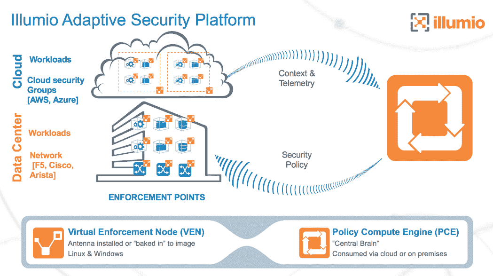

# Illumio 扩展自适应安全平台，提供更全面的保护

> 原文：<https://devops.com/illumio-extends-adaptive-security-platform-comprehensive-protection/>

网络通常是复杂而庞大的。很容易将它们视为一个单一的实体，但是互连、路由和分段网络的设备阵列可能会使监控和管理安全性成为一项挑战。Illumio 希望解决这一挑战，并帮助组织实施更简单、更全面的自适应安全平台。

根据 Illumio 的说法，自适应安全平台正在扩展，以使公司能够在不牺牲安全性的情况下为数据中心和云应用程序采用网络分段。

“安全性面临的最大挑战之一是应对复杂性，而我们在客户数据中心和云环境中看到的日益增长的异构性加剧了这一挑战。451 Research 首席分析师 Eric Hanselman 表示:“传统基础设施与虚拟化和云相结合，这意味着有机会实现政策执行的协调点。“我们认为，深入细分解决了客户的实际需求，他们希望通过集中和协调不同环境中的策略和实施来增强安全性和简化操作。”

“随着分段成为数据中心和云安全的核心战略，各组织现在正在考虑如何利用计算环境的其他元素来执行这些政策，”Illumio 的首席技术官兼创始人 PJ·科尔纳说。“我们的客户要求我们在他们的数据中心和云环境中高效地协调策略，从而简化安全控制平面的管理。”

Illumio 分享了此次更新中包含的一些主要功能:

*   Illumio 现在可以编程和控制领先的数据中心和云基础设施，包括思科系统、微软 Azure、AWS 和 Arista，以提供市场上最全面的细分解决方案。
*   客户不再需要防火墙阻塞点、SDN 部署或升级基础设施来实现强大的基于分段的安全性。
*   Illumio 实施点编程的扩展为客户提供了集中和自动化的策略管理协调，包括:
    *   主机:工作负载(裸机、虚拟机、容器)
    *   网络:思科和 Arista 交换机(新)，F5 LTM 和 ATM
    *   公共云:AWS 安全组、Azure 网络安全组

*   客户现在可以为主机、网络和公共云编写统一的安全策略，从而提高安全性并降低运营开销。

Illumio ASP architecture

Illumio 表示，随着 Illumio ASP 从裸机服务器、虚拟机和容器化主机扩展到网络和云的附加安全控制，它减少了管理多个互不关联的策略模型的需求。Illumio 声称，它有助于消除不同安全策略产生的安全差距，减少手动分段产生的运营开销，并不再需要额外的防火墙阻塞点或 SDN 部署。

“尽管网络安全支出迅速增加，重点是实施更强的安全控制以限制对敏感数据和应用程序的访问，但各种规模的组织并不总是最终拥有更安全的环境，”ESG 的高级首席分析师兼该公司 cybersercurity 服务的创始人 Jon Oltsik 说。“在整个数据中心和云中推动深度细分的能力可能是保护数据中心和云环境的关键下一步。”

托尼·布拉德利