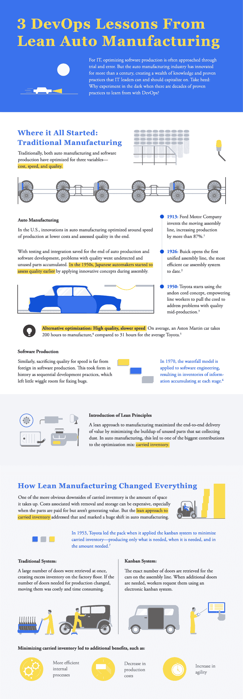
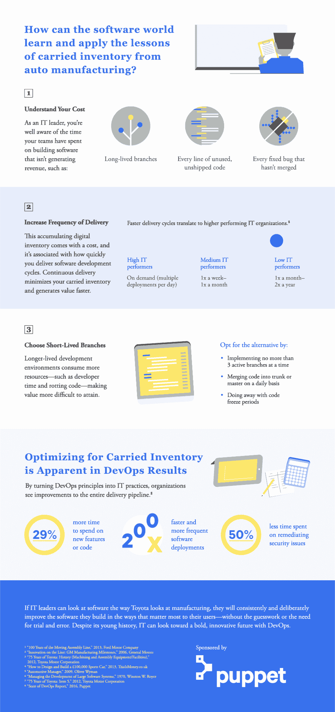

# 信息图:DevOps 从精益汽车制造中吸取的教训

> 原文：<https://devops.com/infographic-devops-lessons-lean-auto-manufacturing/>

精益原则对于今天的软件交付就像对于 20 世纪的汽车制造一样重要。当你将精益实践应用于软件交付时，你会得到同样好的结果——更低的成本，更快的周期和更高的质量。
参见下面来自[木偶](https://tracking.cirrusinsight.com/6e2b2532-c32f-4304-8fb9-7bc2463d3fd1/puppet-com-product-how-puppet-works)的信息图，探索软件可以从精益汽车制造中学到什么，包括开发运维实践和持续交付在提高组织绩效、生产力和盈利能力中的作用。

 