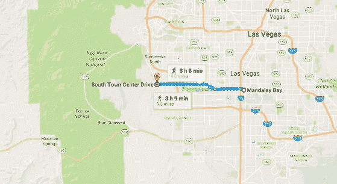
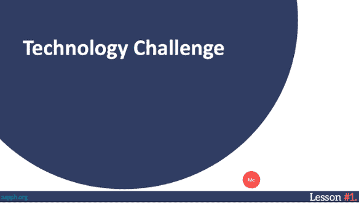

# 面向小型组织的 DevOps:来自 Ed 的教训

> 原文：<https://devops.com/devops-small-organizations-lessons-ed/>

艾德意志消沉。他刚刚听到了一位将改变他一生的演讲者。他知道他需要改变，他知道最终目标是什么。他只是不知道如何到达那里。他需要新鲜空气。他需要内啡肽。还有什么比在拉斯维加斯的一些破旧街区跑上六个小时到达沙漠边缘更好的方式呢？

Ed Ruiz (@eruiz06)是公共卫生学校和项目协会(ASPPH)的高级 IT 主管，我听到他在马拉松[全天 DevOps 会议](http://www.alldaydevops.com/)(免费，在线)期间分享了他转换到 DevOps 的经验教训。

这里是他旅程的起点。当年早些时候，ASPPH 认识到有必要使其成员结构现代化。该组织的成员从 31 人激增到 106 人。教育学院有 10 名员工，为 141 个国家的 54，000 名学生和 13，000 名教师提供支持。ASPPH 专注于遵循微软企业手册，每三到六个月通过瀑布方法进行部署，并且认识到它需要更新它的 it 基础设施。

在那里，在加沙地带舞厅的闪光和魅力中，艾德听到了德沃普斯福音传道者[和安迪·曼](https://www.linkedin.com/in/andimann)(@安迪曼)。埃德全神贯注于安迪要说的话。“这是我们组织所需要的，”他想。但他很快就变得意志消沉，因为他不知道如何领导这场激烈的变革。

在 Ed 跟随 Andi 的主题演讲跑步的过程中，他意识到他需要从一个愿景开始。剧透:Ed 很成功，但也有一些小问题。Ed 分享了他在会议期间学到的四个教训，以帮助我们其他人继续我们的 DevOps 之旅。

1) **清晰表达愿景。**您的团队需要了解组织做什么，为什么它很重要，以及这种变化如何让组织更有效。

2) **从文化和分享开始**。DevOps 口号强调文化、自动化、测量和共享(C.A.M.S .)的同等重要性。人们经常首先被自动化和测量所吸引。这是他们所知道的。DevOps 工具实现起来很有趣。按照 Ed 的说法，过分强调工具是一个巨大的错误。DevOps 之所以叫 DevOps，是因为它实现了开发和运营之间的共享文化。自动化和度量是促进共享的工具，但是如果你的团队不认同文化和共享，DevOps 将会失败。

3) **修剪坏苹果**。我们都知道那个人(他们有很多名字:诺博士、耐莉、米尔顿)。你不希望在你的组织中有诋毁者。当 Ed 因为他的技术敏锐而决定在他的团队中保留一个诺博士时，在他意识到这颗坏苹果需要从树上修剪下来之前，他的团队中有一半人都退出了。诺博士的消极情绪具有传染性，导致士气低落，侵蚀了成功所需的文化。艾德的建议？你可以教技能，但你不能教积极的态度。先雇佣态度好的。

4) **领导的认同至关重要**。优先级和预算会改变，挫折会发生。当你得到领导层的认同时，这就为失败创造了空间。你可以振作起来，朝着你的梦想再迈进一步。

我们不知道那五天在维加斯还发生了什么，但我们知道 ed 回家后变了一个人，他改变了他的组织。我们都可以从中学到一些经验，并将它们应用到我们自己向 DevOps 的过渡中。

[http://https://www . YouTube . com/watch？v = kv 6 pjtp 3 uq 4&feature = youtu . be](http://https://www.youtube.com/watch?v=Kv6PJTp3uq4&feature=youtu.be)

你可以在这里观看全天 DevOps 会议的完整演示(30 分钟)。全天 DevOps 会议的其他 56 个演示可在网上免费获得[点击](https://www.sonatype.com/all-day-devops-on-demand?__hstc=31049440.fff56b041308a66b74cf93c40ea2030a.1456347809383.1484258909413.1484315102822.542&__hssc=31049440.4.1484315102822&__hsfp=1394008546)。

— [德里克·威克斯](https://devops.com/author/derek-e-weeks/)