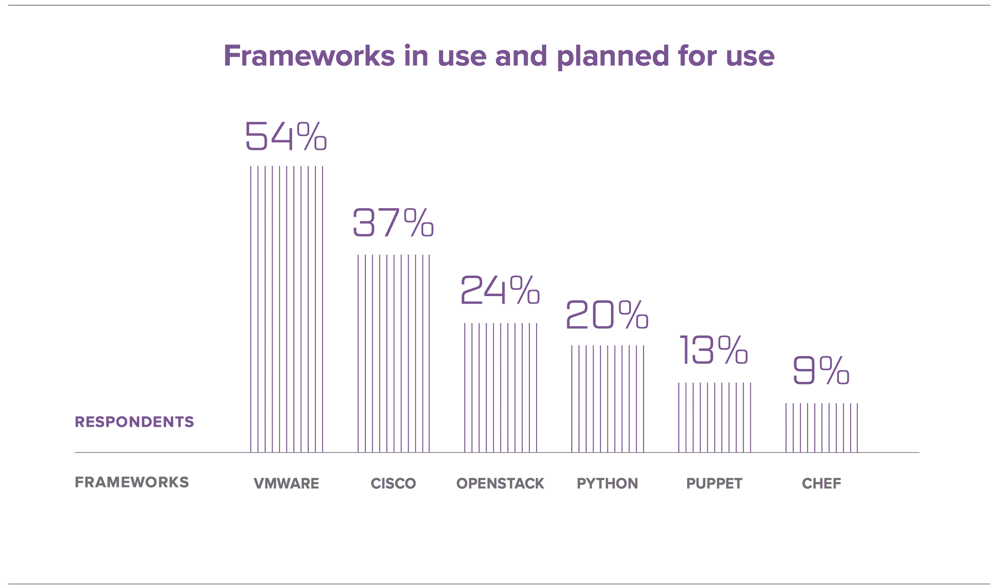

# F5 Networks 2017 年应用交付状况

> 原文：<https://devops.com/f5-networkss-state-application-delivery-2017/>

在过去的三年里， [F5 Networks](https://www.f5.com) 对其用户进行了调查，并提交了“应用交付状态”报告。今年的报告已经有几周了，我有机会通读了一遍。对于“网络运营”人员——那些专注于网络但想要 DevOps 式管理的人来说，这里有很好的信息。该报告讨论了这些趋势及其客户(倾向于更大、更成熟的组织)正在做的事情。

**披露:**我是前 F5 员工，总体而言，我热爱这家公司。它的高层管理人员成功地度过了困难时期，并在好的时期蓬勃发展，当我在那里的时候，公司的方向总体上是非常好的。我离开的原因与高层管理或产品无关。简而言之，我是 F5 的粉丝。此外，我的妻子仍然是该公司的雇员，更糟糕的是，她参与了调查和最终文件的制作。萝莉有时也为 DevOps.com 写歌。因此，我在这里提出的任何批评都必须愿意在社交媒体上、在编辑会议上*和在餐桌上*进行辩护。

综上所述，既然读者可以[下载](https://f5.com/about-us/news/the-state-of-application-delivery?mkt_tok=eyJpIjoiTmpBek1UTTJOV0UzTTJJMSIsInQiOiJjRlwvTjdGVkhXTDJcL0lUTlpBTkFNOHNwTnFOa0ViVWpCZHFKXC95byt4KzNmVERYUVltcTB5Tm16ZzlUQ3pqY1Mxd3F1SEE3QnVjMWthdGpUZysySldUa3JxU2dJb0wyU2pEZEp1S09cL2dJaVpmUDFKdlJjdkdUMXBYWEZcL3RDbVZtIn0%3D)这份报告并形成他们自己的观点，我很乐意写这份报告。我甚至会冒险为我的忠实读者为炸牛排而战。

F5 向来自各行各业的近 2，200 名设备用户询问了一系列关于他们如何使用应用服务的问题，这些问题包括负载平衡、web 应用防火墙或 DDoS 保护等针对应用而存在但不属于应用的内容。还包括开发运维问题和开发运维领域之外的自动化问题。

虽然该报告的大部分内容是任何 IT 从业者都感兴趣的，但其中一些内容是 DevOps 从业者特别感兴趣的。因此，除了一些笼统的陈述外，我将把自己限制在报告中与 DevOps 相关的部分。

**内部人员补充说明:** Lori 提到 F5 有大量数据无法压缩到这份报告中，她会在她的 F5 [博客](https://devcentral.f5.com/users/38/my-contributions)上断断续续地谈论这个话题。如果你对这个话题感兴趣，不妨关注她。

首先要看的是外卖整体清单。该报告提供了四个“关键发现”，有趣的是，其中三个与 DevOps 相关。当您深入研究第四个(与安全相关的)关键发现时，您会发现它也至少与 DevOps 有一点点关系。

虽然我不想透露整个报告，但我将提到与 DevOps 直接相关的三个项目:

1.  数字经济推动应用服务的采用。
2.  云在成长，需要技能。
3.  在他们的调查中，成本节约是 DevOps 的主要驱动力。

可自动化的应用服务的增加在某种程度上强烈暗示了开发运维，而云和开发运维齐头并进，最后一点明确地说*是*开发运维。

该报告包含了有关 F5 客户正在做什么、2017 年对他们来说什么是重要的以及他们计划很快实施什么的信息。总的来说，这是一个很好的阅读材料，可能会支持你对高管支持或增加资金的呼吁。

不过，报告中有一些奇怪的地方。我不是剪辑的粉丝；有些句子看起来很笨拙(例如，在一个假设上下文不同的句子中两次使用同一个单词)；由于某种原因，一个百分比列表是按照从最小到最大的顺序排列的，而所有其他的都是按照从最大到最小的顺序排列的。

虽然编辑错误会让人分心，但我对报告的最大问题是将 [Python](https://www.python.org) 作为一个“框架”包括在内(还有 [VMware](https://www.vmware.com) 、 [OpenStack](https://www.openstack.org) 、[木偶](http://www.puppet.com)、[主厨](https://www.chef.io)……)。在附带的文本中假设这表明了自主开发的自动化水平，但是由于有许多方法来实现自主开发的自动化，这充其量是一个低点指标。总的来说，它在列表中感觉不合适:

*DevOps tools as surveyed by F5 Networks.*

但是老实说，关于每个组织使用的这些“框架”的趋势和数量，有足够多的其他信息被打包到这个部分中，我愿意将语言的包含视为一个可以解释的简单疏忽，因为许多组织*正在*使用 python 进行自动化(我在不止一个组织中使用过)。

该报告还谈到，平均每个应用程序都部署了两位数的应用服务。对我来说，这似乎很高，但这是来自 F5 客户调查的数据，如果您已经为这一捆绑服务付费，也许您更有可能尽可能多地使用这些服务。对我来说，这意味着整个应用环境的自动化。考虑到 F5 在回答技能问题时收到的评论，可以很容易地自动化的自动化解决方案对他们的受访者来说是一个容易的选择。

请注意，在上图中，该公司没有将用户限制为“您使用什么框架进行网络配置？”这可能是一个合理的假设，因为 F5 主要是一家网络公司(不要告诉高管们我说过这些——他们最近似乎正在重新定位为一家应用服务公司)，但我问了，该公司对回答没有限制。这表明其客户对 Puppet 的接受程度远低于我个人的预期，考虑到其客户群的核心应该是 Puppet 的最佳点——各种行业的传统企业。

不过，不同角色的受访者权重可能会对这些角色的排名产生一定影响。响应列表中网络和管理类型占优势，安全、开发、架构和开发运维类型较少。这可能会扭曲结果，即使组织列表在各行业中相对平衡。

总体来看。这是可靠的信息，有一些可用的解释和更多关于垂直行业和用例的评论。当解释你正在做的事情的价值，或者试图扩展你正在做的事情时，这绝对是一份值得拥有的文件。

唐·麦克维蒂