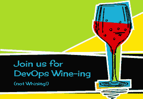
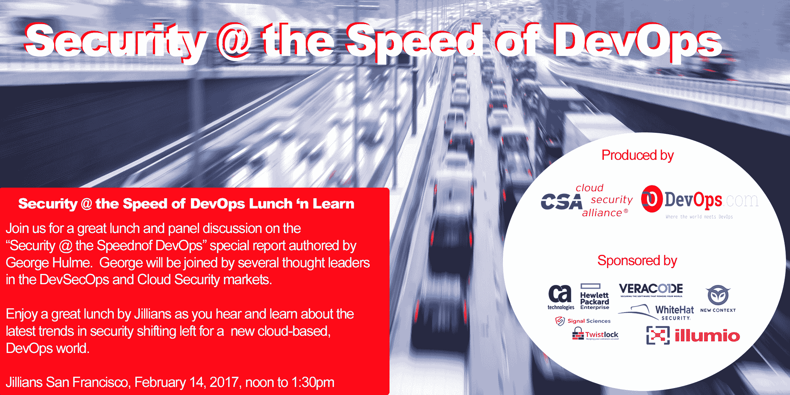

# DevSecOps @ RSA 大会

> 原文：<https://devops.com/devsecops-rsa-conference-2017/>

今年，DevOps.com、 [Sonatype](https://www.sonatype.com) 和 [RSA Conference](https://www.rsaconference.com/events/us17) 再次联手，为 2017 年 2 月 13 日在三藩市举行的 RSA Conference 2017 带来安全/DevOps 学习和交流日。活动是 DevSecOps @ RSA Conference 2017。在前两年大型活动的基础上，今年的活动有望变得更好。下面是一些已经确认的演讲者，你可以亲自看到有多么令人惊讶的一系列会议。最棒的是参加所有 RSA DevSecOps 活动都是免费的。

#### DevSecOps 会话

DevSecOps 的阵容包括 DevOps 和 DevSecOps 先锋， **John Willis、Damon Edwards、Jez Humble、Nicole Forsgren 博士、J. Paul Reed、Josh Corman、Shannon Lietz** 等等。[查看网站页面，了解演讲者和主题的全部详情](http://www.devopsconnect.com/upcoming/rsa-2017-conference/)。

参加全天活动(上午 10 点到下午 4 点)是免费的，但您需要注册 RSA Conference。如果您已经参加了 RSA，您需要修改您的注册，以表明您正在参加 DevSecOps(或 Rugged DevOps)。如果您尚未注册，您可以注册并获得 RSA 会议的免费 expo 通行证，这样您就可以注册并参加 DevSecOps 会议。可以使用代码: **1U7DEVOPSXP** 和[在这里注册](https://ae.rsaconference.com/US17/portal/newreg.ww)。

#### DevOps 葡萄酒(没有抱怨)党

 除了全天的精彩演讲，我们还将在会议结束后立即举办一年一度的 DevOps Wine-ing(不发牢骚)鸡尾酒会。您需要为葡萄酒活动单独注册。这里有一个[到 eventbrite 注册的链接](https://www.eventbrite.co.uk/e/devops-wine-ing-not-whining-cocktail-party-registration-30923852074)。

葡萄酒活动是从 4:30 到 6:30，应该再次成为安全和 DevOps 部落交往的好时机。向在 DevSecOps 演讲的 Josh Corman 致敬，他在 4 年前发起了 DevOps 葡萄酒聚会。

#### 安全性@ devo PS 午餐和学习的速度

在接下来的一天，也就是周二，我们将举办一次午餐会，讨论我们与云安全联盟共同制作的“以 DevOps 的速度提高安全性”报告。我们将有一个包括 George 和一些领先的 DevSecOps 和云安全专家在内的小组，在 Jillians 的午餐上讨论这些发现。这个活动也是免费的，但是你需要在这里注册[。](https://www.eventbrite.co.uk/e/security-the-speed-of-devops-lunch-n-learn-tickets-30931128839)

该报告由 George Hulme 撰写，基于一项由 DevOps.com 和云安全联盟共同制作和发布的调查。您可以在 https://www.surveymonkey.com/r/RSACSADEVOPS 的[花几分钟时间参与调查(我们需要您的帮助，请务必参与)。也可以随意告诉你的朋友。](https://www.surveymonkey.com/r/RSACSADEVOPS)

我们将在 RSA 会议上分发该报告的副本，并通过 DevOps.com 以数字形式分发。我们还将在活动中分发其他几个惊喜赠品。

是的，今年的 RSA 大会将推出大量的 DevSecOps，您可以免费参与其中。当然，如果没有一大群赞助商的帮助，这是不可能的，他们今年已经站出来支持这些活动。除了 RSA Conference、Sonatype 和 DevOps.com，本次活动的赞助商还有:

**金牌赞助商**

**CA Technologies、HPE、白帽安全、Veracode、Cloud Passage、New Context 和 Illumio**

**白银赞助商**

**信号科学，扭锁**

13 号旧金山见！

— [Alan Shimel](https://devops.com/author/ashimmy/)