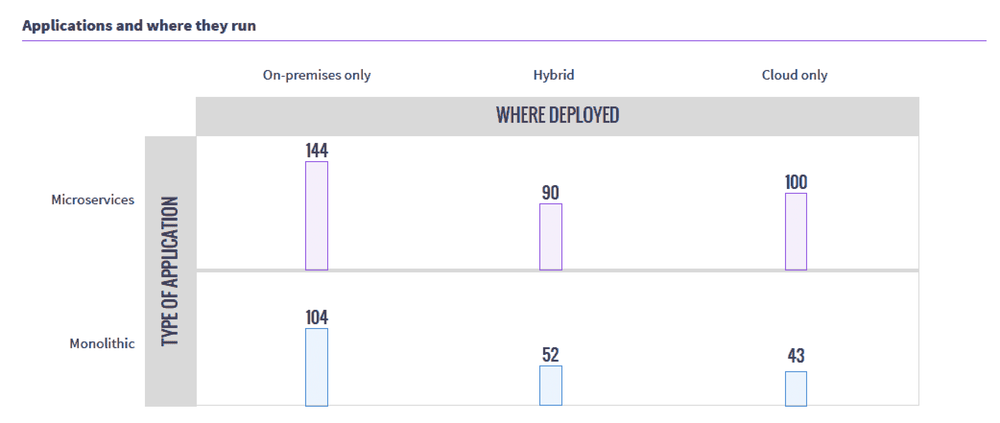
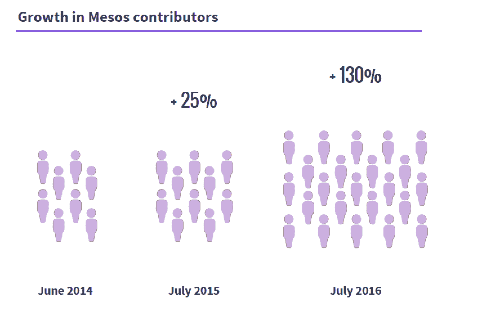

# Mesos 使用调查:大型集群、大型工作负载

> 原文：<https://devops.com/mesos-usage-survey-big-clusters-big-workloads/>

[meso sphere](https://mesosphere.com),[DC/OS](https://mesosphere.com/product/)的提供者，最近发布了一份针对 Mesos 用户的[调查](https://mesosphere.com/blog/2016/11/02/apache-mesos-survey-2016/)，重点关注 Mesos 部署信息。

有一些有趣的结果，有些事情我希望他们能挖掘得更深一点。如果你曾经做过调查，那么你会知道结果不可避免地会产生更多的问题。毫无疑问，中间层和我有同样的新问题。

我想强调的第一个重要花絮是一个警示故事。我接触集群(大数据、云以及最近的 Mesos 风格的集群)已有多年，本次调查显示，有一个事实比 Mesos 更具全球性。集群最终总是比你计划的要大。调查显示，在使用 Mesos 超过六个月的用户中，25%的用户拥有超过 100 台服务器支持集群。

当规划一个集群时，总是假设它比你计划的要大，比你想象的要快。需要这种技术的组织需要它来执行任务，并发现自己比计划的更多地使用它，所以集群总是在增长。我见过一些组织做了一个 20 台服务器的集群，在六个月内数量超过了 100 台服务器，最终达到了 200 台。我听说过更快/更大的意外增长率，但没有见过，也没有与负责人交谈过。做比你认为需要的更大的计划——最坏的情况，你会计划过度，这比被太小的集群抓住更容易处理。

我认为这是一个有趣的领域，如果有一个后续问题深入探讨调查受访者计划的集群规模与他们目前部署规模的对比。

调查中另一个有趣的收获是使用模式。虽然内部/外部/混合云并不是一个令人惊讶的分布，但如此多的组织将单一工作负载转移到 Mesos 的事实有点令人惊讶。调查的样本规模相对较小，但仍然有很多“我们有 Mesos，让我们开始在那里运行它”。

我想我会与 Mesosphere 合作，与其中一个在 Mesos 上运行 monolithic 应用程序的组织交谈，看看我们是否能获得一次有趣的采访。

为了开源项目的健康，我想看看那些参与的人发生了什么——观众在增长吗？开发者的数量在增长吗？补充调查数据说是的。

我仔细检查了这一信息，因为它应该是公开的，尽管从 GitHub 到 Apache Git 的迁移使得追踪变得更加困难，但 7 月份的这篇 Apache 帖子确实验证了上面的图表，并提供了更有趣的数据。

Mesos 仍然让我感兴趣的一点是，它不允许用户通过共享服务器来创建虚拟机，而是共享服务器来创建一个大规模的并行系统。但是在它上面运行容器(正如这个数据表明的那样，大多数是为了资源隔离)把它分割成各种各样的虚拟体。非常深奥。

我不会重复我对每一个问题的看法来烦你。点击文章顶部的调查链接，您可以获得调查回复摘要来支持您的工作。

唐·麦克维蒂