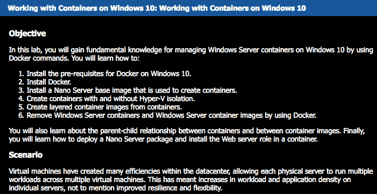
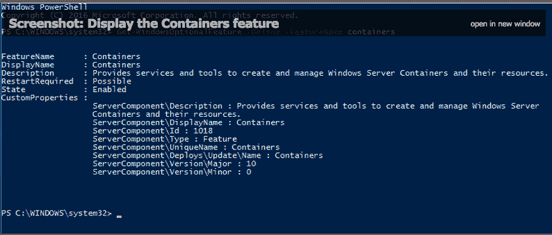
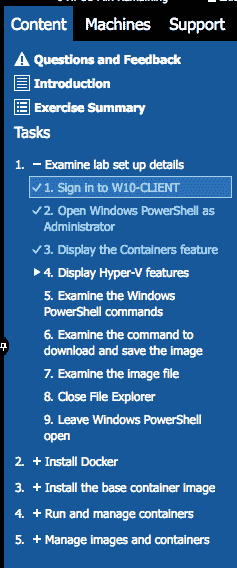

# Windows 上的 Docker，你是认真的吗？微软的动手实验室向您展示如何操作

> 原文：<https://devops.com/docker-on-windows-are-you-serious-microsofts-hands-on-lab-shows-you-how/>

你可能听说过或者读到过 Docker 在 Windows 和 Azure 上的可用性。Docker 和微软都加大了他们合作的力度。但是你真的调查过这两个人在做什么吗？如果没有，现在就是你的机会。微软在 Docker、containers 和 Windows 的 lab 上放手一搏。

在本动手实验中，有一些模块介绍了 Windows Server、Windows Nano Server 上的 Docker，以及如何使用 Windows 10 管理它们。可以用微软的 HyperV，也可以不用。这确实是了解容器、Docker 和 Windows 平台的好方法。你可以点击这里在实验室里玩这个游戏，或者如果你喜欢剪切和粘贴这里的链接:【http://msftdevops.learnondemandsystems.com/? wt . MC _ id = aid 557152 _ QSG _ 博客 _22879 。(*编辑注意:弹出窗口拦截器可能会阻止实验室加载。如果您有问题，请尝试禁用弹出窗口拦截器*。)

以下是该实验室涵盖的更详细的内容:

我趁机自己玩了玩实验室。虽然我不是开发人员，甚至不是运营人员，但我不得不说微软在这一点上是对的。连我都能完成它！实验室应该花你 30 分钟，但是他们给你 8 个小时来完成。有一套很棒的介绍视频，可以让你对你将要做的事情有一个全面的了解。这是一个静态照片的例子:

该实验室实际上被分成几个模块，不必一次完成。这个实验室不需要你做任何设置。它可以在你的浏览器中运行。实验室让您运行两台不同的 Windows 机器，一台是 Win10，一台是 Windows Server。您可以直接从浏览器切换和登录。该实验室还要求您登录 PowerShell:

 它实际上给了你必须键入的 CLI 命令，告诉你何时在机器之间切换，并指导你一步一步地完成几个任务中的每一个。底部有一个很棒的信息栏，里面有上下文相关的说明，可以引导你完成整个过程。还有一个侧边栏，让您可以很好地监督整个实验室，您在这个过程中的位置和选项。总而言之，我认为他们在 UX 上做得很好，让复杂的任务变得简单。

Windows 主题的整个 Docker 和 containers 已经酝酿了一段时间了。虽然许多人怀疑这可能会发生，但新的微软似乎已经让 Docker 如鱼得水。

据我所知，在 Azure 平台和容器上将会有类似的免费实验。我们将与微软合作，在这里进行更深入的挖掘，所以请继续关注！

— [Alan Shimel](https://devops.com/author/ashimmy/)