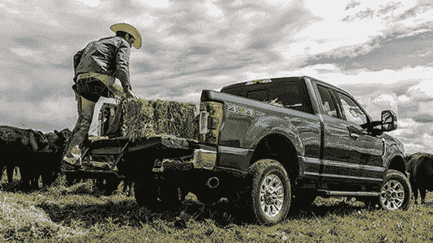

# “最好”是相对的，但从顶端开始

> 原文：<https://devops.com/best-relative-starts-top/>

你年迈的妈妈需要一辆新车。你为她挑选是因为她很久以前就不再关注汽车了。你买的都是福特。你也总是买卡车。你会给你妈妈买一辆 F350 吗？除非她真的需要一辆 F350(可能性极小，但高龄妈妈和其他人群一样多种多样，所以也许是)。为什么？仅仅因为你买车是为了解决一个问题:你母亲需要一辆新车。

Ford F350

设定决策参数是首席信息官的职责。或者至少是一部分。自成立以来，它一直在与正当理由作斗争。太多时候，我们在证明选择是正确的之前，就在证明选择是正确的。浏览器战、操作系统战、语言战……从 IT 人员变得必不可少的那一天起，所有这些几乎都破坏了 IT。

事实是，人们有偏好，组织也有。如果您有 300 个 Oracle 数据库实例在运行，那么您需要在员工、培训、许可证等方面进行投资。如果 Oracle 是下一个项目的选择，您可以重用它。与此形成对比的是“下一个项目”,它包含一个购买的包，只适用于 SQL Server。这两者是需要解决的自然矛盾。

在太多的情况下，我们专注于个人认为最好的或“正确的”，而不是组织跨项目的需求。在开发方面，敏捷使得这个问题比以往任何时候都要严重。简而言之，敏捷的规则是越快越好，但是这种方法的长期影响是巨大的。如果内部开发的应用程序从 NoSQL 到 SQL server 到 Hadoop 再到 Oracle，并且您必须在运营和开发中维护上述所有应用程序，那么您可能已经快速交付了，但是从长期来看，累积的成本(称之为抵押技术债务)可能会非常昂贵。

对于一个给定的问题，我们最终得到多个解决方案的方式是让冠军在真空中把他们的观点带回家。当员工说“我知道有一个[需要的库、工具、应用]可以解决这个问题，我可以在一天内让它运行起来”，这当然很好，但是需要考虑更大的情况。

DevOps 无疑给了我们一个机会来回顾这些选择，并在地面下赌注。有时内部拥护者是对的，这是在这种情况下使用的工具。有时候不是，应该使用已经实现的工具/库/应用程序。但是对话需要发生。

我在 F5 工作时写过一些这方面的内容。令我惊讶的是，有这么多客户购买了 F5 非常昂贵的设备，然后将其设置为负载均衡器，并在其他地方寻找 WAN 优化或安全解决方案，而 BIG-IP 可以完成这项工作。这是浪费的一个很好的例子，但只是冰山一角。

在运营端实施 DevOps 时，看看您有什么。如果你为三个不同的目标编写相同的脚本，那么可能是时候找出原因了。这些理由可能是完全可以接受的，但也可能不是。如果购买的应用程序真的只支持一个 AAA 产品，那么这个产品可能是必需的，即使这意味着将登录传播到公司标准的 AAA 工具。

但是，确定这些决策的过程是明智的，重点是标准化，但处理异常情况的适应性是自上而下驱动的。强调第一选择是 X，但是 Y 和 Z 对于优先级为 3 或更高的项目是可接受的选择，这一点很重要。它从顶部强调说，“我们有标准，我们都需要努力遵守这些标准，以尽可能降低工作负载，但我们有业务要支持，并将在增加业务价值的情况下破例。”

这并不总是容易的。政治上没有，技术上也没有。有时，内部可用的解决方案并不完全适合给定的问题，但从长远来看，解决问题所需的工作比投入更简单的解决方案所需的费用(重复的专业知识和许可费用，更不用说重复的 DevOps 脚本)要少。IT 人员都是聪明人，完全有能力做出这些决定，但这样做的方向必须来自高层。如果没有它，有些人会把目标放在标准化而不是实现速度上，有些人则相反。不可避免地，许多人会瞄准对他们来说最容易的。

我曾在两个行业工作过，在这两个行业中，数据从文件柜中的纸张到缩微胶片到大型机到客户端/服务器到虚拟化和/或云。不要认为你正在做的事情只对现在重要。制定规则，问一些棘手的问题，比如“我们内部有什么可以履行这一职能？”期待诚实的回答。

如果您要进行诸如 TCO 或 ROI 之类的计算，请确保团队知道您希望这些数字引导您找到解决方案，而不是相反。因为我们都见过解决方案改变了数字的计算方式，这只是浪费每个人的时间。

所以站出来，首席信息官先生。给妈妈买辆福克斯或者本田——只要能满足她的需求就行。不是你一直做的事，也不是你最容易做的事。制定规则，让团队知道什么是决策标准，并让他们清楚，这样就不会有误解。最后，让您的 DevOps 团队有空间提出整合建议。如果他们看到重复工作，让他们引起注意，并有一个过程来解决他们的问题。最后，一个简单的，“不，因为 X，重复是必要的，”或者“是的，我们应该整合，”需要从他们提出的每个建议的过程中产生。

如果你妈妈是那个开 F350 的人，给我发一张她在卡车旁边的照片。我会和编辑们谈谈让它发表的事。

唐·麦克维蒂