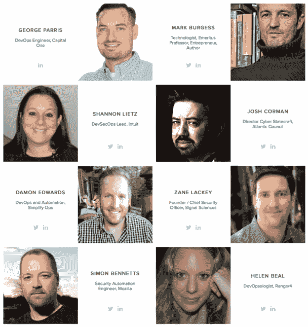

# 整天 DevOps

> 原文：<https://devops.com/all-day-devops/>

在过去的一年里，我参加了 18 场 DevOps 活动并发表了演讲。我还听说，在过去的几年里，John Willis 参加了 200 多次 DevOps 活动。但不是所有人都有时间或预算让我们自己和我们的团队参加这些活动，在这些活动中我们可以向其他从业者学习。

这就是我们为 11 月 15 日[召集](http://www.alldaydevops.com/)[全天 DevOps 会议](http://www.alldaydevops.com/)的原因。

## 免费开发

全天 DevOps 将在 **15 个小时**和 **15 个时区**提供 **57 场由从业者主导的会议**。不允许供应商推销。为了打破您和您的团队的旅行和预算障碍，我们免费在线直播每场会议。每一次会议也将被记录。我们这样做是因为我们希望与每个人分享全球 DevOps 专业知识。

## 开发大脑

现在已有 3，500 多人注册参加会议。我们有一个强大的演讲阵容，涵盖三个主题:现代基础设施、CI/CD 和自动化安全。以下是一些精彩会议的示例:

*   **CI/CD**
    *   作为代码的元基础设施(Meta infra structure): Capital One 如何用不可变的詹金斯自动化我们的自动化工具，作者乔治·帕里斯(Capital One 的主软件工程师)
    *   **为逝者说话**:瀑布和单体架构的重要正面经验，作者迈克尔·德汉(Ansible 前首席技术官&创始人)
    *   就我而言，欢迎我们的新机器人统治者

*   **自动化安全**
    *   **停止更改您的密码**，Chris Swan(CSC 全球基础设施首席技术官)
    *   Akash maha Jan(OWASP Bangalore 负责人)**使用 Ansible 进行系统强化**:应用程序部署+配置管理+持续交付
    *   Josh Corman(大西洋理事会网络管理主任)的《建筑规范的建筑规范》

*   **现代基础设施**
    *   **改造您的基础设施**:30 分钟内从初学者到半专业人士，Britt tree ce(phi shme 的生产工程师)
    *   面向 API&微服务的 DevOps 友好文档发布，Mandy Whaley(思科开发者体验总监)
    *   **监控，保持基础设施**–充分利用 Lambda，Michael(data dog 的 DevOps 布道者)

## 不要只是听，要说话

我们从社区收到的一个重要意见是，每个人都希望有机会互动。这就是为什么我们在 Slack 为你建立了一个专门的团队空间。每位与会者都有机会与休息室的演讲者互动。问答将是现场直播、在线和免费的。我们还将为那些有问题的人设立“物以类聚”频道，让那些有答案的人来帮助他们。

## [立即注册](http://www.alldaydevops.com)

如果你想加入我们，你能免费注册吗？非常感谢艾伦和他在 DevOps.com 的团队帮助我们在这里传播这个事件。我们真的很高兴有来自北美、欧洲、亚洲和澳大利亚的团队加入我们的活动！

[www.AllDayDevOps.com](http://www.AllDayDevOps.com)

— [德里克·威克斯](https://devops.com/author/derek-e-weeks/)