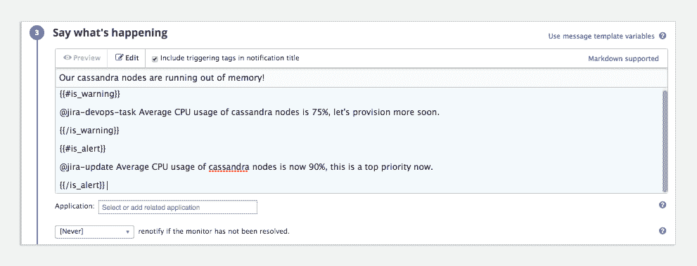

# 数据狗监控和 JIRA 集成

> 原文：<https://devops.com/datadog-monitoring-jira-integration/>

运营部门通过监控来及早发现系统/服务器/网络问题。其中一个监控选项是 Datadog，这是一个软件即服务(SaaS)云服务/应用程序监控工具，允许运营部门近乎实时地获得有关其应用程序问题的通知。与此同时，开发团队使用 JIRA 来跟踪票证和管理整个敏捷开发。

但是如果你的产品正是运营部管理的东西呢？DevOps 的最佳位置是应用在内部开发并由运营部门管理的地方，因为整个堆栈都在 IT 管理之下。

这就是为什么 [Datadog 和 JIRA 现在被整合](https://www.datadoghq.com/blog/jira-issue-tracking/)。

Datadog 可以在基础架构堆栈中的不同位置以不同级别监控基础架构和应用程序，从磁盘可用性到响应时间再到内存使用情况。Datadog 能够进行监控，并在出现异常或超出指定范围时发出警报，或者直接发生故障。

JIRA 是 Atlassian 的敏捷项目管理软件，在一个地方有问题跟踪和所有常用的敏捷工具。

Configuring Monitoring’s alerting to JIRA.

现在，Datadog 可以创建 JIRA 票证，在有更多信息可用时更新它们，并用运行系统中的相关信息填充它们。

比方说，一个云实例内存不足，超过了一个阈值。Datadog 发现了这个问题，并在 JIRA 开了一张票，上面显示了什么系统、什么时间以及运营部门定义的任何其他信息。现在，该票证就像其他票证一样存在于系统中，开发人员可以获取它，并查看在相关实例上运行的整个应用程序部分的内存使用情况。

根据新闻稿，这是此次整合中包含的三个自动化功能:

1.  在 Datadog 中检测到性能问题时创建 JIRA 票证。
2.  用已识别问题的相关信息填充 JIRA 票证。
3.  当新信息出现时，更新现有的 JIRA 票证。

我是一个善于分析的人，所以我的第一个想法是，“太酷了，”第二个想法是，“但是如果它给 JIRA 带来了非发展问题，那该怎么办？”由于 Operations 会配置哪些内容会发送到 JIRA，而 Datadog 支持警报汇总(一个或两个通知中包含多个警报)，因此可以控制此类垃圾邮件。过分热心的操作人员最初可能会将报告配置为发送太多，但是随着经验的增长，这应该成为自动化错误报告的可行方法。特别是，对 Datadog 生成的事件进行标记应该可以快速显示哪些警报创建了过多的票证，并为团队提供机会来更改票证的创建方式，或者，如果发现票证是由于严重的影响应用程序的错误而创建的，则提高修复的优先级。

这就把我们带到了更新状态部分。在 Datadog 中，运营部门可以对带有“@jira-update”标签的问题发表评论，jira 会收到评论通知。这意味着运营部门可以提高对一个看似平常但影响巨大的问题的认识，或者在需要时为 JIRA 机票添加细节，所有这些都可以在 Datadog 中完成。

有趣的是，Datadog 还与另一个 Atlassian 产品 BitBucket 集成在一起，因此当集成版本包含对票证的引用时，打开的票证可能会被标记为“测试中”。简而言之，BitBucket 集成意味着 Datadog 的监控能够感知提交和签出，操作人员能够将其与发生的问题关联起来。添加 JIRA 集成意味着运营部门可以看到提交、获得警报并更新 JIRA。信息如此丰富，以至于你会想使用他们的各种过滤技术来确保你得到的是重要的东西。

我对一些领域很感兴趣，例如一组特别复杂的查询/缩减对大数据平台的影响。我还没有尝试过 [Hadoop 集成](https://www.datadoghq.com/blog/monitor-hadoop-metrics-datadog/)，但是看起来这个代理能够向 JIRA 接口传达给定的缩减是问题的根源。即使这些互补的集成还没有出现，你也能感觉到 JIRA 正在产生“这种减少导致了系统范围的问题”。那很酷。

总的来说，Datadog 和 JIRA 的整合实现了 DevOps 的梦想，将运营与开发更紧密地联系在一起，并允许在运营中更紧密地跟踪开发变化。毕竟，关键是让系统尽可能接近最高效率运行，并尽可能自动化。从 Datadog 警报到 JIRA 票证产生的问题也很大程度上保证了对开发和运营的需求增加，因为自动化系统出现的问题会得到讨论和研究。

如果您致力于开发和运营的合作环境，即使您不称之为 DevOps，Datadog/JIRA 集成也值得一看。

唐·麦克维蒂