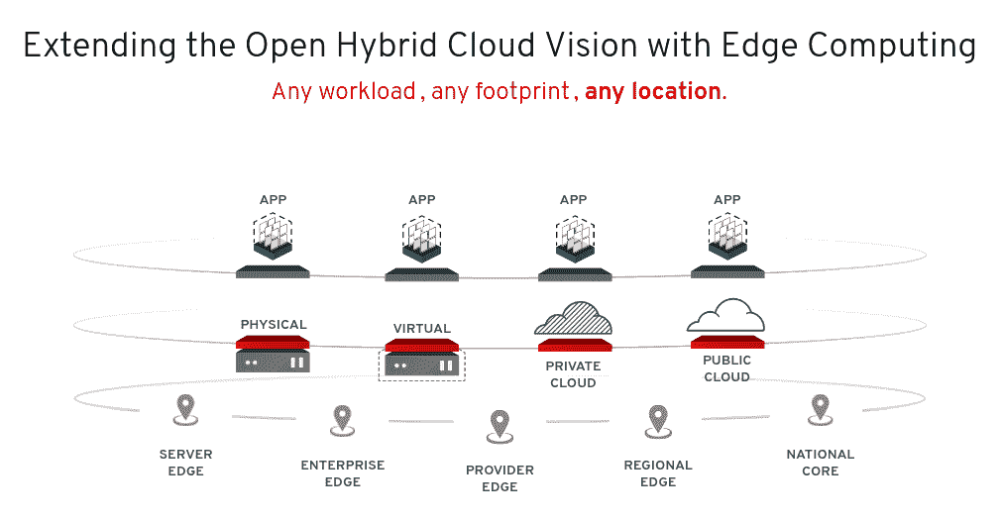

# 红帽更新 OpenStack 平台

> 原文：<https://devops.com/red-hat-updates-openstack-platform/>

Red Hat 今天发布了 OpenStack 的一个[更新，使其能够在 Red Hat Enterprise Linux (RHEL) 8 操作系统上运行。](https://www-admin.corp.redhat.com/en/about/press-releases/red-hat-combines-continuous-community-innovation-long-life-enterprise-support-red-hat-openstack-platform-16)

Red Hat 产品管理高级经理肖恩·科恩(Sean Cohen)表示，Red Hat OpenStack Platform 16 将 OpenStack 的三个版本，即“Rocky”、“Stein”和“Train”结合成一个更新，该公司计划在流媒体的基础上进行更新。此外，未来对 Red Hat OpenStack 平台的更新将与 RHEL 8 的更新保持一致，Cohen 说。

Red Hat OpenStack Platform 16 现在也可以通过长期支持订阅获得。

 Cohen 表示，在采用 OpenStack 构建自己的云计算平台的客户方面，Red Hat 继续保持增长。电信公司已经在云框架上进行了大量投资，现在云框架正在扩展到网络边缘。本周早些时候， [Orange Egypt 宣布将使用 Red Hat OpenStack 平台部署虚拟网络功能](https://www.businesswire.com/news/home/20200217005016/en/Orange-Egypt-Builds-Horizontal-Cloud-Red-Hat) (VNFs)来管理网络流量。与此同时，企业 IT 组织正在开源平台上构建自己的私有云。

Cohen 补充说，在某些情况下，企业 IT 组织依赖 OpenStack 来提供部署基于 Kubernetes 的云原生应用程序的基础。目标是利用部署 OpenStack 的虚拟机来确保在 Kubernetes 上运行的容器化应用程序实例之间的隔离。Cohen 说，在其他情况下，IT 组织正在利用诸如 Ironic 之类的工具来自动在裸机上部署 Kubernetes 集群。

然而，[OpenStack 和 Kubernetes 之间的关系仍然很复杂](https://containerjournal.com/topics/container-ecosystems/openstacks-complicated-kubernetes-relationship/),因为有些组织正在内部 IT 环境中部署 Kubernetes 集群，而不依赖任何传统的基础架构即服务(IaaS)平台，如 open stack 或 VMware vSphere。尽管如此，Cohen 表示，Red Hat 希望看到 [Red Hat OpenShift 应用程序开发和部署平台](https://containerjournal.com/topics/container-ecosystems/red-hat-updates-openshift-platform-to-simplify-operations/)得到更广泛的采用，该平台基于 Kubernetes，基于 Red Hat OpenStack 平台 16。

Cohen 表示，随着 IT 组织转向大规模自动化 IT 基础架构管理，采用最佳 DevOps 实践的组织与 OpenStack 的使用之间存在高度相关性。组织面临的挑战是确定采用非常全面的 OpenStack 框架的哪些模块。事实上，这个挑战就是为什么组织依赖 Red Hat 来代表他们管理 OpenStack。Cohen 说，就采用率而言，Red Hat 在所有 OpenStack 发行版中拥有最大的市场份额。

尚不清楚基于 Kubernetes 的云原生应用的转变会在多大程度上增加 OpenStack 的采用。随着组织寻求构建混合云计算环境，在内部和公共云中部署通用框架的能力具有一定的吸引力。然而，亚马逊网络服务(AWS)等公共云计算平台已经提供了管理 IaaS 环境的专有平台。许多 IT 团队自然更愿意与 AWS 平台集成，而不是取代它。然而，不管混合云计算的方法如何，OpenStack 很有可能会以某种形式出现。

— [迈克·维扎德](https://devops.com/author/mike-vizard/)