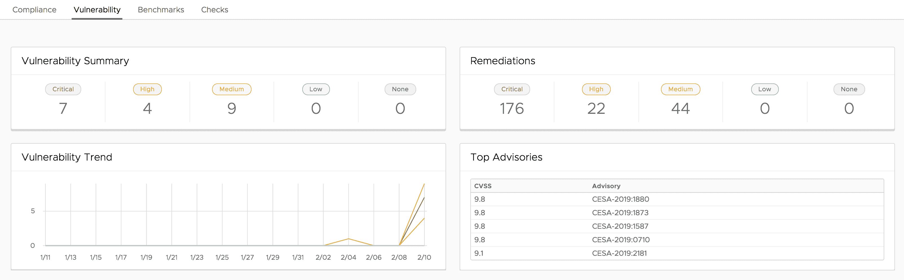

# SaltStack 更新企业 IT 自动化框架

> 原文：<https://devops.com/saltstack-updates-enterprise-automation-framework/>

SaltStack 已经与 Tenable.io 合作，使漏洞数据纳入与其同名的 it 自动化框架的企业版成为可能。

此外，SaltStack Enterprise 的[版本 6.2 现在与 Splunk 的 IT 运营分析平台相集成，使得配置 Splunk 通用转发器来索引和分析由 SaltStack 框架生成的事件成为可能。](https://www.saltstack.com/blog/saltstack-infrastructure-automation-now-integrated-with-tenable-io-for-closed-loop-vulnerability-remediation/)

SaltStack Comply 合规性管理模块也已更新，包括已通过互联网安全中心(CIS)认证的 Windows Server 2012 和 Windows Server 2019 平台的内容。

最后，SaltStack Enterprise 6.2 通过添加一个中间 SQLite 数据库层来排队事件，优化了 Salt Master 和 SaltStack Enterprise Operations 框架之间的通信。SaltStack 表示，IT 组织应该会看到事件处理吞吐量提高了 20 多倍。SaltStack 还增加了将 SaltStack 事件转发到任何 Salt Returner(如 SQL 数据库或本地文件)的能力，以提高性能并保持高可用性。

SaltStack 的高级产品经理 Mehul Revankar 表示，随着其开源框架企业版的更新，该公司正在利用合作伙伴关系，使 IT 系统能够创建闭环系统。例如，Tenable.io 发现的漏洞现在可以使用 SaltStack Enterprise 自动修复。

Revankar 说，目标是让 it 团队更容易创建一个只需按一下按钮就可以自动化的 IT 流程。他说，随着 IT 环境变得越来越大，越来越难以管理，IT 组织将需要大规模地自动化更多流程。为了实现这一目标，SaltStack 正在简化流程，以连接到更广泛的第三方平台，这些平台包含自动化闭环流程所需的数据类型。

自然，采用 DevOps 原则的组织处于 IT 自动化的最前沿。Revankar 说，随着 IT 专业人员团队汇聚到驱动 DevOps 和 DevSecOps 过程，使用 IT 自动化框架的意愿变得越来越强。目标是自动化尽可能多的流程，以注入一定程度的敏捷性，从而加快应用程序的部署和更新速度。组织在 it 自动化方面一直面临的挑战是将 IT 自动化框架与相关数据源集成所需的时间。

Revankar 还指出，随着需要管理的应用程序数量的增加，IT 运营团队的普通成员对 IT 自动化的抵触情绪正在下降。大多数组织都找不到或留不起足够的 IT 人员来管理现在所需规模的 IT 运营。因此，尽可能多地自动化死记硬背的 IT 流程的需求已变得显而易见。在漏洞管理的情况下，这一点尤其重要，因为修补应用程序所需的时间与特定的风险级别直接相关。

当然，谈到 it 自动化框架，现在并不缺少选择。事实上，现在关于采用哪种 IT 自动化框架的决策不仅与框架支持的自动化流程的可靠性有关，还与框架能够从中提取相关数据的来源数量有关。

— [迈克·维扎德](https://devops.com/author/mike-vizard/)