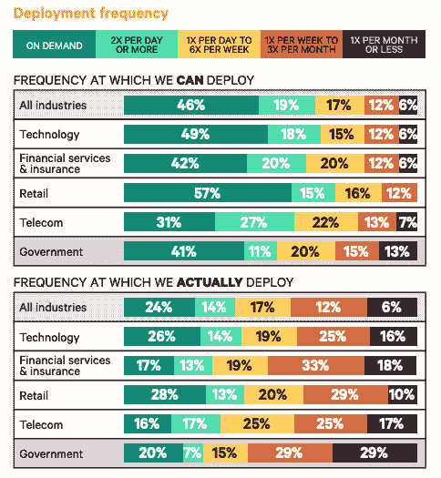

# 报告发现零售业更快采用 DevOps

> 原文：<https://devops.com/report-finds-faster-devops-adoption-in-retail/>

传统观点认为，当涉及到任何 it 进步时，技术公司都会引领潮流，金融服务业紧随其后。然而，Puppet 已经提供了一份基于该公司第八次年度“DevOps 状况”调查的行业记分卡，该调查表明，当谈到 DevOps 的采用时，零售部门现在是最先进的。

调查发现，28%在零售行业工作的受访者表示他们正在按需部署，而 57%的受访者表示他们可以按需部署。相比之下，26%的人在科技行业这样做，49%的人有能力这样做。相比之下，在金融服务/保险行业，只有 17%的受访者表示他们正在按需部署，而 42%的受访者表示他们有能力部署。

零售行业也能够以最快的速度解决关键漏洞，53%的受访者表示他们可以在不到一天的时间内修复一个漏洞。然而，零售行业在报告的“重要”或“完全”安全集成方面也排名垫底(32%)。

Puppet 产品营销总监岚娜·布朗表示，零售行业正在更加积极地接受 DevOps，这主要是因为人们越来越关注数字化转型。她说，公司更多地通过应用程序体验的质量来区分自己。

她指出，公平地说，金融/人寿保险领域的应用环境往往更加复杂。

当然，行业中任何一个组织的 DevOps 专业知识[都有可能大相径庭](https://devops.com/culture-becoming-bigger-issue-as-devops-goes-mainstream/)。然而，Puppet 调查清楚地表明，DevOps 的采用正在变得更加广泛。

事实上，就年同比增长率而言，调查发现，媒体/电信行业取得的进步仅次于零售业。高度发展的电信组织的百分比增加了 9 个百分点，从 8%增加到 17%。得分低的组织数量从 13%下降到 5%。大部分电信组织在团队中嵌入了指定的安全专家，同时保持集中的安全功能(41%)。然而，就 DevOps 的采用而言，只有 16%的受访者表示他们会按需部署，而 31%的受访者表示他们可以。以这种速度，这甚至比政府机构还慢。五分之一的政府机构(20%)表示他们按需部署，而 41%的政府机构表示他们可以这样做。但是，只有 3%的受访者表示他们能够在不到一小时的时间内修复漏洞，24%的受访者表示能够在不到一天的时间内修复漏洞。

布朗指出，尽管所有垂直行业领域仍有很大的改进空间，但当涉及到 DevSecOps 时，肯定会出现左移。许多开发团队现在指定一名网络安全专家，就安全问题为团队的其他成员提供建议，而不是等待来自中央 IT 组织的网络安全专家，该专家几乎没有编程专业知识。

DevOps 在所有垂直行业领域广泛采用可能还需要一段时间。然而，与此同时，很明显 DevOps 的进展终于开始加速了。

— [迈克·维扎德](https://devops.com/author/mike-vizard/)