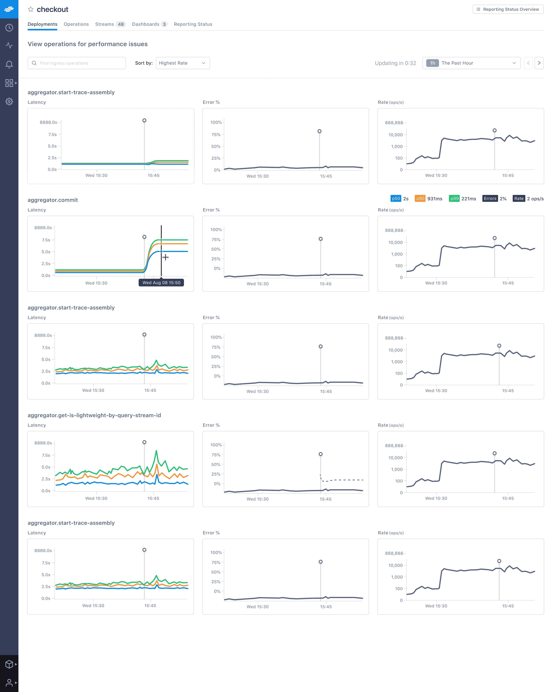

# LightStep 为 APM 平台增加了回归监控

> 原文：<https://devops.com/lightstep-adds-regression-monitoring-to-apm-platform/>

LightStep 本周宣布，它已经为其同名的 observability platform 添加了一个[Service Health for Deployments](https://www.businesswire.com/news/home/20200128005264/en/LightStep-Announces-Solution-Empower-Developers-Fastest-Identify)模块，该平台完全是为微服务和无服务器计算框架而设计的。

LightStep 的高级产品经理 Talia Moyal 表示，部署的服务健康将使 DevOps 团队能够在应用部署期间和之后监控性能退化。

DevOps 团队还可以利用聚合跟踪分析功能，如延迟直方图比较、操作图和自动关联引擎，来执行快速根本原因分析，以了解为什么会出现回归。

最后，内置的工具评分功能使 DevOps 团队能够在部署之前、期间和之后比较性能；比较实例之间的延迟，以估计回归的大小和范围；关联对延迟影响最大的标签；和映射每个操作或服务关键路径延迟。

随着组织采用微服务和无服务器计算框架，整体 IT 环境变得更加复杂，难以管理。作为一个应用性能管理(APM)平台，LightStep 利用 [OpenTelemetry](https://opentelemetry.io/) 软件来收集指标，然后将这些指标输入统计引擎以检测异常，APM 随后可以记录和重放这些异常。Moyal 说，通过使用 OpenTelemetry，LightStep 能够使用分布式跟踪来显示比传统 APM 工具更多的上下文。

考虑到采用 APM 平台所涉及的成本，大多数 IT 组织在历史上都将 APM 平台的使用限制在其最关键的单一应用程序上。然而，构成现代云原生应用的微服务和无服务器计算框架之间存在的依赖性现在要求 IT 组织更广泛地应用 APM 平台。事实上，可观察性是最佳 DevOps 实践的核心原则，许多组织在构建和部署云原生应用程序时都在更广泛地采用这一原则。这些应用程序中有许多在最初部署时运行良好，但随着时间的推移，性能会因为各种原因而下降，从存储访问延迟增加到对同一个应用程序编程接口(API)进行太多调用。

当然，谈到 APM 平台，并不缺少选择。LightStep 为 OpenTelemetry 提供了一个案例，因为它提供了一组开源 API、库、代理和收集器服务来捕获分布式跟踪和度量。这种方法使开发人员能够更容易地对他们的应用程序进行检测，从而允许 LightStep 等平台对应用程序性能有更多的了解。LightStep 声称，它已经采用这种方法分析了超过 1.4 万亿条痕迹。OpenTelemetry 目前正在云本地计算基金会(CNCF)的支持下开发。

现在说跟踪将在多大程度上取代传统的采样方法来分析应用程序性能还为时过早。可以肯定的是，随着开发人员对应用生命周期管理的责任越来越大，他们中的许多人都要求访问更复杂的 APM 工具，以提供他们所需的可见性，从而更快地解决应用性能问题。

— [迈克·维扎德](https://devops.com/author/mike-vizard/)