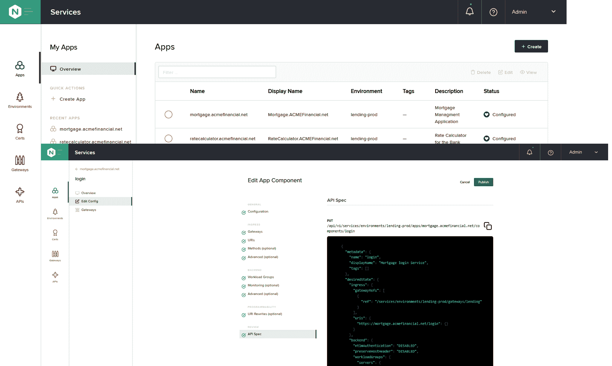

# F5 Networks 推出基于 NGINX 的下一代 ADC

> 原文：<https://devops.com/f5-networks-launches-next-gen-adc-based-on-nginx/>

F5 Networks 本周发布了其 NGINX 应用交付控制器 (ADC)的[版本 3.0，增加了应用编程接口(API)管理工具、分析和监控工具、服务网格、证书管理器、开发人员门户以及与多个持续集成/持续部署(CI/CD)平台的集成。](https://www.f5.com/company/news/press-releases/f5-s-next-generation-nginx-controller-accelerates-delivery-of-mo)

F5 Networks NGINX 产品管理总监 Ken Bocchino 表示，作为自 F5 Networks 去年收购 NGINX 以来 NGINX 控制器的首次重大更新，3.0 版本代表了通过捆绑许多以前需要单独购买的功能来降低开发运维总成本的共同努力。

此外，NGINX Controller 3.0 降低了与构建 DevOps 工作流相关的复杂性，因为组成 NGINX Controller 的所有组件都已预先集成，Bocchino 说。

基于开源 NGINX 代理服务器，NGINX 控制器是一种机制，通过该机制，商业功能作为向企业 IT 客户提供的 NGINX Plus 订阅服务的一部分得到提供和支持。Bocchino 指出，以前的 ADC 更多的是以基础设施为中心，而不是以应用为中心。

虽然 F5 Networks 自然希望 IT 组织消费所有这些服务，但 Bocchino 表示，ADC 采用模块化方式设计，使组织能够消费他们认为合适的 REST APIs 服务。他说，NGNIX 代理服务器的未来版本将能够支持多种类型的服务网格，包括 NGINX 团队创建的轻量级产品，该产品将在今年晚些时候作为 NGINX Controller 3.0 的一部分上市。

Bocchino 指出，F5 Networks 预计 NGINX 控制器将在推动网络运营、安全和开发运维团队进一步融合方面发挥重要作用。NGINX Controller 3.0 通过提供自助服务门户以及基于角色的访问控制和模块化工作流来实现这一目标，从而消除了为完成每项 IT 任务而签发票证的需要。

目前还不清楚这种趋同正在以何种速度发生。然而，F5 Networks 去年发布了一份针对开发运维团队和网络运维团队的调查,表明网络运维团队和开发运维团队之间仍存在巨大差距。调查发现，只有略多于三分之一(38%)的 DevOps 团队将“跨供应商/设备的工具集集成”视为对网络自动化的挑战。相比之下，近一半的 NetOps 受访者(47%)指出缺乏集成是一个问题，仅次于缺乏自动化专业知识(49%)。

F5 Networks 通过收购 NGINX 押注的是，与大多数已经采用 NGINX 代理服务器软件的组织相比，F5 Networks 更愿意扩展现有的功能，而不是用一套新的软件来替换其 ADC，例如，基于竞争对手开源 Envoy 代理服务器的软件，该服务器是在云本地计算基金会(CNCF)的支持下开发的。

代理服务器之战以及相关的 ASC 平台之战将如何收场，仍然是一个未知数。显而易见的是，开发运维团队需要轻松访问广泛的可编程网络和安全服务，以将开发运维提升到下一个水平。

— [迈克·维扎德](https://devops.com/author/mike-vizard/)