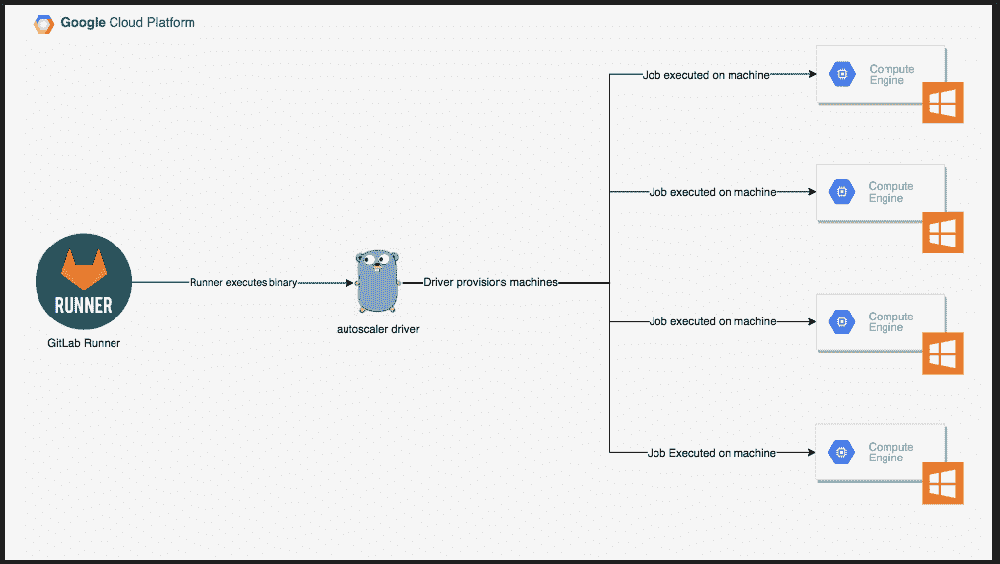

# GitLab 更新核心 CI/CD 平台

> 原文：<https://devops.com/gitlab-updates-core-ci-cd-platform/>

GitLab 本周对其同名的持续集成/持续交付平台进行了更新，承诺使管道更有效、更易于管理，此外还使在 Windows 环境中设置管道更容易。

[核心 GitLab 平台【12.7 版本增加了对父子管道和管道资源组的支持。父子管道使并发运行单独的子管道成为可能，而管道资源组使 DevOps 团队能够限制管道并发性，以更好地管理作业和资源。](https://about.gitlab.com/releases/2020/01/22/gitlab-12-7-released/)

Code Review Analytics 模块旨在更容易地找到 Review 中需要某种程度干预的合并请求，而增强的 Merge Request 小部件显示何时对特定环境进行了更改。

其他新功能包括能够使用 GitLab 集成开发环境(IDE)自动准备所有更改，以及能够与另一个组共享组访问。

最后，GitLab 增加了 Windows Shared Runner 的测试版，它通过托管服务将 Windows 环境引入 GitLab 平台。GitLab Runner 的高级产品经理 Darren Eastman 表示，Windows 环境正在成为 GitLab 平台的成熟公民，而不是必须单独下载代理软件来执行 git lab 管道上的作业。

Eastman 说，与他们的 Linux 兄弟相比，运行 Windows 的 IT 组织在 DevOps 成熟度方面仍有一点落后。然而，随着基于 Windows 上 Docker 容器的微服务的到来，采用最佳 DevOps 实践来管理应用程序开发和部署的需求变得更加明显，他说。

当然，微软正在以 Azure DevOps 的形式推自己的竞争对手 CI/CD 平台，其前身是 Visual Team Studios。GitLab 认为，大多数组织将更喜欢使用跨 Windows 和 Linux 平台的完全托管的 CI/CD 服务，尤其是在混合云计算在未来几个月和几年内获得牵引力的情况下。

无论采用何种 CI/CD 平台，随着更多依赖 Windows 构建和部署应用的组织采用 DevOps 的核心原则，DevOps 社区的整体规模将在 2020 年大幅扩大。自然，微软和竞争对手的 CI/CD 平台提供商之间的竞争将会非常激烈。从很多方面来看，微软都是一个庞然大物，主要由忠诚的开发人员组成，预计该公司会小心翼翼地保护他们。然而，随着微软在云中拥抱 Linux 和 Windows，接触过替代平台的 Windows 开发人员的数量增加了。

与此同时，拥有在 Windows 和 Linux 上构建和部署应用程序的团队的组织将面临一些文化挑战，如果他们决定在一组通用的 DevOps 流程上实现标准化。与孤立地管理每个平台不同，这是一个明显的机会来[降低成本和提高应用程序开发效率](https://devops.com/gitlab-outlines-scope-of-devops-ambitions/)。现在的问题是确定哪个 DevOps 平台可能最能让他们开始一段可能需要几年时间才能完全完成的旅程。

— [迈克·维扎德](https://devops.com/author/mike-vizard/)