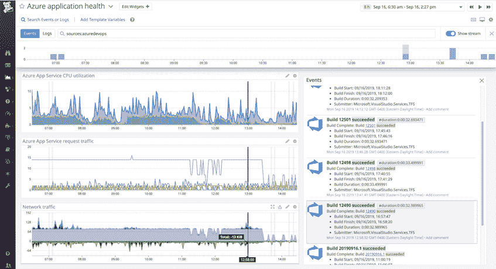

# Datadog 增加了对 Microsoft Azure DevOps 的支持

> 原文：<https://devops.com/datadog-adds-support-for-microsoft-azure-devops/>

Datadog 在其同名的监控和分析平台中添加了对微软 Azure DevOps 的支持[。](https://www.businesswire.com/news/home/20191212005797/en/Datadog-Announces-Integration-Microsoft-Azure-DevOps)

Datadog 产品和社区副总裁 Ilan Rabinovitch 表示，Microsoft Azure DevOps(正式名称为 Visual Studio Team Services)作为一个可部署在内部或云中的持续集成/持续交付(CI/CD)平台，正在获得越来越多的关注。

通过这种集成，采用 Microsoft Azure DevOps 的 DevOps 团队现在可以从他们的持续集成管道中拉入事件来创建指标，然后将该信息与 Datadog 从其整个堆栈中拉出的数据实时关联起来。Rabinovitch 说，DevOps 团队还可以配置为监控 Azure DevOps 部署管道中的网关，使他们能够自动检测和放弃不良版本。

Rabinovitch 补充说，最后，DevOps 团队还可以通过跟踪(例如，构建完成或失败的频率或代码提交的频率)来使用 Datadog 衡量他们过程的效率。

在过去的一年中，微软已经投入了大量资源来构建 Microsoft Azure DevOps。在最近的微软 Ignite 2019 大会上，该公司发布了 Azure DevOps Server update 1.1 候选版本，以解决组织在生产环境中部署该平台之前的一些 bug 问题。微软还增加了审计工具的预览，扩展了报告功能，增强了存储库页面的用户界面，使其对移动设备更加友好，并增加了更多的计费选项。

微软 Azure DevOps 将在该公司的混合云计算分叉方法中发挥更大的作用。一方面，该公司正在推动越来越大的 Azure 公共云服务组合。在内部 IT 环境中，有大量的 Windows 服务器和新生的 Azure Stack 平台，为组织提供了在公共云上部署与微软相同的 IT 环境的选项。长期目标是让组织更容易使用相同的 DevOps 管道在混合云计算环境中构建和部署应用程序。

当然，微软 Azure DevOps 并不是唯一可以用来实现这一目标的 CI/CD 平台。随着竞争对手的 CI/CD 平台继续将其触角伸向 Azure 和 Windows 环境，微软将发现自己正在与一小群竞争对手 DevOps 平台竞争，这些平台不仅涵盖 Azure、Windows 和 Linux 平台，还包括竞争对手的云平台，如亚马逊网络服务(AWS)和谷歌云平台(GCP)。

与此同时，随着 CI/CD 平台的发展，IT 组织应该会看到许多第三方工具可用于 Microsoft Azure DevOps。在某些情况下，组织将基于 Microsoft Azure DevOps 进行标准化。在其他情况下，Microsoft Azure DevOps 将成为组织内不同团队正在使用的几个 CI/CD 平台之一。然而，不管采用哪种 CI/CD 平台，最终采用多种 CI/CD 平台的组织可能希望尽可能多地整合他们所依赖的监控工具。

— [迈克·维扎德](https://devops.com/author/mike-vizard/)