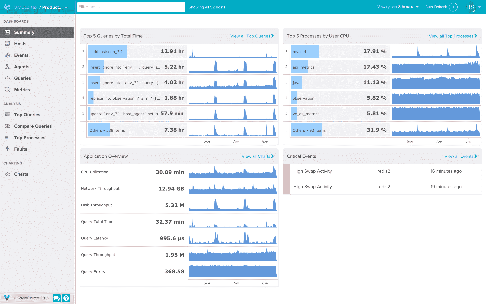

# 网络安全管理软件产品收购 VividCortex 用于数据库监控

> 原文：<https://devops.com/solarwinds-acquires-vividcortex-for-database-monitoring/>

网络安全管理软件产品本周宣布，它将通过收购 VividCortex 扩展其 DevOps 工具组合，VividCortex 是一家监控各种数据库的工具提供商，作为一套软件即服务(SaaS)应用程序提供。

公司总裁兼首席执行官凯文·汤普森(Kevin Thompson)表示，收购 VividCortex 增加了一个数据库监控平台，能够监控所谓的云原生数据库，如 MySQL、PostgreSQL、亚马逊 Aurora、MongoDB 和 Redis，补充了公司现有的监控数据库的工具，以支持遗留应用程序。

此外，Thompson 指出，VividCortex 工具是高度可扩展的；可以在 90 天内添加对新数据库的支持。

VividCortex 声称今天有近 300 个客户，包括 Etsy、GitHub、SendGrid、DraftKings 和 Yelp。与此同时，网络安全管理软件产品号称拥有 30 多万名客户。

Thompson 说，随着开源替代方案在专有数据库上取得进展，组织需要监控的数据库数量正在增加。Thompson 补充说，结果是混合计算环境需要工具进行集中管理，因为尝试并掌握为每个数据库平台提供的每套监控工具是不现实的。

他补充说，IT 组织还希望能够比较和对比在不同环境中运行的数据库上部署工作负载的成本。许多 IT 组织已经发现，在公共云上部署某些类型的工作负载的成本比预期的要高。

Thompson 说，如果不能监控应用程序所依赖的底层数据库，观察应用程序实际上是不可行的。他说，在这方面，VividCortex 为 DevOps 团队增加了一项关键能力。网络安全管理软件产品打算将 VividCortex 与不断增长的 DevOps 工具组合相集成，该组合已包括一系列应用性能管理(APM)和基础设施管理工具。一如既往，Thompson 说，IT 组织也应该期待网络安全管理软件产品降低使用数据库监控工具的成本。

Thompson 说，随着它的不断发展，网络安全管理软件产品相信会有更多的组织采用最佳开发运维实践。大部分努力将涉及对现有员工的再培训，因为没有足够的大学毕业生来填补 IT 组织内部迅速扩大的技能缺口。

目前还不清楚降低工具成本会在多大程度上加速过渡开发。许多组织已经依赖开源工具。然而，设置和维护这些工具的总成本往往会高于 SaaS 平台。此外，SaaS 平台的所有升级都由服务提供商处理。

在许多情况下，开发人员最终会采用开源工具来降低构建应用程序的成本，一旦应用程序部署到生产环境中，IT 运营团队就会使用商业工具来管理应用程序。然而，在某些情况下，开发人员所采用的开源工具最终也会在生产环境中使用。无论是哪种情况，IT 组织现在都有比以往更多的工具可供选择。

— [迈克·维扎德](https://devops.com/author/mike-vizard/)