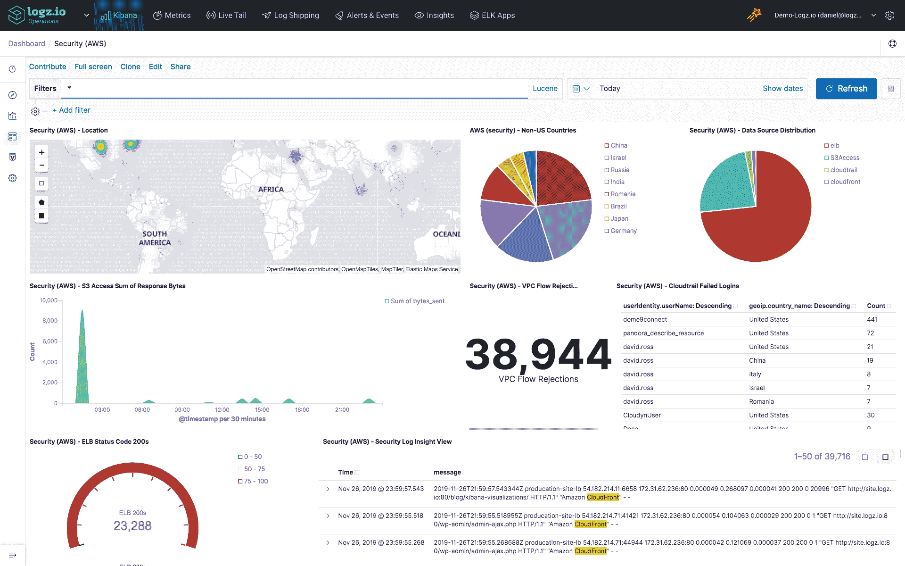

# Logz.io 增加了基于 ELK 和 Grafana 的监控服务

> 原文：<https://devops.com/logz-io-adds-monitoring-service-based-on-elk-and-grafana/>

Logz.io 今天在 [AWS re:Invent 2019](https://reinvent.awsevents.com/) 大会上推出了[云可观测平台](https://www.globenewswire.com/news-release/2019/12/03/1955661/0/en/Logz-io-Unveils-First-Ever-Open-Source-Based-Cloud-Observability-Platform-Powered-by-ELK-and-Grafana.html)，这是一个基于搜索引擎 ELK—开源 Elasticsearch 的监控和安全云服务；Logstash，一个数据处理管道；还有一套可视化工具 Kibana，以及一个分析和监控平台 Grafana。

公司首席执行官 Tomer Levy 表示，很明显，开发者对管理云原生应用的开源工具有着强烈的偏好。因此，麋鹿的认养量大幅增加。他说，随着 Grafana 的日益成熟，组织希望将开源分析和监控工具与之前对 ELK 工具的投资相结合也变得越来越明显。

然而，并不是很多 IT 组织都有很多 ELK 和 Grafana 的专业知识。为了填补这一空白，Logz.io 推出了基于 Logz.io 日志管理的托管云服务，logz . io 日志管理是 ELK 的一个实例，该公司通过机器学习算法和数据分析功能进行了增强，使 DevOps 团队能够更快地发现和解决问题。

该核心平台正在通过 logz . io infra structure Monitoring 进行扩展，这是一个基于 Grafana 的测试版监控平台，以及一个名为 Cloud SIEM 的安全信息和事件管理(SIEM)平台，该平台基于一个包含内置威胁检测工具的 ELK 堆栈。

此外，Levy 表示 Logz.io 计划增加对 Jaeger 的支持，Jaeger 是一种开源的分布式跟踪工具，正在云本地计算基金会(CNCF)的支持下开发。

Levy 说，显而易见，可观察性是 DevOps 的核心宗旨，他说这就是为什么已经有 50 万开发人员在使用 ELK 软件。组织发现的挑战是，监控基于云原生应用程序的现代 IT 环境既麻烦又耗时。Levy 指出，Logz.io 正在通过提供一个开源监控平台的企业级实例来解决这个问题，该实例带有数百个内置连接器，使 DevOps 团队能够采用一个监控平台，而不必担心被特定供应商锁定，因为他们可以随时切换到开源代码。

开发人员倾向于支持开源工具，因为他们不必等待购买许可就可以使用它们。然而，企业 IT 组织倾向于青睐由商业供应商支持的平台。Logz.io 试图通过提供对开源平台的支持来解决这个问题，该平台将使企业 IT 组织能够舒适地放弃对专有监控平台的依赖。到目前为止，Logz.io 拥有 700 多个客户，该公司希望扩大客户数量，因为它已经有了一个可以作为云服务使用的平台实例。

现在说开源平台会在多大程度上取代企业中的专有平台还为时过早。企业 IT 组织的变化往往是缓慢的。然而，随着组织采用基于微服务和容器的下一代应用，企业 IT 组织显然正在评估其未来的监控平台选项。

— [迈克·维扎德](https://devops.com/author/mike-vizard/)