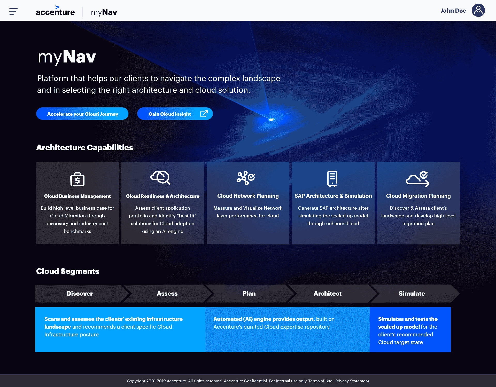

# 埃森哲云模拟平台推进 DevOps

> 原文：<https://devops.com/accenture-cloud-simulation-platform-advances-devops/>

埃森哲推出了云模拟服务，通过该服务，DevOps 团队可以更好地确定哪些工作负载将在不同的云计算环境中运行得最好。

埃森哲技术服务公司的云增长和战略主管 Kishore Durg 表示, [myNAV](https://newsroom.accenture.com/news/accenture-launches-mynav-cloud-platform-to-help-enterprises-navigate-the-cloud-landscape.htm) 是埃森哲创建的云服务，它利用机器学习算法和其他形式的人工智能(AI)来利用埃森哲在其十多年的云项目工作中开发的知识库。他说，DevOps 团队可以利用这种专业知识，而不需要埃森哲现场人员在承诺特定云计算平台之前考虑部署变量，如技术基础设施、应用程序工作负载类型、数据、运营模式甚至业务成果。

Durg 补充说，DevOps 团队还可以使用 myNAV 来进行应用程序工作负载的金丝雀测试。

采用 myNAV 的 DevOps 团队将接受一个三步流程的指导，该流程从扫描和评估现有基础架构、应用和数据环境开始，以推荐最合适的云架构。埃森哲开发的人工智能引擎然后访问埃森哲管理的知识库，提出推荐的企业架构。最后，应用模拟和测试工具来确保 IT 环境将根据需要进行扩展。

Durg 说，在过程结束时，DevOps 团队会收到一份材料清单，该清单类似于建造房屋时可能会出现的材料清单。

尽管有商品定价模型，但并非所有云计算平台都是平等的。应用程序工作负载的各种属性更适合云计算平台的不同属性。对于 It 组织来说，在遇到性能问题或发现在云上运行特定类型的应用程序的成本超出了他们的可用预算后，发现自己从云平台回滚应用程序并不罕见。

Durg 表示，3d 可视化工具通过确保选择的云环境针对该应用程序工作负载进行了优化，使确定采用哪个云平台并从投资中获得最大价值变得更加容易。他指出，埃森哲的研究表明，多达三分之二的组织没有从他们的云投资中获得最大价值，其中大多数问题源于云平台配置不佳，Durg 补充道。

不管是意外还是有意，大多数 IT 组织都在采用多种云来构建和部署应用程序，但他们的云平台选择过程往往是随意的。开发人员通常默认使用对他们来说最容易访问的云平台，这可能会造成云平台锁定。云模拟平台使整个 it 团队更容易更好地理解选择一个云平台而不是另一个云平台的利弊。

当然，大多数 IT 团队都希望将多个云的管理统一在一个控制台下，通过这个控制台，他们可以更轻松地利用混合云计算模型在服务提供商之间展开竞争。然而，在这一天到来之前，大多数 IT 组织会发现，在做出可能会后悔的决定之前，尽可能多地了解任何云平台都是有利的。

— [迈克·维扎德](https://devops.com/author/mike-vizard/)