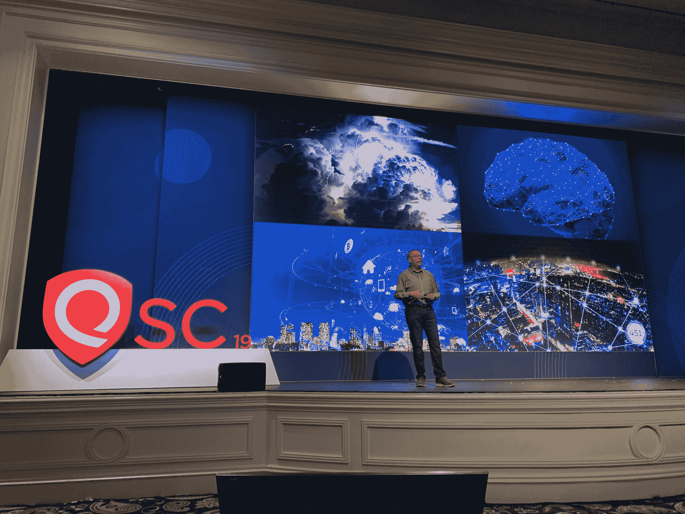
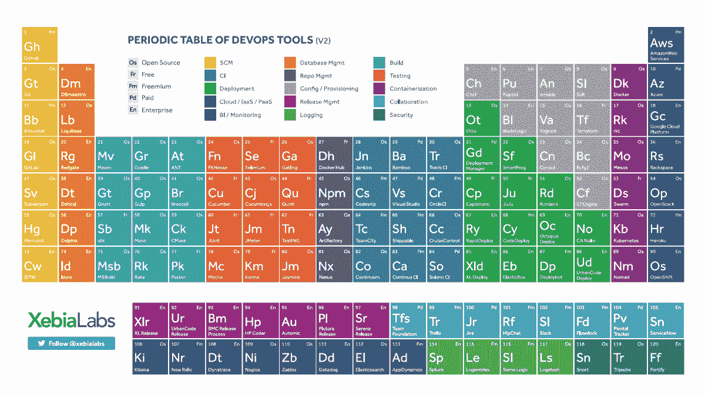

# 安全、开发运维转型的未来之路

> 原文：<https://devops.com/the-road-ahead-for-security-devops-transformation/>

本周，Qualys 在拉斯维加斯举办了 Qualys 安全会议。来自世界各地的数百名与会者聚集在贝拉焦酒店，以了解更多关于网络安全的现状和未来[的商店](https://blog.qualys.com/misc/2019/11/20/the-power-and-future-of-the-qualys-cloud-platform)。正如您所料，鉴于当今的技术形势，许多会议和讨论都围绕着 DevOps 以及网络安全如何适应 DevOps 文化。

Scott Crawford, Research Vice President at 451 Research presents “The Road Ahead for Security, IT, and DevOps” at the Qualys Security Conference

## 不断变化的技术生态系统

451 Research 的研究副总裁 Scott Crawford 在 Qualys 安全会议的第二天发表了主题演讲“安全、IT 和 DevOps 的未来之路”克劳福德谈到了过去十年左右的巨大变化——从单片到微服务，从独立应用到集成软件，从瀑布到敏捷，企业网络到物联网/ OT，从标准网络到 5G 无线，从传统 IT 到 DevOps。他讨论了组织面临的挑战，以及重复过去的成功和错过创新的困境。

随着这种技术生态系统的转变，会产生一些后果。组织不再拥有单点控制，IT 团队面临着管理和保护日益复杂的互联平台、应用程序和服务网络的挑战。

## 安全和开发

克劳福德还谈到了零信任的兴起。他将其描述为最低特权访问概念的一种混搭，结合了行为分析和按需、即时的访问管理方法。零信任模式基于“从不信任，始终验证”的前提，这意味着要根据具体情况确定谁在请求访问、他们在什么条件下请求访问以及他们打算对该访问执行什么操作。

他分享了 Xebia Labs devo PS 工具的周期表，以说明大量可用的选项，并强调了自动化的重要性。CI/CD(持续集成/持续部署)、RPA(机器人流程自动化)和 SOAR(安全协调、自动化和响应)解决方案已经开发出来，以帮助解决和管理 DevOps 部署和网络安全的一些复杂性。

[Xebia Labs](https://xebialabs.com/periodic-table-of-devops-tools/) Periodic Table of DevOps Tools

## DevOps 和数字化转型

克劳福德的主题演讲之后是题为“Qualys 平台的 DevOps 转型:经验教训”的演讲 Qualys 工程和云运营高级副总裁陈爱龙·巴赫瓦尼谈到了该公司如何解决“创新者的困境”，以及在经历自己的数字化转型时采取了哪些措施来应对成长的烦恼。

Bachwani 解释说，Qualys 的工程团队在相对较短的时间内呈指数增长。这带来了一些好处，例如他们可以多快地开发和实施新的解决方案，但该团队也面临着平衡这种增长并试图在不牺牲稳定性或可靠性的同时保持速度的挑战。

就像所有其他正在经历 DevOps 转型的组织一样，Qualys 不得不打破人员、流程和工具的孤岛。Bachwani 解释说，他们需要以不同的方式来实现尽可能多的功能自动化。他们决定将基础架构和操作视为软件问题，并找到完全自动化部署和配置的方法。

他还强调安全性必须贯穿整个 DevOps 生命周期。Qualys 采用了中心辐射型 DevOps 模型，并开发了一个强大的 DevOps 工具链，旨在组合和编排一套用于开发、交付和维护软件的有效工具。拥有一个标准化的工具链可以确保每个人都有一个通用的平台。

## 与公民开发者一起加速转型

在克劳福德主题演讲的最后，他谈到了缺乏具有正确知识和技能的人。网络安全风险投资公司预测，到 2021 年，将有 350 万个网络安全职位空缺。那只是网络安全。开发人员和其他关键人员呢？克劳福德提出了这样一个问题，“我们到哪里去找做这一切的人？”

他说，答案是公民开发商。什么是公民开发者？这是一场通过交换工具和支持来实现想法的运动。他们是最接近问题的人，也可以说是最了解如何解决问题的人。他们不需要成为专业的开发人员，也不需要有编码环境的经验。低代码和无代码平台赋予他们将想法转化为解决方案的能力。

几年前，George Hulme 写了一篇关于成长中的公民开发者运动的文章。Hulme 指出，“在公民发展方面取得成功的组织将是那些全心全意地拥抱运动并在它的帮助和指导下培养它的组织。”

DevOps 革命不会消失。不接受数字化转型的公司可能会被遗忘，因为它们被更具创新性的竞争对手远远甩在身后，而不知道如何将安全性集成到其文化结构中的组织将难以应对快速扩展和演变的威胁形势。

在这一点上，这些东西就像海洋潮汐。不管你喜不喜欢，它都会到来，它会摧毁那些没有准备好的人。Crawford 最后要求观众思考他们在构建和维护 DevOps 和网络安全的未来中将扮演什么角色。

托尼·布拉德利