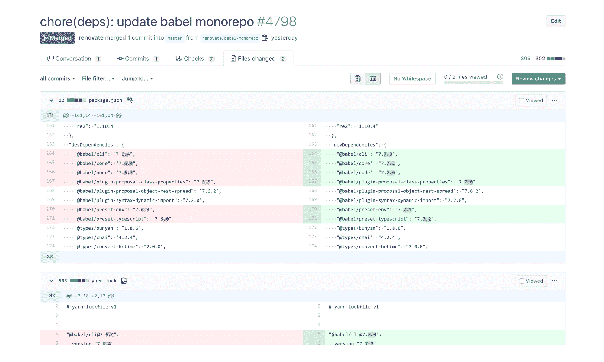

# WhiteSource 收购 renew 以自动更新依赖关系

> 原文：<https://devops.com/whitesource-acquires-renovate-to-automate-dependency-updates/>

WhiteSource】收购了 renew，这是一家开源自动依赖更新平台提供商，该公司计划免费提供该平台。

Renovate 的联合创始人 Rhys Arkins 现在是 WhiteSource 的产品总监，他说，随着软件项目变得越来越复杂，越来越需要一种机制来识别和跟踪依赖性，并在发生变化和更新时自动更新它们。

Arkins 补充说，随着基于微服务的应用程序的兴起，这种需求变得尤为迫切，这大大增加了应用程序内部和应用程序之间的依赖关系。微服务使 DevOps 团队能够更快地构建和部署应用程序，但微服务之间的依赖关系通常会导致应用程序环境变得过于复杂，难以管理。最近，revenue 增加了对 Helm Charts 的支持，这些 Helm Charts 用于在 Kubernetes 环境中打包应用程序，许多微服务现在都部署在 Kubernetes 环境中。

此外，WhiteSource 计划增加对 Cocoapods 的支持，Cocoa pods 是 Swift 和 Objective-C Cocoa 项目的依赖管理器。

在收购之前，WhiteSource 正在转售 renew platform，该平台拥有 150 多名贡献者。现在 WhiteSource 拥有了 renew 平台，包括托管的 GitHub 应用程序和自托管的 GitHub 和 GitLab 应用程序，该公司决定以 white source renew 品牌名称免费提供它。

Arkins 表示，未来，white source renew 应用程序将增加对 Bitbucket Cloud 和 Azure DevOps 的支持，从而扩大可用于降低更新风险和时间的依赖数据的来源。他补充说，实际上，WhiteSource 希望其自动化依赖平台成为任何持续集成/持续交付(CI/CD)平台的自然延伸。

Arkins 说，当谈到管理依赖性时，最大的挑战是让开发人员识别它们。在缺乏管理该过程的平台的情况下，开发人员要么根本不声明依赖性，要么更常见的是，不为他们的应用程序所依赖的特定软件版本提供正确的版本号。这个过程变得越自动化，开发运维团队就越不可能发现应用程序因为依赖而崩溃，而他们并没有意识到这一点，或者在项目过程中的某个时刻忘记了这一点。

随着 DevOps 的兴起，许多组织现在采用更结构化的方法来处理依赖关系。然而，Arkins 指出，许多组织并不知道有一个开源平台可以自动更新所有的依赖关系。

WhiteSource 因帮助组织发现开源代码中的漏洞而闻名。随着对 renew 的收购，该公司正在进一步实现其成为软件组合分析工具提供商的雄心。

究竟有多少组织会将自动化依赖关系更新平台整合到他们的 DevOps 流程中，还有待观察。虽然许多组织已经采用了 DevOps，但是 DevOps 成熟度的水平参差不齐。然而，一个组织启动的软件项目越多，就越有可能需要一种更好的方法来管理软件依赖性。

— [迈克·维扎德](https://devops.com/author/mike-vizard/)