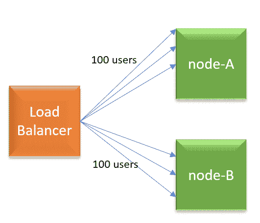
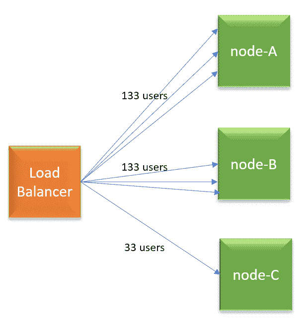

# 负载平衡:循环法可能不是正确的选择

> 原文：<https://devops.com/load-balancing-round-robin-may-not-be-the-right-choice/>

根据我们的经验，我们认为循环法可能不是一种有效的负载平衡算法，因为它不能在所有节点之间平均分配流量。你可能会想，这怎么可能？

## 循环算法是如何工作的？

循环算法按照接收请求的顺序在节点间发送请求。这里有一个简单的例子。

假设您有三个节点:节点 A、节点 B 和节点 c。

*   第一个请求被发送到节点 a。
*   第二个请求被发送到节点 b。
*   第三个请求被发送到节点 c。

负载均衡器根据这个顺序继续向服务器发送请求。这听起来像是流量将在节点间平均分配。但这不是真的。

## 循环算法有什么问题？

Figure 1: Load Balancer with 2 nodes (Round Robin).

让我们举一个简单的例子:假设您用一个负载平衡器启动了您的 web 应用程序，它后面有两个节点(node-A，node-B)。负载平衡器配置为使用循环算法运行，并且启用了粘性会话负载平衡。假设目前有 200 名用户在使用您的应用程序。由于负载均衡器中启用了循环算法，每个节点将获得 100 个用户请求。

Figure 2: New node added. Newly added node gets less traffic in Round Robin algorithm.

几分钟后，您正在添加 node-C。现在，又有 100 个用户开始使用该应用程序。由于是循环算法，负载平衡器会将新用户的请求平均分配给所有 3 个节点(即每个节点有 33 个用户请求)。但是请记住，节点 A 和节点 B 已经分别处理了 100 个用户请求。因此，现在节点 A 和节点 B 将分别处理 133 个用户请求(即 100 个原始用户请求，加上 33 个新用户请求)，而节点 C 将只处理 33 个(新)用户请求。现在，你明白为什么循环法不能平均分配流量了吗？

在循环算法中，池中较旧的节点将总是最终处理更多的请求，而新添加的节点将最终处理较少的流量。负载永远不会均匀分布。出于维护、修补和安装目的，您必须不断地在负载平衡器池中添加和删除节点。如果您就地使用自动伸缩，情况会变得更糟，因为在自动伸缩中，节点更加动态。它们被更频繁地添加和删除。

## 用什么算法？

Figure 3: New node added. Traffic is evenly distributed in Least Connections.

有多种负载平衡算法:加权循环法、随机法、源 IP、URL、最少连接数、最少流量、最少延迟。鉴于循环赛的缺点，你可以考虑尝试其他选择。你可以考虑的一个选择是:最少连接算法。按照这种算法，拥有最少连接数的节点将获得下一个请求。因此，根据我们之前的示例，当 100 个新用户开始使用应用程序时，所有新用户请求都将被发送到 node-C。因此，负载将在所有节点之间平均分配。

— [苏亚宝贝](https://devops.com/author/surya-baby/)