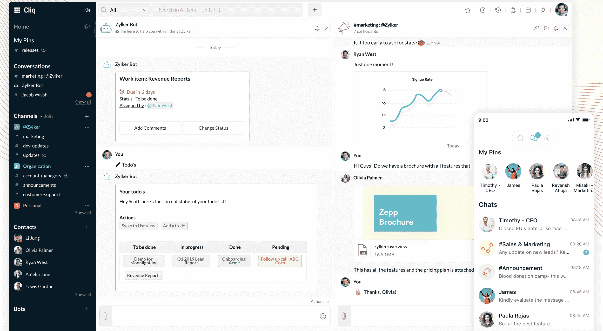

# Zoho 提供免费的 SaaS 应用程序来对抗冠状病毒的传播

> 原文：<https://devops.com/zoho-offers-free-saas-apps-to-combat-coronavirus-spread/>

Zoho 今天宣布，它将在 7 月 1 日之前免费提供一组软件即服务(SaaS)应用程序，远程命名为。

Zoho 的首席传道者 Raju Vegesna 说，远程是一种人道主义姿态，有助于减轻全球冠状病毒流行病的影响。Remotely 由一组生产力和协作应用程序组成，用户只需五分钟即可访问这些应用程序。

远程包括生产力、协作和项目管理应用程序，以及自动将数据迁移到 Zoho 云平台的工具。

Vergesna 表示，Remotely 还通过使 IT 团队能够对允许员工访问的数据进行安全控制来解决网络安全问题。当然，在许多情况下，IT 组织仍然需要[确保用于访问 SaaS 应用程序的网络连接是安全的](https://securityboulevard.com/2020/03/coronavirus-concerns-to-put-remote-access-to-the-security-test/)。

现在，许多地方政府都建议组织允许员工在家工作，以帮助限制冠状病毒爆发的传播，许多 it 管理员都在争先恐后地提供对应用程序的远程访问。为可能会间歇性出差的少数员工提供访问是一回事，但在一段未知的时间内为整个远程工作人员提供支持则是另一回事。

然而，Vergesna 说，在这一点上，与实现这种转变相关的挑战更多地是克服文化问题，而不是技术问题。他说，向 Zoho SaaS 应用程序的大部分过渡已经实现了自动化。

冠状病毒爆发可能会在多大程度上加速向云应用的过渡，这仍有待观察。许多 IT 管理员仍在管理 Windows 服务器的本地实例来交付应用程序，因为迁移到 SaaS 应用程序需要大量的时间和精力。从技术角度来看，让这些本地应用程序大规模远程可用不仅具有挑战性，而且成本高昂。

当然，Zoho 远非 SaaS 生产力和协作应用的唯一提供商。然而，其他提供商是否会效仿 Zoho，还有待观察。这些供应商都希望，一旦冠状病毒危机过去，许多利用其软件让员工在家工作的组织将开始付费使用该软件。

与此同时，冠状病毒的经济影响可能是惊人的。会议被取消，面对面的商务会议被转移到网上。很难说这些会议中有多少可能会永远留在那里。至少，更多的最终用户将会发现 SaaS 应用程序环境变得多么丰富。在许多情况下，IT 团队会使用应用程序编程接口(API)将一系列 SaaS 应用程序的工作流连接在一起。他们将面临的挑战是获得构建这些工作流所需的编程技能。

— [迈克·维扎德](https://devops.com/author/mike-vizard/)