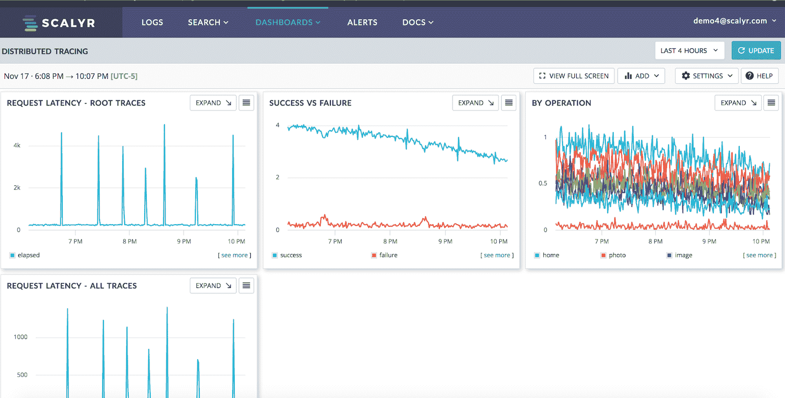

# Scalyr 改变了测井分析经济学

> 原文：<https://devops.com/scalyr-alters-log-analytics-economics/>

Scalyr 今天宣布，其日志分析云服务现在能够[实时接收每个客户每天超过 200TBs 的数据](https://www.prnewswire.com/news-releases/scalyrs-sonic-boom-breakthrough-delivers-enterprise-caliber-log-analytics-with-best-in-class-performance-and-affordability-301039851.html)。

公司首席执行官 Christine Heckart 表示，目标是以低于每 GB 5 美元的价格提供尽可能多的日志数据。

Heckart 表示，Scalyr 希望能够继续扩大其向客户提供的数据量，因为其同名平台是建立在柱状数据存储而不是索引引擎的基础上的。她说，一个名为“音爆”的项目的目标是最终为云服务用户提供 1pb 的数据。

日志分析的一个悖论是，虽然 IT 组织被鼓励使用这些数据在问题变成大问题之前主动识别问题，但存储这些数据的成本通常会导致 IT 组织限制他们分析的日志数据量。因此，他们经常错过可能对 IT 环境有重大影响的异常事件。

她说，作为一种与亚马逊网络服务(AWS)定义的 S3 存储接口兼容的云服务，Scalyr 采用的柱状存储引擎更容易将云存储的经济性传递给最终客户。新冠肺炎疫情事件之后，IT 成本当然会成为一个更大的问题。随着组织适应一夜之间变得更糟的经济，IT 的几乎每个方面，包括日志分析，都可能在未来几周和几个月内受到成本审查。

Heckart 说，许多组织在日志方面将面临的问题是，数据是任何数字流程的生命线。组织可能不需要永远存储这些数据，但分析日志数据以识别异常(例如，网络安全违规)现在几乎成了日常工作。因此，在哪里以什么样的成本提供多少日志数据成为争论的话题。

当然，在本地存储日志数据可能成本更低。但是，IT 人员中需要有人来管理这些日志。Scalyr 和其他基于 SaaS 的日志分析平台提供商认为，依靠云服务来管理日志数据更具成本效益，而且通过共享分析工具也更容易访问日志数据。

不管可用的 IT 资源有多少，有一点是肯定的，即数据量和数据分析速度都不会很快放缓。事实上，许多组织可能会加快向数字流程的过渡，这些流程最终会比现有流程更加灵活且更具成本效益。这将取决于 DevOps 的领导者如何利用手头的任何资源来最好地跟上这种变化的速度。

— [迈克·维扎德](https://devops.com/author/mike-vizard/)