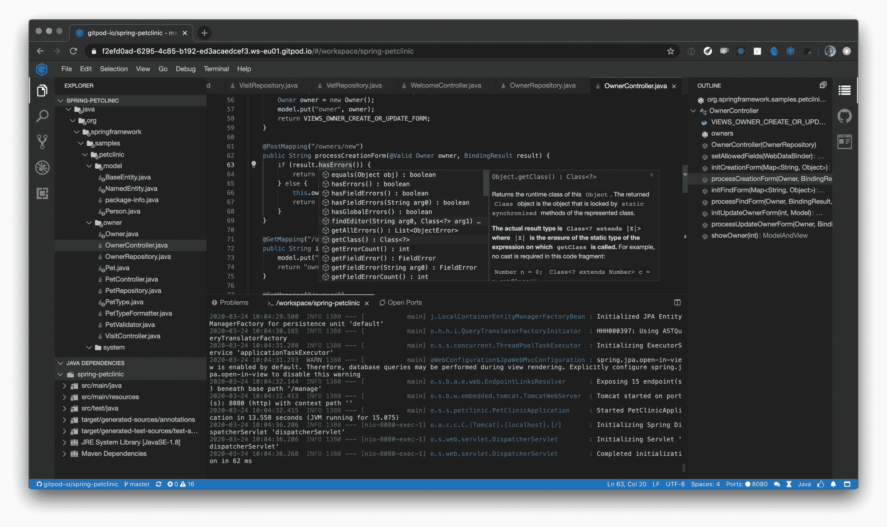

# Eclipse 基金会兑现了忒伊亚承诺

> 原文：<https://devops.com/eclipse-foundation-delivers-on-theia-promise/>

Eclipse Foundation 已经[发布了忒伊亚 1.0](https://www.globenewswire.com/news-release/2020/03/31/2009010/0/en/The-Eclipse-Foundation-Releases-Eclipse-Theia-1-0-a-True-Open-Source-Alternative-to-Visual-Studio-Code.html) ，这是微软 Visual Studio (VS)代码编辑工具的开源替代品。

Eclipse 基金会的执行董事 Mike Milinkovich 表示，忒伊亚将为 IT 团队提供一个免费的代码编辑选项，可以部署在内部或与 Eclipse 集成开发环境一起部署在云上。相比之下，VS 代码现在只能在桌面上运行，他说。

虽然许多开发人员仍然喜欢在他们的桌面上编写代码，但 Milinkovich 指出，现在有更多的代码是在云中与其他开发人员合作编写的。他补充说，随着更多的开发人员在家工作，作为减轻新冠肺炎疫情影响的努力的一部分，这种转变的速度只会加快。

为了提供对云中代码编辑器的访问，忒伊亚在两个独立的前端和后端进程中运行，这两个进程通过 WebSockets 上的 JSON-RPC 消息或 HTTP 连接上的 REST APIs 进行通信。这两个过程都公开了一个依赖注入(DI)容器，可以对其进行扩展。Milinkovich 指出，这些扩展也可以通过 Eclipse 基金会市场获得。

事实上，他说，Eclipse 基金会预计更多的开发者将通过第三方应用开发平台首先接触到忒伊亚。忒伊亚项目的早期采用者和贡献者包括 ARM、Arduino、爱立信、Gitpod、谷歌云、IBM、Red Hat、SAP 和 TypeFox。然而，微软到目前为止还没有表示出任何参与忒伊亚项目的兴趣。Millinkovich 指出，在许多情况下，这些供应商将使忒伊亚成为这些供应商已经作为云服务提供的 DevOps 环境的扩展。

编写代码的未来显然变得更加混合。应用程序开发人员总是希望有灵感的时候能够在本地编写代码。由于云计算的兴起，协作的水平正在发生变化。小团队的开发人员一起编辑代码变得容易多了，这在理论上应该会减少调试，因为更好的代码是在过程的前端创建的。该理论自然实现的程度将根据任何开发团队的个人技能而有所不同。

与此同时，Millinkovich 表示，Eclipse 基金会仍然致力于扩大现在可以通过云访问的开源工具的范围，包括 Che，一个集成开发环境(IDE)；CodeWind，一个在 Eclipse 基础上增加对 ide 容器支持的项目；Eclipse Dirigible，SAP 开发的基于云的开发平台；Eclipse Sprotty，一个图表框架；以及基于浏览器的集成平台 Eclipse Orion。

所有这些项目达到推动主流采用所需的成熟度水平可能需要一段时间。然而，随着这些项目工作的继续，进入云的开源应用程序开发工具的数量在未来几个月只会加速增长。

— [迈克·维扎德](https://devops.com/author/mike-vizard/)