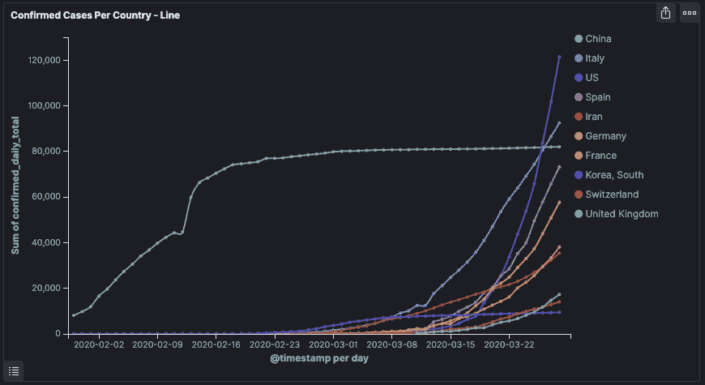

# Logz.io 推出新冠肺炎仪表盘

> 原文：<https://devops.com/logz-io-launches-covid-19-dashboard/>

Logz.io 本周推出了一个[社区新冠肺炎仪表板项目](https://logz.io/blog/community-covid-19-dashboard-project/)，旨在为软件开发人员和数据科学家提供可靠的数据源，以评估疫情的全球影响。

Logz.io 的产品宣传员 Dotan Horovits 表示，其目标是通过使用基于开源 Kibana 软件的公共仪表板来访问数据，从而帮助组织理解往往相互冲突的数据。他说，数据本身存储在一个弹性搜索库中。

他补充说，Logz.io 还计划通过基于开源 Grafana 软件的仪表板访问数据，以便更容易地浏览时间序列数据。

Horovits 承认，关于新冠肺炎疫情的数据充其量是不稳定的。然而，随着时间的推移，通过应用分析识别可疑数据将变得更加容易。他说，新冠肺炎提供的大部分数据都是格式良好的；面临的挑战只是找到一种方法，以一种广泛的潜在最终用户可以访问的方式来聚合这些数据。

在短期内，Loz.io 设想第一反应者等组织使用仪表板来帮助优化有限资源的部署。从长远来看，这些数据还可以用来评估疫情对从环境和经济到生活在不同地区的人们的精神健康等方方面面的影响。Horovits 补充说，至少，访问可以大大减少新冠肺炎错误信息的传播。

Logz.io 从约翰霍普金斯大学的新冠肺炎数据开始。除了这些核心数据之外，该公司还在整合来自媒体、政府和世界卫生组织(世卫组织)等其他公共来源的数据。该公司还邀请任何收集了新冠肺炎数据的组织为该项目做出贡献。

当然，许多组织将使用 Logz.io 和类似计划提供的数据来构建广泛的分析应用程序。例如，通过更快地识别个人正在经历高烧的区域，有可能避免未来的大流行。考虑到这些应用程序的重要性，很可能大多数应用程序都需要使用最佳开发运维实践来构建，以确保及时交付。

尚不清楚疫情将如何推进数据科学。组织多年来一直在利用大数据分析应用程序。然而，疫情可能会导致在全球基础上聚合和分析医疗数据的更雄心勃勃的努力。可以说，正是由于缺乏可靠的数据，才使得病毒传播如此广泛。否则，像社会距离这样的举措可能会更早实施，医疗机构也会配备更多的设备。

与此同时，除了像其他人一样在家工作之外，大多数 IT 专业人员可能没有太多办法来应对当前的疫情。然而，在防止下一次爆发方面，应用于病毒研究的数据科学专业知识水平可能很快成为数百万人的生死问题。

— [迈克·维扎德](https://devops.com/author/mike-vizard/)