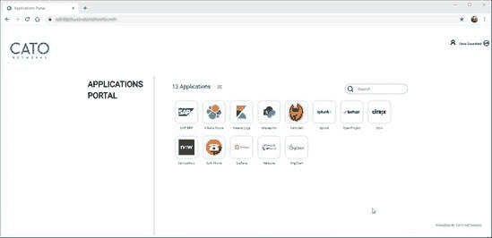

# 卡托网络公司提供即时 SD-WAN 服务

> 原文：<https://devops.com/cato-networks-offers-instant-sd-wan-service/>

Cato Networks】为其软件定义的广域网服务(SD-WAN)服务增加了即时启动功能，使 it 团队能够更轻松地为员工提供远程应用访问。

Cato Networks 的技术宣传员 Dave Greenfield 表示，IT 团队无需在每台设备上配置和安装虚拟专用网络(VPN)客户端来访问应用程序，只需共享一个 URL，即可通过单点登录协议提供网络访问，而无需客户端软件。他说，在许多 IT 团队争先恐后地允许每个员工在家工作以帮助抗击新冠肺炎冠状病毒传播的时候，卡托软件定义的边界(SDP)服务提供了一种替代方法来大规模实现这一目标。

Cato SDP 网络是由 Cato Networks 共同管理的全球 SD-WAN 服务的一个实例。IT 团队仍然使用多因素身份认证来控制谁有权访问哪些应用，而 Cato Networks 则管理底层网络和安全基础设施，包括所有防火墙和终端保护软件。因此，Greenfield 说，Cato SDP 是基于 Gartner 现在描述的安全访问服务边缘(SASE)架构的服务的首批实例之一。

Greenfield 表示，试图使用传统的 VPN 软件来扩展访问是有问题的，因为这需要 it 团队获得更多的软件许可证和带宽，而最终用户则被提供了访问公司网络的密码，这很容易被黑客攻击。也许最有问题的是，大多数 VPN 限制了网络上允许的同时用户数量。

Greenfield 表示，Cato SDP 提供了对零信任网络环境的访问，该环境只提供对最终用户专门授权使用的应用程序的访问，并指出所有这些都可以在短短 10 分钟内完成。

自新冠肺炎疫情爆发以来，Greenfield 表示，Cato Networks 的全球网络使用量急剧增加，该网络由分布在世界各地的第三方数据中心的接入点组成。这种设置可以根据最终用户实际访问互联网的位置来优化应用体验。

新冠肺炎疫情消退可能需要几个月到两年的时间。今天可能被视为单一破坏性事件的事件很可能预示着组织从现在开始需要如何工作。即使 IT 团队让他们组织中的每个人都在家运行，他们中的许多人也必须问自己，他们准备在多长时间内将 IT 作为远程服务来管理。基于 SASE 的服务的出现提供了一种替代的共管方法，允许 IT 团队依赖外部服务提供商，而不必将对其应用程序的控制权交给托管服务提供商(MSP)。

自然，在当前的危机消退到足以让组织意识到他们可能需要从根本上改变他们消费 it 的方式之前，可能还需要一段时间。目前唯一可以确定的是，对话几乎是不可避免的。

— [迈克·维扎德](https://devops.com/author/mike-vizard/)