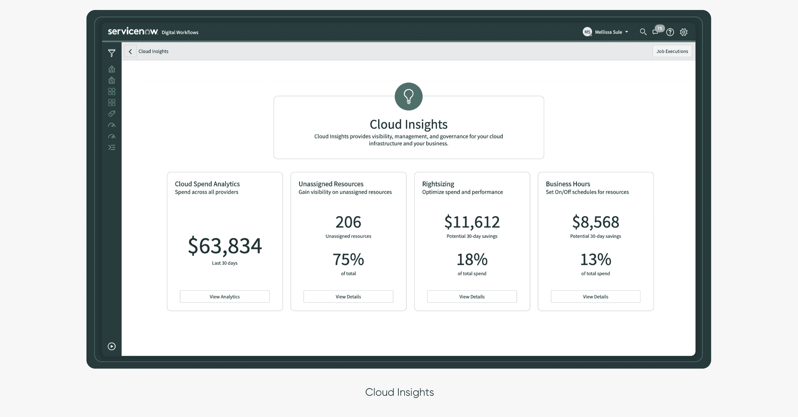

# ServiceNow 采用人工智能来管理它

> 原文：<https://devops.com/servicenow-embraces-ai-to-manage-it/>

ServiceNow 发布了其云平台的 [Orlando](https://www.businesswire.com/news/home/20200311005232/en/ServiceNow-Introduces-Intelligence-–-AI-Analytics-Drive) 更新，增加了高级分析和人工智能(AI)功能。

此外，[现有的集成框架](https://devops.com/servicenow-makes-the-devops-connection/)使 ServiceNow 平台能够管理第三方平台创建的 DevOps 管道，现已成为核心平台的一部分。以前，该功能只能作为附件从 ServiceNow 在线商店下载。

service now it 工作流高级副总裁 Pablo Stern 表示，随着基于 ITIL 的框架和 DevOps 继续融合，IT 团队显然也需要更多地依赖人工智能来管理日益复杂的 IT 环境。

他说，嵌入 Now 平台的 Now 智能功能将通过提出见解和建议来解决这一问题，从而在问题成为重大问题之前预测和解决问题。

IT 团队还可以利用“永不停机的虚拟代理”来跟踪和自动启动特定的工作流。
Now Intelligence 提供的分析功能还包括如何根据可用的计费选项优化云资产使用的建议，以及评估业务风险的能力。后一种功能包括软件和硬件的漏洞评估，可用于自动触发补救过程。

ServiceNow 还增强了对移动计算平台的支持，并增加了对工作分配的代理关系，允许 IT 团队将工作分配给最擅长处理特定问题或熟悉特定最终用户的代理。

总的来说。Stern 表示，IT 组织最好开始消除 DevOps 和基于 ITIL 的传统 IT 管理方法的拥护者中存在的许多偏见。根据手头的任务，这两种方法同等重要。他说，现在的挑战是提供一个公共数据池，为这些过程提供信息。

毫无疑问，ITIL 和 DevOps 框架将在未来许多年继续并肩发展。事实上，ITIL 框架的最新版本从 DevOps 实践者开创的最佳实践中借用了许多灵活管理 IT 基础设施的概念。需要达到的平衡是找到一种方法来更快地响应快速变化的应用程序和业务条件，同时不牺牲管理 IT 的结构化方法，这种方法可以持续扩展具有高度弹性的系统。

自然，要达到平衡可能还需要一段时间。然而，人工智能将在帮助组织实现这一目标方面发挥关键作用。鉴于现代 it 环境的复杂性，依靠无法扩展的手动流程或自定义脚本来有效管理 IT 是不可能的。人工智能不太可能很快取代对人类 IT 专业知识的需求，但它将大大有助于最大限度地利用已经不堪重负的资源，这种资源往往比任何人都愿意承认的更容易出错。

— [迈克·维扎德](https://devops.com/author/mike-vizard/)