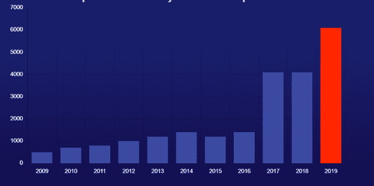

# 开源漏洞在 2019 年增长了 50%——它将如何影响 2020 年的软件开发？

> 原文：<https://devops.com/open-source-vulnerabilities-were-up-50-in-2019-how-will-it-impact-software-development-in-2020/>

近年来，开源漏洞一直在增加，但 2019 年确实是创纪录的一年，比前一年增加了近 50%。

根据白源研究团队最近发布的开源安全漏洞 [状态](https://www.whitesourcesoftware.com/open-source-vulnerability-management-report/?utm_source=devops-com&utm_medium=channel&utm_term=annual-report-blog-promotion&utm_content=the-state-of-open-source-security-vulnerabilities&utm_origin=3rd&utm_from=devops-com) 报告，漏洞数量从 2018 年的 4100 个跃升至 2019 年的 6100 个。

Figure 1: Number of reported open source vulnerabilities per year.

为了更好地理解开源漏洞数量增加背后的原因，它告诉我们现代软件开发中开源使用的状态，甚至我们在未来几年可能走向何方，让我们看看该报告的调查结果，了解开源安全的现状。

## **代码越多，漏洞越多**

根据研究报告，开源漏洞增加的主要驱动力是开源的增长。现在有比以往更多的开源项目、代码和社区成员。

所有这些好人都在努力工作，不仅要写更多的代码，通常是在大型 [科技巨头](https://www.forbes.com/sites/adrianbridgwater/2019/09/07/the-impact-of-the-tech-giants-on-open-source/#c690a65d2777) 的支持下，还要找出代码中的漏洞，这些漏洞可能会让他们的组件的用户处于危险之中。编写的代码越来越多，审查代码中不可避免的人为错误的人越来越多，这两者结合在一起产生了大量被报告的漏洞。

开源组件中漏洞数量的增加会对软件开发产生相当大的影响。近年来，我们已经看到开源组件在开发人员构建应用程序的过程中发挥着越来越大的作用。大多数估计认为，在大多数现代应用程序中，开源组件占代码库的 60-80%。当 Apache Struts 或 Linux 内核等受欢迎的项目中报告了一个漏洞时，大量开发人员可以快速找到他们需要修补的软件。

## 好的、坏的和集市

WhiteSource 的研究透露了一个令人欣慰的消息，超过 85%的开源安全漏洞都有可用的补丁。

这种进步的原因之一是，越来越多的企业依赖开源组件来开发自己的软件，因此他们投资于使其更加安全，通过 [漏洞奖励计划](https://www.hackerone.com/internet-bug-bounty) ，支持开源安全的 [基金会](https://www.linuxfoundation.org/projects/security-compliance/) 或支持 项目本身。

然而，尽管该领域的情况似乎正在改善，但仍有一段路要走。

许多已发布的开源漏洞没有在一个中心位置进行索引，这一事实增加了开发团队试图掌握已发布的开源安全漏洞的挑战的复杂性。如果专有软件仍然被认为是经典的 [大教堂](https://en.wikipedia.org/wiki/The_Cathedral_and_the_Bazaar) ，井井有条的信息和一个屋檐下的支撑，那么开源就是非常多的集市。

white source 报告发现，只有 84%的已知开源漏洞出现在国家漏洞数据库(NVD)中。这意味着关于另外 16%的已知漏洞的信息就在那里，分布在广泛的资源中。这些可能是安全建议、错误跟踪器和其他位置的清单。虽然最初没有在 NVD 上发布的 45%的已报告开源漏洞最终会出现在那里，但这可能需要几个月才能在其他资源上发布。

组织面临的挑战是，他们冒着使用不知道安全更新的易受攻击组件的风险，而黑客正在搜索所有资源，寻找可能成为他们下一顿饭的漏洞。

考虑到组织面临的不断发展的安全挑战，开源安全在未来一年的前景如何？

## **我们对 2020 年的预测**

我们可以提供的最简单的预测是，2020 年报告的开源漏洞将比 2019 年发布的还要多。唯一的问题是:它会有多大？由于最近的进步使报告变得比以往任何时候都更容易，以及一个开源漏洞，这个数字可能会更大。

在过去的一年里，GitHub 安全实验室成立，旨在帮助研究人员、维护人员和用户轻松报告开源漏洞，并在一个集中的位置发布经过验证的修复程序。通过简化报告和文档过程，GitHub 在帮助他们的用户以更高质量的报告保护他们的软件方面取得了很大的进步。

## **关键要点**

对许多人来说，报告的开源漏洞数量的增加可能令人担忧，这让我们不得不面对这样一个事实:我们的软件中可能现在就有很多这样的漏洞。然而，情况实际上正在改善，甚至朝着正确的方向发展。当报告了易受攻击的开源组件时，我们可以跟踪它们并快速采取补救措施。只有当你知道你有问题时，你才能开始解决它。

希望安全意识的提高将继续推动一个更强大、更有组织性和更受支持的开源社区，它将在面对更多可能在明年的研究报告中出现的漏洞时具有弹性。