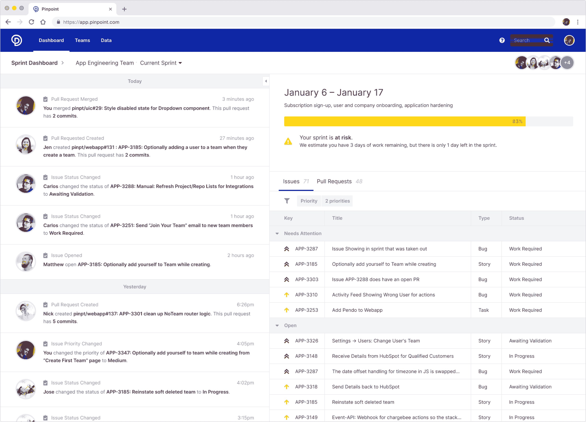

# Pinpoint 为多个 DevOps 平台推出仪表板

> 原文：<https://devops.com/pinpoint-unveils-dashboard-for-multiple-devops-platforms/>

Pinpoint 今天为软件开发团队[推出了一个同名的操作仪表板，旨在跨越多种工具和平台](https://www.globenewswire.com/news-release/2020/04/15/2016459/0/en/Pinpoint-Debuts-First-Engineering-Operations-Dashboard.html)。

公司首席执行官 Jeff Haynie 表示，Pinpoint 仪表板提供了软件开发项目的整体视图，无需在多个管理控制台中为构成 DevOps 工具链的每个工具和平台打开标签。他说，IT 领导者可以采用单一问题工作流仪表板来实时跟踪通常采用的 DevOps 平台(如吉拉、Azure Team Foundation Server (TFS)、GitLab、GitHub 和 Bitbucket)中发生的活动。

Haynie 说，DevOps 团队可以更容易地深入到问题的细节或拉式请求，以从单个控制台查看跨多个平台的工作流。他指出，以前，DevOps 团队要么必须自己创建和维护这些集成，以创建一个通用控制台，要么登录到多个管理工具，从而难以关联跨多个平台发生的数据和事件。

Haynie 说 Pinpoint 希望大多数组织使用它的软件来识别软件开发过程中的瓶颈。Pinpoint 还嵌入了基于机器学习算法的模型，以根据从事项目的开发人员数量、组织历史和预计的截止日期来预测哪里可能出现问题。

Haynie 指出，目标是确保组织不仅仅是更快地编写更多代码，而是在正确的时间编写正确的代码，以使某些应用程序开发项目保持正轨。

各种 DevOps 平台的提供商最近一直在投资类似的工具，但 Haynie 指出，这些产品都是针对特定平台优化的。他说，Pinpoint 仪表板可以与任何平台集成，为跨各种工具和平台的复杂工作流提供急需的可见性。

在新冠肺炎疫情之后，这些项目的可见性变得前所未有的重要。许多组织正试图加速应用程序开发项目，作为将新生项目整合到更大的依赖于数字业务流程的业务连续性战略的努力的一部分。因此，在特定日期之前完成应用程序开发项目的可行性已经成为一些组织内部激烈争论的问题。

当然，一些组织可能会利用 Pinpoint 提供的可见性来欺压开发人员。然而，Haynie 说，Pinpoint 预计大多数组织将采用 Pinpoint 来促进合作，而不是简单地关注交付日期。他指出，从商业角度来看，软件工程的最大问题之一是，它是一个“黑箱”，使得组织很难进行规划。

毫无疑问，在应用程序开发团队内部和外部都存在不同程度的挫败感，因为项目之间存在着各种依赖关系。例如，如果有人意识到一个项目需要一些额外的开发人员来满足一个必须在其他项目开始之前完成的期限，那么许多问题都可以避免。现在说揭开软件开发的神秘面纱会对整个商业产生什么影响还为时过早，但是最起码每个人都应该更加重视实现一个应用程序所需要的东西。

— [迈克·维扎德](https://devops.com/author/mike-vizard/)