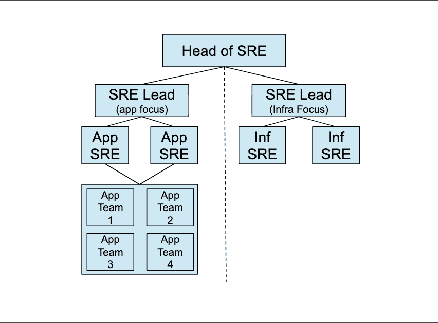
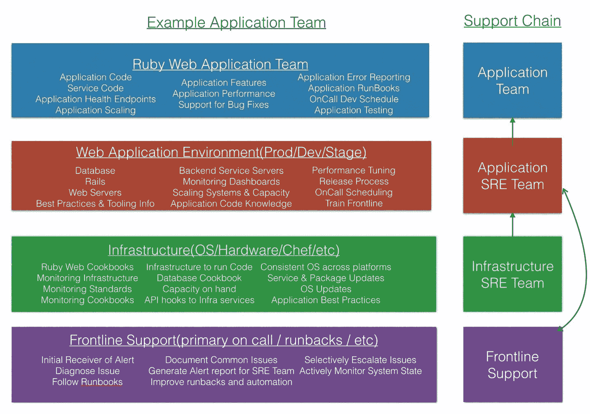

# SRE(第二部分):实用的方法

> 原文：<https://devops.com/sre-part-2-a-practical-approach/>

在我上一篇关于 SRE 文化的文章中，我讲述了定义 SRE 对你的团队意味着什么的基本知识。然而，一些团队可能不需要专门的 SRE 支持。这就是中央组织派上用场的地方。专用资源专注于构建指导方针、标准、服务和平台，供团队使用，能够在您的环境中自主运行。拥有一个广泛沟通的中心团队还可以让这些其他团队知道当他们需要帮助或者想要一些关于他们的技术堆栈的建议时去哪里。

## **应用/服务 SRE 对基础设施 SRE**

**应用 SRE 包括:**

*   嵌入式应用/服务团队。
*   新服务和基础设施的架构指南。
*   现代技术的设计和实施。
*   应用/服务团队内部的支持。
*   团队应用和服务的自动化。
*   操作工作的自动化。
*   应用/服务团队的监控/指标。
*   代码的基准测试和性能帮助。
*   应用和服务的基础设施部署和架构。
*   为应用/服务堆栈发出的警报编写文档和操作手册。

**基础设施 SRE 包括:**

*   构建和管理“管道”技术基础设施(供应、操作系统、dns、dhcp、网络、中央认证等)。).
*   基础设施服务的自动化(遥测、监控、日志汇总、配置管理、异常检测、协调等)。).
*   构建和管理可消费的服务和工具(消息队列、数据库、分布式计算场、API 服务/集成、容器等)。).
*   基础设施即代码(IaC)。
*   实施全球 IR & IM 流程。
*   对应用程序 SRE 团队的支持。
*   架构指南和最佳实践文档。

## **组织布局**

不管我们愿不愿意相信，组织结构确实有助于整个团队的交流。它允许团队领导组成一个单一的任务，并由他们的团队成员执行该任务。我在《SRE 纳尼亚指南》的第一部分中提到，我认为这个组织必须集中起来才能成功。下面是一个高级概述，显示了应用程序 SRE 和基础架构 SRE 之间的分离。

领导可以处理多个团队和学科。这可以在您的组织内根据您的需要进行缩减和扩展。申请 SRE 是直截了当的。基础设施 SRE 可以嵌入到现有的基础设施团队中，或者组建一个专注于特定项目的新团队。

## **SRE 互动的例子**

下面是一个应用程序团队(这个团队运行一个 ruby 应用程序)和 SRE 层级之间的交互示例。您将看到一个名为“前线支持”的团队作为初始交互。这个团队不是必需的，但也是一个很好的团队。它在任何大小的环境中都有帮助，并且可以真正卸载大量的操作工作负载，同时对出现的问题有一个全局视图。

前线支持的职责是遵循监控系统中的警报运行手册。它类似于传统的 NOC，但在他们关注的整个堆栈中有更多的专业知识。它还允许进行趋势分析，并将数据带到围绕系统中重复出现的问题或错误的对话中。

我建议初级团队成员以此为起点。它允许他们快速学习这个系统，并与这个团队中或本周有寻呼机的更有经验的成员交朋友。这是培训和雇佣技术员工的好方法。没有什么比给他们看坏掉的东西更好的了。

## **总结**

总的来说，每个人的旅程都会不一样。有相当多的书籍和例子存在，但请仅将它们作为想法，以形成您对这些组织应该如何工作的看法。没有处方，没有什么是完美的。我在这篇文章中遗漏了相当多的信息，但我总是对关于这个话题和其他类似话题的对话感兴趣。你会看到一个一致的主题，那就是塑造文化。关注你的文化，雇佣优秀的人才和优秀的领导者。祝你好运，黑客快乐。

安东尼·卡亚法