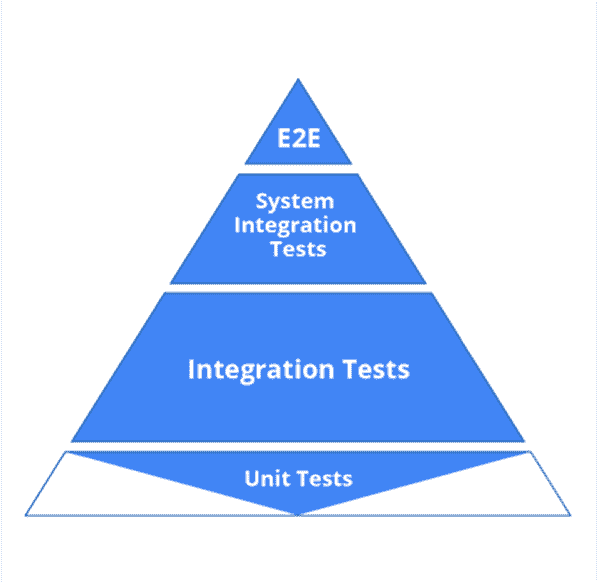
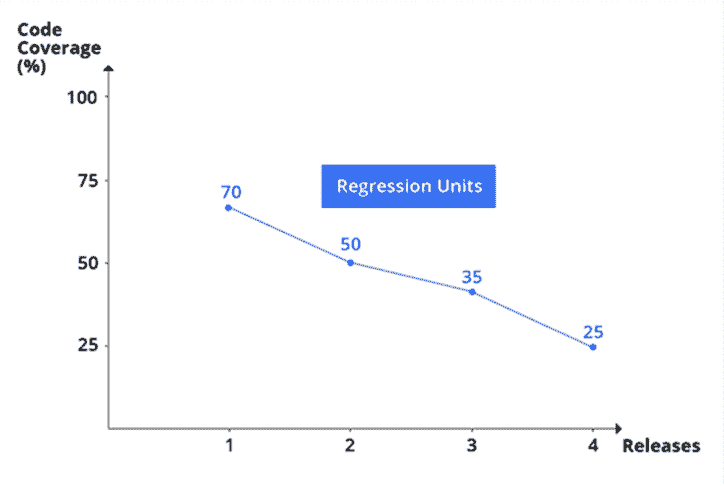
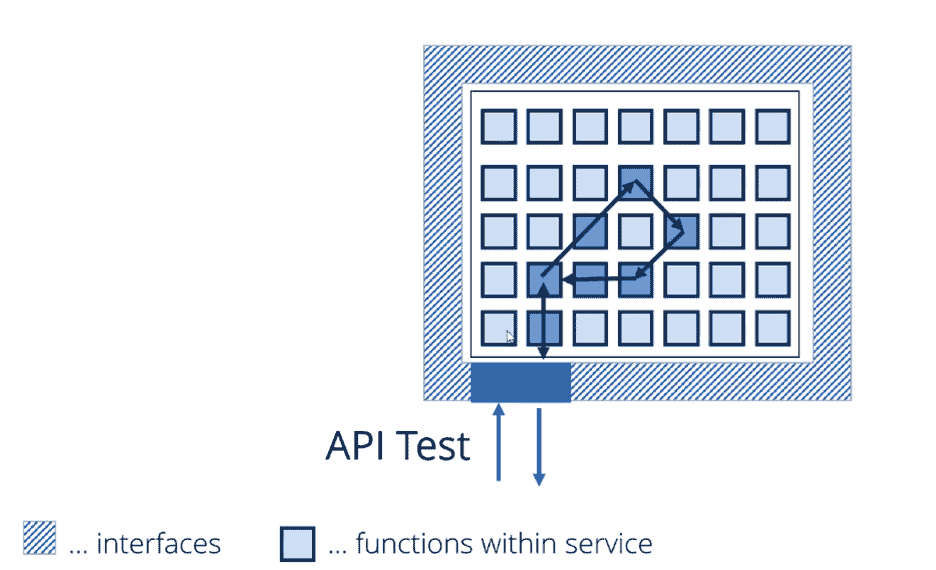
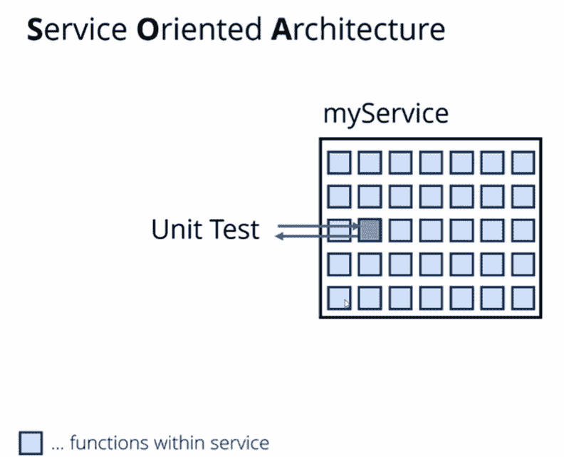
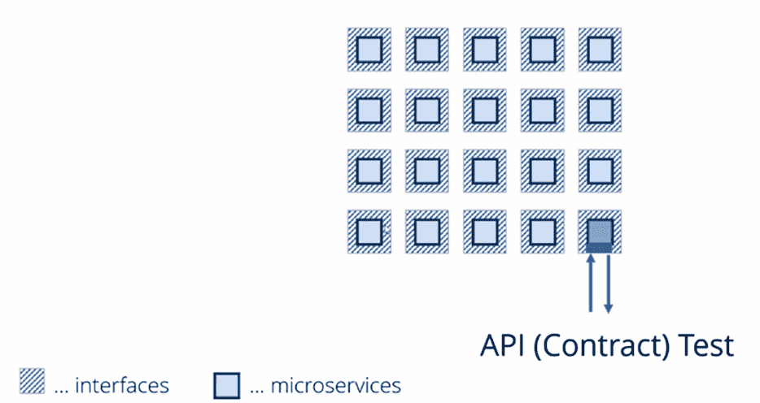
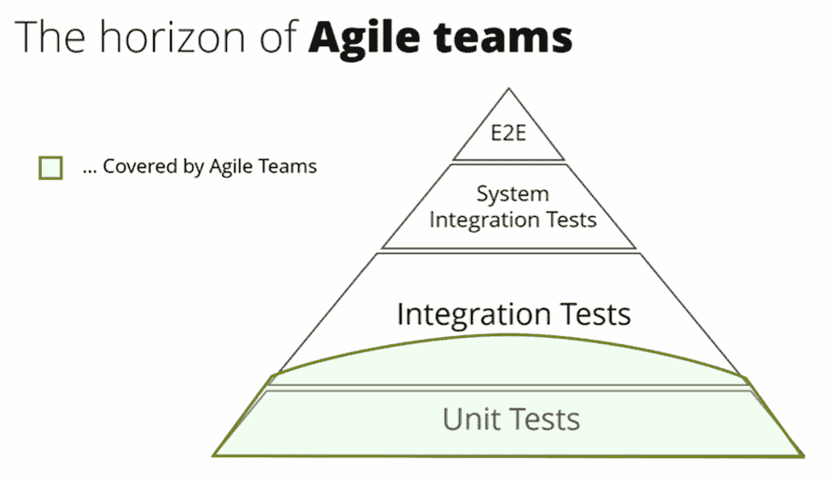

# 软件测试:2020 年代的回归者

> 原文：<https://devops.com/software-testing-the-comeback-kid-of-the-2020s/>

过去的 15 年对软件测试人员来说是艰难的。外包的兴起和衰落，敏捷从宣言到运动的成长，以及不断缩短的发布周期都带来了负面影响。到了 2011 年，艾伯特·赛唯雅在谷歌测试自动化大会(GTAC)上扮成死神走上台，宣布测试已死。从那时起，对“测试自动化”中“自动化”部分的强调刺激了对测试中软件开发工程师(SDETs)的需求，并让许多测试人员怀疑他们是否必须学习编程才能保住工作。

如果你看看人们在谷歌上搜索“软件测试”的频率，趋势似乎表明这个职业即使没有死亡，至少也是平淡无奇的。

  不过，我觉得时代在变。钟摆将会摆回来——到那时，软件测试可能会成为 21 世纪 20 年代的新生事物。听起来很疯狂，我知道。但是考虑一些可能扭转局面的发展。 

## **开发人员不想承担测试负担**

在敏捷开发团队中，政党路线是单元测试是必不可少的。这是暴露引入的实现错误的最有效方式。当您在这个级别测试时，您可以可行地覆盖每个函数/方法，另外，当一个测试失败时，您确切地知道哪个函数被破坏了。此外，拥有一套有效的单元测试建立了一个安全网，当变更破坏了先前验证的功能时，它会提醒团队。这些只是单元测试形成敏捷测试金字塔基础的几个原因。

但是，如果你在一个随意的环境中与开发者交谈，真相就会浮出水面。单元测试需要大量的工作，他们怀疑是否值得。只需浏览一下谷歌搜索“单元测试真的值得吗？”返回的 25 亿个结果中的几个来了解一些问题。

不幸的是，为了确保单元测试作为回归测试的安全网提供长期的好处，需要做看似无穷无尽的工作。开发人员致力于进展测试，而不是回归测试。尽管敏捷团队中的开发人员通常会编写单元测试来检查新的功能，但是很少有人会随着代码库的发展而更新单元测试。随着团队进入另一个冲刺阶段，这些测试变成了回归测试。然后，一点一点地，他们开始失败——但是开发者继续前进。敏捷测试金字塔底部的工作单元测试的数量减少了，测试套件曾经提供的可信度也减少了。

事实上，我们对 EMEA 各地财务指令的内部研究数据显示，随着迭代的结束，单元测试覆盖了大约 70%的新代码。经过几次代码扩展、重构和修复之后，最初的单元测试只覆盖了最初功能的 50%。经过几次迭代后，这个数字下降到 35%，通常在六个月后下降到 25%。

##   **单元测试是注定的吗？**

最终，开发人员没有时间或意愿长期保持这些测试的最新状态。20 多年来，单元测试一直是最佳实践，然而尽管出现了一波又一波的单元测试自动化工具(包括艾伯特·赛唯雅在宣布测试死亡前不久创建的一个工具)，单元测试仍然是开发人员的眼中钉。这是否意味着我们完全放弃了单元测试的好处？ 不一定。

为了承担单元测试本身，测试人员需要理解开发人员的代码以及编写他们自己的代码。那是不会发生的。但是，您可以让测试人员通过他们可以创建和控制的弹性测试来补偿丢失的单元测试覆盖率。专业测试人员认识到设计和维护测试是他们的主要工作，他们最终由测试套件的成功和有效性来评估。老实说，谁更有可能让测试保持最新，是迫于压力更快地交付更多代码的开发人员，还是因为发现主要问题而受到奖励(或因为忽略问题而受到指责)的测试人员？

另一个选择是考虑新的测试方法，为当今最流行的开发架构实现单元测试的好处——但不需要代码知识。进入微服务合同测试。

## **微服务契约测试:新单元测试**

自 2015 年以来，人们对微服务(下图中的蓝线)的兴趣一直在快速上升。事实上，它似乎是在与软件测试(红线)完全相反的道路上。

  这种崛起不足为奇。从架构的角度来看，微服务有显著的优势。对面向服务的架构(SOA)的最初尝试是在实现重用和灵活性方面向前迈出的一大步。以前在单一应用程序中实现的业务逻辑被释放出来，作为隔离的独立服务发布，这些服务是松散耦合和高度分布式的。

微服务将分离和粒度提升到新的水平。业务逻辑现在尽可能在最小、最离散的单元中实现。曾经是单个服务的功能现在分布在数十个甚至数百个微服务中，每个微服务都可以独立开发和部署。

除了实现前所未有的敏捷性和可伸缩性，这种极端的分离还为测试开辟了有希望的新选项。在最初的服务和 API 浪潮中，API 测试别无选择，只能通过一组相当广泛的业务逻辑，这可能是通过多个代码单元(例如，函数)实现的。

  如果一个 API 测试失败，没有明确的指针指向需要修复的具体代码功能。这需要单元测试和/或额外的调试。

  现在，随着每个微服务实现一个极其专注的业务逻辑单元，你确切地知道当一个 API 测试失败时什么代码被破坏了。如果你已经从一些不那么痛苦的事情中获益，为什么还要花费时间和精力在单元测试上呢？

你可能会想，“测试数百个独立发展的微服务只会带来不同的痛苦。”正确。每个集成点都是潜在的失败点，测试所有可能的集成是一场逻辑噩梦——所以不要这样做。不要测试每个微服务如何与它接触的所有其他微服务交互，而是执行契约测试。

  非常基本地，契约测试帮助微服务消费者和提供者确保他们在消息格式和数据方面满足预期。微服务消费者添加一个契约，为其与其他微服务的各种交互指定预期的请求和响应对。每个契约用于创建一个虚拟服务，然后消费者可以对其进行测试。如果消费者的更改导致不正确/不可接受的请求消息，他们将立即收到虚拟服务触发的合同失败消息。

另一方面，微服务提供商可以使用相同的消费者指定合同来确保他们自己的更改不会破坏消费者依赖的功能。如果实际的提供者响应突然不能满足消费者的期望，他们也会得到一个相当清楚的合同失败消息。

这种方法的美妙之处在于——除了消费者和提供商都不需要维护整个由相互连接和独立发展的微服务组成的蜘蛛网之外——你可以获得非常具体的单元级故障信息，而不会给开发人员带来负担。一旦测试从代码层转移到 API 层，就不需要开发人员来做了。你当然不需要开发人员来处理维护，你甚至真的不需要他们来设置测试。相反，这项任务可以委托给那些将测试——而不是开发——视为职业的人。我们称他们为测试员。

## 超越单元测试对于确保积极的用户体验至关重要

尽管如此，过度关注任何风格的单元测试都会让你对许多关键问题视而不见。 例如: 端到端交易的每一步都按预期工作了吗——从用户碰巧拥有的任何移动或浏览器界面，通过后端(可能与定制/遗留应用、打包应用、大型机、数据库、第三方服务等交互。)并反馈给用户？在需求突然增加的情况下，这些交易的表现会令人满意吗？如果用户以开发人员没有预料到的方式运行应用程序，应用程序会以合理的方式响应，或者至少优雅地失败吗？

这些问题的答案超出了典型敏捷团队所执行的测试的范围，这很少超出单元测试和一点集成测试。

  然而，当组织在数字化转型计划上投资数百万时，这并不能解决问题。最大限度地利用这一投资需要自始至终全天候的完美用户体验。专业测试人员热衷于揭露开发人员容易忽视的小故障，但这会让首席信息官畏缩不前。

我相信，如果我们致力于扩大软件测试的范围和有效性，软件测试的重要性将在 2020 年代激增，这将最终提升其商业价值。当钟摆摆回来的时候，测试人员不能期望只是等待时机。愿意抓住这十年趋势的势头——例如，加强敏捷测试金字塔的基础，接受新的实践，如微服务契约测试——将是实现转变的关键。