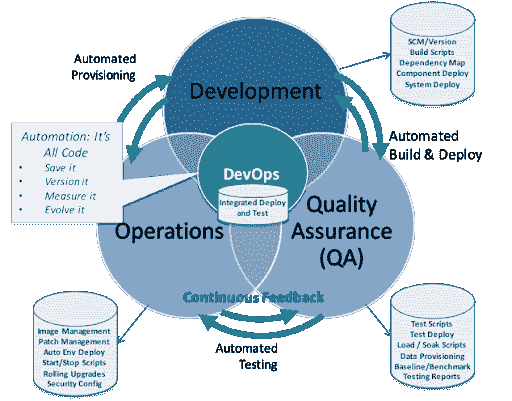

# 最大限度地利用你的 DevOps 的七个有效技巧

> 原文：<https://devops.com/seven-effective-tips-to-get-the-most-out-of-your-devops/>

最近，似乎每个公司都试图将开发运维纳入他们的软件交付周期。这可以理解。根据 [2019 加速 DevOps 状态报告](https://cloud.google.com/devops/state-of-devops/) 显示，使用 DevOps 的公司更有可能在软件开发和交付方面取得精英业绩。

像谷歌和亚马逊这样的公司一天可以部署数千次更新。这些快速更新提高了公司的业绩，并为最终用户提供了更好的软件解决方案。

在这篇文章中，我们将看看七个有效的技巧来充分利用你的 DevOps，让你获得最大的成功。在我们研究这些技巧之前，让我们先简单定义一下 DevOps。

## **什么是 DevOps？**

DevOps 是一组管理实践的术语，旨在加快系统变更的部署，同时确保高质量的交付。它融合了敏捷基础设施和敏捷开发等管理理论。埃里克·里斯(Eric Ries)的《精益创业》(The Lean Startup)是关于这个主题的最有影响力的书籍之一，它引起了硅谷许多有影响力的商业领袖的共鸣。

DevOps 的核心思想是，你应该能够快速地实现变化，这样你就可以更快地向你的客户发布一个优秀的产品。这种将优质产品快速推向市场的能力，赋予了能够获得这种优势的公司超越竞争对手的优势。

## **回顾你的组织结构**

协作是软件公司快速部署和执行变更的纽带。DevOps 的专家公司通常会减少合作的障碍。

在传统的 IT 组织中，各个部门都是孤立的。他们只在必要的时候才相互交流。因此，他们对彼此的工作了解有限。该模型呈现了开发、测试和部署的线性过程。

为了减少这些孤岛，您需要首先分析您的组织结构，并找出协作的障碍。首先要确保管理层认同你的愿景。你需要:

*   查看经理的工作描述，创建支持协作的 KPI。
*   制定薪酬方案，促进部门间更紧密的合作。

解决阻碍部门间合作的结构性问题会有所帮助。你还需要建立一个部门之间的沟通系统。

幸运的是，有一些有用的工具可以让不同业务线之间的持续协作变得更加顺畅。沟通渠道不应仅限于发送电子邮件或电话会议。请记住，DevOps 需要持续快速的协作来确保快速部署。

使用 [统一通信](https://www.ringcentral.co.uk/office/unified-communications.html) (UC)是促进公司协作的有效方式。统一通信集成了电话、电子邮件、聊天、文档共享、会议和在组织内交换信息所需的其他平台。重要的是，您还可以在一个地方访问这些信息。

## **减少部署的操作障碍**

部署更新的方式因公司而异。在部署之前，通常有一个讨论目标和一系列检查的系统。例如，部门领导会提出一个想法。它们将被开发，然后在运营部门部署之前由质量保证部门审查。

这可能是一个繁琐而耗时的过程，会降低开发速度。许多公司面临的问题是，无论是大的还是小的变更，在部署之前都需要经过相同的质量保证过程。

Source: [Tech Beacon.](https://techbeacon.com/devops/7-steps-choosing-right-devops-tools)

虽然在重大更新时实施这一流程是有意义的，但应该可以更快地推出较小的更新。要做到这一点，需要做两件事:

*   赋予员工独立决策的权力，同时让他们有机会无风险地从错误中学习。
*   通过创建用于审查更新的排名系统，减少部署的管理障碍。这将允许开发人员独立地或在最少的监督下推送小的更新。

赋予员工推动变革的能力，有助于您加快开发进度。

## **小批量计划**

小批量计划对于在组织中推广 DevOps 非常重要。使用小批量测试，测试假设、获取反馈和再次测试的周期可以在非常短的时间内完成。它快捷高效——简单。

这个反馈可能感觉很明显。也许在小批量计划时更好考虑的问题是 : 多小才算小？让敏捷开发中的 [投资](https://cloud.google.com/solutions/devops/devops-process-working-in-small-batches) 概念帮助你。

*   **独立:** 计划小批量要独立于其他部分。
*   在收到部署反馈后，每一批都应该是可重复和可协商的。
*   有价值: 每个人都应该为项目和最终用户增加价值。
*   **可估计:** 批次应包含可估计的信息，以便确定范围。
*   **小:** 小应该小到可以在几个小时到几天内处理。
*   可测试: 一个计划好的批次应该是可测试的，并且可以被连续监控。

然后，每批产品的部署、测试和监控结果应至少每天部署一次。此外，在计划小批量时，不同的部门应该保持在循环中。这将极大地有利于 DevOps 在组织中的工作。

## **创造协作空间**

即使没有 DevOps，促进部门间的协作也是必不可少的。你可以通过定期会议来使合作正式化。然而，各个部门通常位于不同的办公区域、楼层甚至不同的建筑中。想象一下，仅仅为了开会，就不得不走到设施另一侧的会议室。

这种设置是企业协作瓶颈的一个例子。协作是 DevOps 的核心，创造有利于团队合作的公司文化和办公空间至关重要。

SpaceX 是一家通过公司文化和物理空间管理在整个组织中促进协作的公司的例子。办公室是开放的，每个人都可以看到其他人在做什么。这促进了员工热情工作的动力。此外，每个人都可以访问工厂不同部分的摄像头，这激发了对其他人正在做什么的好奇心。由于这种文化，员工变得专注并对取得成果感到兴奋。

## **利用微服务**

在处理复杂的 IT 系统时，将大量的信息分成更小、更容易消化的部分会更有好处。这就是微服务的用武之地。

微服务或微服务架构是一种架构风格，其中复杂的系统被分解成较小的服务。它不是把一个系统作为一个整体来对待，而是被看作一个可管理的部分的集合。

团队作为一个整体同时处理系统的各个部分会使系统更容易崩溃。利用微服务使监控、维护和测试更加容易。它们之间也是松散连接的，这意味着固定不会对其他部分产生太大影响。此外，每个微服务都可以独立发布。

举个例子，Wix 从一个独石开始，当他们只处理 100 万个站点时，这个独石是有用的。然而，相互依赖和低质量的编码导致停机，最终对业务不利。现在他们转向使用微服务架构，他们迅速扩大规模，达到[7000 万个站点](https://techbeacon.com/app-dev-testing/best-practices-scaling-devops-microservices) 。

## **保持连续监控**

DevOps 促进快速、持续的集成和部署。快节奏的环境更容易出现问题。软件开发生命周期中的任何一点都可能失败。 持续监控帮助你快速识别错误。它确保了软件的最佳性能、可靠性和健康状态。

设定监测目标，如发展里程碑，可以改善这一过程。发展里程碑是一个总括性的范畴，它可以让你洞察团队的实际表现。监控告诉您 DevOps 实现的性能。

可以考虑的一种方法是综合监控，其中您的应用会经历模拟的客户交互。这样，在软件发布给实际用户之前，您可以监控软件的确切动作和性能。

## **实施变更管理**

DevOps 采用持续集成、持续部署和持续监控。这是一个快速变化的循环。变更管理对于保持系统正常运行至关重要。

说起来容易做起来难，因为变革会对各种利益相关者产生影响。这包括作为最终用户的您的 [客户](https://www.getcloudapp.com/blog/customer-service-use-voip) 、安全性、法规合规性和公司政策。有了这个，开发、测试、部署和监控中的变更应该被一致地管理。

变革管理本质上是反应性的。这通常是因为部署后收到的反馈。但是使用 DevOps，变更管理应该是主动的。不是管理大规模的变更，而是将流程分解成具有明确定义范围的更小的部分。此外，全面计划、调整和传达预期的变化。因此，可能的风险和问题得到了有效的管理。

## **总结**

没有完美的系统，也没有完全相同的系统。成功实施 DevOps 的关键是评估什么最适合您的组织。DevOps 不是一个标准化的过程。这不是一个适用于所有公司的系统。更确切地说，DevOps 是一种管理理论。

提高你公司的 DevOps 将涉及一个持续审查和改进的系统。你需要了解什么在起作用，存在什么问题，以及你可以改进什么。这一切都可以借助自动化和 [协作](https://www.ringcentral.co.uk/blog/ultimate-guide-how-collaborate-anywhere/) 通过持续的流程来完成。不管你的软件开发项目规模有多大，这些简单的提示和技巧将帮助你最大限度地利用你的 DevOps。

— [山姆·奥布莱恩](https://devops.com/author/sam-obrien/)