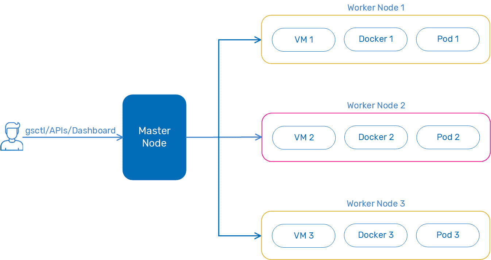

# GigaSpaces 采用 Kubernetes 的数据运营替代方案

> 原文：<https://devops.com/gigaspaces-embraces-kubernetes-alternative-for-dataops/>

GigaSpaces 在其内存计算平台中添加了一个 [DataOps](https://www.dataopsmanifesto.org/) 框架，通过使用 HashiCorp 的 Nomad 软件作为调度程序，为 Kubernetes 提供了一个替代方案。

GigaSpaces 的产品副总裁 Yoav Einav 表示，许多企业 IT 组织无法采用 Kubernetes，但他们仍然需要一种方法来采用最佳数据操作实践，以实时处理大量数据。

[该公司同名平台的 15.2 版本](https://www.gigaspaces.com/blog/unleashing-the-power-of-your-data-performance-and-dataops-at-their-best-with-gigaspaces-15-2-release/)增加了基于 ElasticGrid 的 GigaOps Stack 模块，作为 Kubernetes 的替代方案；和运营经理；gsctl 和监控工具。GigaSpaces 本身已经支持 Kubernetes，但 Einav 表示，有相当数量的 IT 团队不具备部署和管理 Kubernetes 集群所需的技能。

[DataOps](https://devops.com/how-devops-teams-can-skill-up-on-dataops/) 是 DevOps 的必然结果，它定义了一套自动配置存储系统的实践，使应用程序可以随时访问数据。Einav 指出，随着组织构建和部署注入机器学习算法的应用程序，自动化这些过程的需求变得更加迫切。

Einav 说，ElasticGrid 旨在提供一个更具声明性的替代方案来实现这一目标，而不必学习如何以编程方式启动 Kubernetes 集群。他补充说，这种方法使普通 IT 管理员更容易使用 ElasticGrid。

除了能够支持虚拟机和容器，Einav 表示 ElasticGrid 比 Kubernetes 快大约 20%。

GigaSpaces 最新版本中添加的其他功能包括一个流迭代器优化工具，可将读取密集型工作负载的吞吐量提高两倍，并支持内存级加密和每属性压缩，以更好地遵守数据隐私法规。

GigaSpaces 正在打造一个内存计算平台，该平台经过优化，可以近乎实时地运行应用程序。随着企业采用广泛的数字业务应用程序，针对批处理模式处理应用程序而优化的传统 IT 基础架构需要更新，以支持需要处理内存中数据的应用程序，从而支持近乎实时处理数据的应用程序。

目前还不清楚在新冠肺炎疫情带来的经济衰退期间，组织将在多大程度上投资于新平台。毫无疑问，一些组织将撤回这些投资。然而，许多组织也在加快构建数字业务应用程序的速度，以推动新制定的业务连续性战略。由于认识到客户和供应商需要能够从任何地方访问的更具弹性的应用程序，许多组织在疫情之后都在加快交付这些应用程序的最后期限。

当然，在部署内存计算平台来支持这些应用程序时，有多种选择。然而，许多组织将面临的挑战是找到一个内存计算平台，该平台还能解决与按需将大量数据移入和移出平台相关的固有挑战。