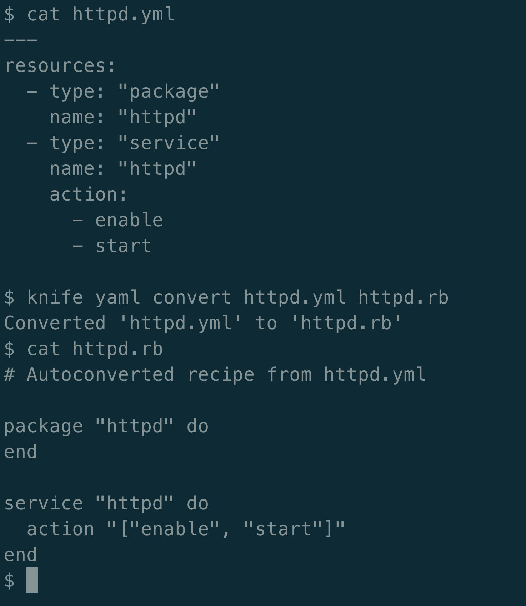

# Chef 更新以代码形式管理 IT 基础架构的工具

> 原文：<https://devops.com/chef-updates-tool-for-managing-it-infrastructure-as-code/>

Chef 今天更新了用于自动化 IT 基础架构管理的工具,作为进一步消除依赖通常无法扩展的手动流程的努力的一部分。

Chef 的产品副总裁 John Wyss 表示，Chef Infra 16 增加了一个统一的模式，提供了一种更简化的执行策略的方法，并增加了对 YAML 的支持，这意味着 IT 团队现在可以雇用 Chef 来自动化基础架构的管理，而不必编写代码。

此外，Chef 使得更新使用 Chef 构建的 cookbooks 的传统实例变得更加容易，并且增加了对 Arm 处理器的支持。

随着新冠肺炎疫情带来的经济衰退，人们对 IT 基础设施管理自动化的兴趣预计会大大增加。许多 IT 团队的规模可能会大幅缩减。剩下的 IT 员工将需要比以往更大程度地自动化 IT 管理。这些基础设施中的大部分可能很快也会驻留在公共云中，而不是本地 IT 环境中。

当然，Chef 并不是自动化 IT 基础设施管理的唯一途径。然而，精通 Chef 的 IT 专业人员通常能够创建自动化更广泛任务的工作流。

作为使用代码管理基础设施的早期先驱，Chef 一直致力于使用 Ruby 编程语言来简化 it 基础设施的大规模管理。虽然 Chef 的采用在很大程度上仅限于能够掌握 Ruby 的 IT 专业人员，但 Wyss 指出，随着组织寻找拥有管理任务所需技能的 IT 专业人员，对掌握 Chef 的个人的需求将会更高，否则这些任务将需要更多的员工。

It 专业人员会在多大程度上进一步接受 IT 自动化框架还有待观察。许多人开发了自己的脚本来自动完成任务。IT 组织遇到的挑战是，这些脚本通常缺乏文档记录，并且通常无法扩展。自动化框架提供了一种以易于重复的方式持续管理大规模 IT 基础设施的方法。

与此同时，关于 IT 组织内部谁将自动化基础架构管理的争论仍在继续。一些 IT 组织希望开发人员负责整个堆栈，作为减少人员的一部分，而其他组织出于各种原因更喜欢让开发人员将所有精力集中在编写应用程序代码上。无论是谁实现了基础架构管理的自动化，几乎每个人都同意的一点是，传统的 IT 基础架构管理流程通常涉及许多枯燥乏味的任务，这种方式已经不再适用。

Wyss 指出，事实上，对 IT 自动化的日益依赖可能会加快最佳开发运维实践的采用，因为自动化底层基础架构管理所需的框架可能已经由 IT 运营团队部署到位。否则，DevOps 团队本身必须在其他 IT 运营人员的帮助下或不帮助的情况下，将这些 IT 自动化框架部署到位，这是许多 DevOps 团队认为没有的当前状况。