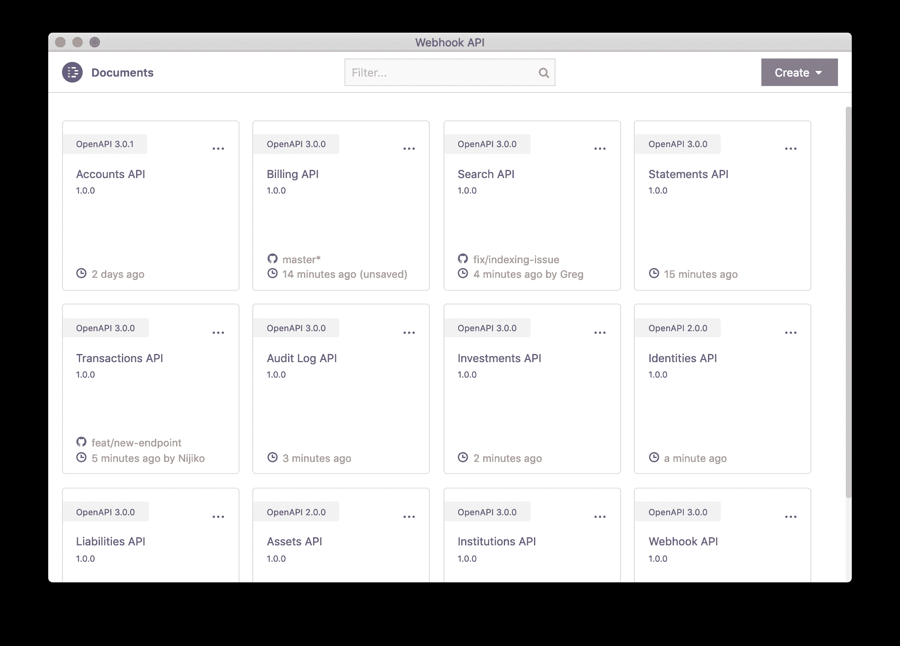

# 孔将协作引入 API 设计

> 原文：<https://devops.com/kong-brings-collaboration-to-designing-apis/>

Kong 已经发布了一个用于设计应用编程接口的开源工具，该工具旨在使开发团队更容易协作编辑可以存储在 Git 存储库中的 API 规范。

基于该公司去年通过收购 Floating Keyboard Software Inc .获得的开源失眠 API 管理平台，用于设计 API 的失眠设计器工具与失眠 API 管理平台中嵌入的测试功能进行了本机集成，使协作设计 REST 和 GraphQL 服务变得更加容易。

作为这项工作的一部分，Kong 还发布了插件，使团队能够自动将 Kong 网关策略直接嵌入到 Git 存储库中的 API 规范文件中。

Kong 失眠问题技术负责人 Greg Schier 表示，他们的目标是通过让团队共享使用最佳 GitOps 流程编辑 API 规范的更新来简化设计 API 的工作流程。

例如，DevOps 团队现在可以搜索 API 设计来发现细节，如 Git 状态和 Git 分支。他们还可以在单独的 API 规范文件中为 Kubernetes 和 Kubernetes 的 Kong 自动生成配置。开发人员还可以选择 Kong 插件，这些插件提供诸如认证或速率限制之类的功能来管理他们的 API 行为。

随着组织采用基于微服务的应用，设计、构建、部署和维护 API 的需求变得越来越重要。应用程序中的每个微服务都公开自己的 API。采用微服务的组织很快发现他们可能需要构建数千个 API。Kong 并没有将这些 API 作为一个独立的项目来处理，而是构建了一套工作流，使其更容易在更大的 DevOps 流程的上下文中设计和构建 API。

Schier 说，目标应该是最终使 API 测试成为嵌入在持续集成/持续交付(CI/CD)平台中的单元测试过程的自然延伸。

在太多的组织中，API 的设计和构建仍然是事后的想法。构建微服务自然有很多关注点，但是一旦构建好了，就不会再关注 API 了。然而，尽管微服务经常被替换，但 API 却保持不变。组成应用程序的微服务之间的所有依赖关系都是可管理的，因为使用了 API 来连接它们。Kong 并没有在微服务构建完成后再构建 API，而是坚持按照最佳 DevOps 实践来设计和构建 API。

在新冠肺炎疫情之后，很难说组织会以什么样的速度构建和部署新的应用程序。可以肯定的是，大部分新应用将基于云原生微服务，使它们更加灵活和有弹性。这样，当下一次重大危机爆发时，组织将能够更敏捷地响应快速变化的业务条件，因为企业架构现在围绕着 API。