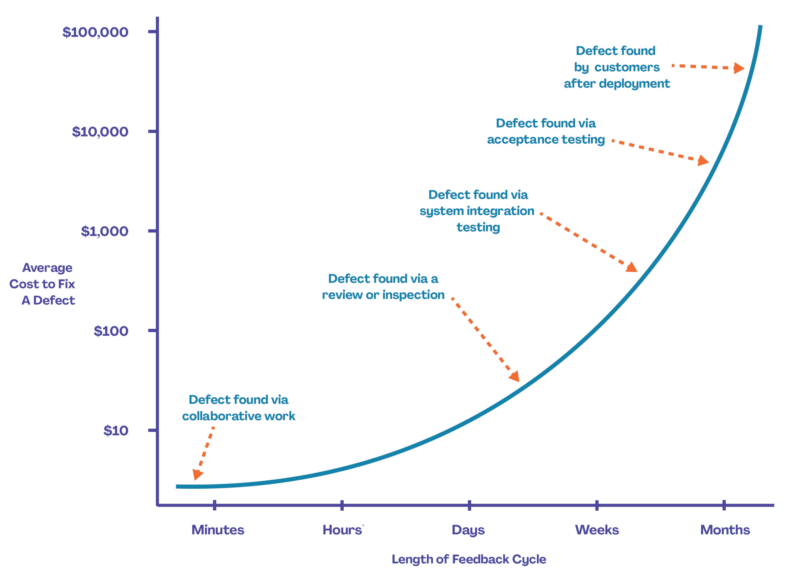

# 与管理层就技术债务进行沟通

> 原文：<https://devops.com/communicating-with-management-about-technical-debt/>

我们都熟悉技术债务的挑战。虽然这通常是不可避免的——由于时间限制、资源考虑或仅仅是缺乏好的信息——但它仍然压在我们的心头，让我们处于守势。这使得未来的改变更加困难。随着它的积累，它会产生一种挥之不去的未付账单的感觉，那是累积的利息，即将到期。

但是，也许技术债务最具挑战性的方面就是:让高级商业领袖理解它是什么，并说服他们对此采取行动。

有很多原因导致我们没有通过。管理层经常面临交付成果的巨大压力，没有耐心讨论任何对具体成果没有直接贡献的事情。资源可能有限。比起偿还技术债务的更长期但幕后的好处，更喜欢短期的满足——比如开发一个新的面向客户的应用——这是人类的天性。

如果我们诚实的话，我们也要为我们缺乏进步承担一些责任。我们需要更好地定义和解释为什么技术债务对商业领袖很重要。但是，我们如何做到这一点？

这里有五种方法向关键决策者解释和强调解决技术债务的重要性。

## **放下技术话题**

当讨论技术债务时，很容易依赖于商店谈话，即，用 it 术语解释技术债务。从商业角度来看，这是一场必须进行的战斗。幸运的是，技术债务和金融债务之间有许多相似之处，这是商业领袖所熟悉的。

所有健康的企业账面上都有金融债务，领导人知道债务必须保持在一定的限度内，以保持健康的资产负债表。事实上，他们非常清楚背负过多债务的后果。这不仅会危及公司的信用评级——使未来的借款成本更高——还会累积利息，并可能迫使公司缩减某些对股东很重要的行动，如派息或回购股票。这就是为什么当债务水平上升到一定程度时，大多数公司都会咬紧牙关，齐心协力偿还债务，然后开始另一个业务建设周期。

## **概述背负过多技术债务的潜在业务影响**

技术债务必须保持在一定的限度内，以避免损害业务。未支付的技术债务会产生利息，利息会随着时间的推移而增加，并增加解决问题的成本。背负过多的技术债务会导致负面的业务(相对于 IT)后果，包括:

*   由于系统停机导致销售损失和/或生产力降低。
*   由于用户体验越来越差而失去竞争优势。
*   无法适应市场变化。
*   因违反安全而被罚款。
*   不一致或不及时的数据导致的糟糕决策。

## **找到富有创意和视觉效果的方式来讲述故事**

有几种不同的方法可以将技术债务联系起来——从使用日常类比，如日常家庭保养的重要性，到预防性维护的好处，如经典的 Fram 滤油器“现在付钱或以后付钱”[广告](https://www.youtube.com/watch?v=OHug0AIhVoQ.)。你也可以利用像下面这样引人注目的视觉效果来戏剧化你的论点。

Source: [Projectmanagement.com](https://www.projectmanagement.com/articles/308195/An-Introduction-to-the-Cost-of-Change-and-Technical-Debt)

## **冲洗并重复**

在向企业领导人说明解决技术债务的必要性时，采取宣传活动的方式很重要。像广告商一样思考，他们根据影响范围和频率来衡量他们的影响——他们接触了多少人，这些人接触了他们的信息多少次。当你没有进行广告活动时，你需要准备好让你的案例随着时间的推移而发生，并且接触到决策者和影响决策者的人。一封电子邮件或一次管理层演示不会让你的信息被理解。

## **创建健康的 IT 资产负债表**

技术债务是不可避免的，并且在某些情况下，具有合理的商业意义，例如，当上市速度至关重要时，当资源有限或信息不完整时。如果技术债务达到一定水平，为了偿还债务，放弃即时满足的项目(开发闪亮的新应用程序)是很有商业意义的。

这就是为什么以企业领导人理解的方式(例如，通过金融债务的视角)构建技术债务可以使企业领导人更倾向于认识到管理技术债务的重要性，就像他们认识到企业面临的其他风险一样。

当然，负责任的 IT 领导者不仅仅会发现需要管理层关注的表面问题，他们还会提供潜在的解决方案。例如，支付技术债务的融资策略，包括正在进行的工作和大大小小的改进项目。

通过将技术债务视为一项业务而不是一个技术问题，技术官员有更好的机会突破管理层，偿还那些烦人的旧债，并最终使其 IT 资产负债表恢复正常。