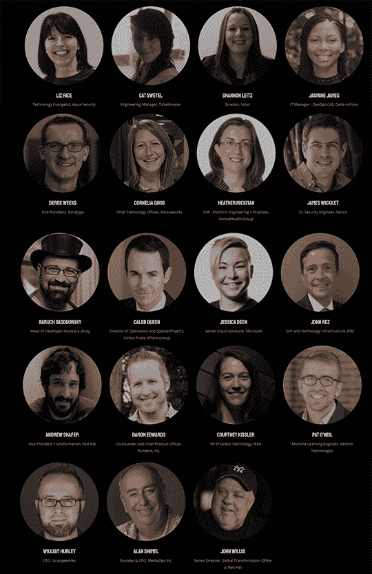

# TechStrong Con: 12 小时，6 月 4 日

> 原文：<https://devops.com/techstrong-con-12-hours-strong-june-4/>

在我之前的文章中，我提到作为我们新冠肺炎回应的一部分，MediaOps 已经推出了每日视频流 [TechStrong TV](http://techstrong.tv) 。此外，我们将在 6 月 4 日举办迄今为止最大的虚拟活动 [TechStrong Con](http://techstrongcon.com) ，持续 12 个小时。我们希望 TechStrong Con 成为我们迄今为止最大、最好的虚拟活动。我们想表明，虽然我们可能在家工作，抗击这种可怕的病毒，应对经济动荡，但科技行业并没有屈服。我们合作，我们交流。我们开发，我们部署。我们很强大，#techstrong。

我知道你在想什么:嗯，另一个虚拟事件，joy。正是我们需要的。是的，我同意你的观点——似乎每个人和他们的母亲都在举办虚拟活动，或者至少把他们正在做的事情称为虚拟活动。但是真的，这个不一样。原因如下:

1.  演讲者阵容非同一般。约翰·威利斯亲自挑选了主厅礼堂的演讲者。阵容还没有最终确定，但已经包括了一个惊人的组合:  说真的，这是一个重磅的演讲者阵容。此外，将有多个礼堂以及主舞台，都有很棒的扬声器。虚拟活动的优势之一是，如果两个精彩的演讲同时进行，你不必错过一个演讲者。这些会议将在给定的时间进行直播，并且可以点播。
2.  活动本身将内置聊天室。许多演讲者将在会议结束后在聊天室现场回答问题或与与会者聊天。
3.  该活动将持续 12 个小时，充满各种技术学习、社交机会和逃避坏消息的机会。
4.  求职公告板将提供给公司招聘和寻找工作的人。
5.  部分赞助收入(可免费参加)将捐赠给新冠肺炎相关慈善机构。

整个活动将在我们最先进的虚拟环境中进行，在过去的 24 个月中，我们一直在稳步改进这一环境。这真的是一个你不想错过的事件。此外，如果你有兴趣赞助或演讲，请在 [【电子邮件保护】](/cdn-cgi/l/email-protection#b6d3d2dfc2d9c4f6d2d3c0d9c6c598d5d9db) 给我写信。

保持健康。保持坚强。