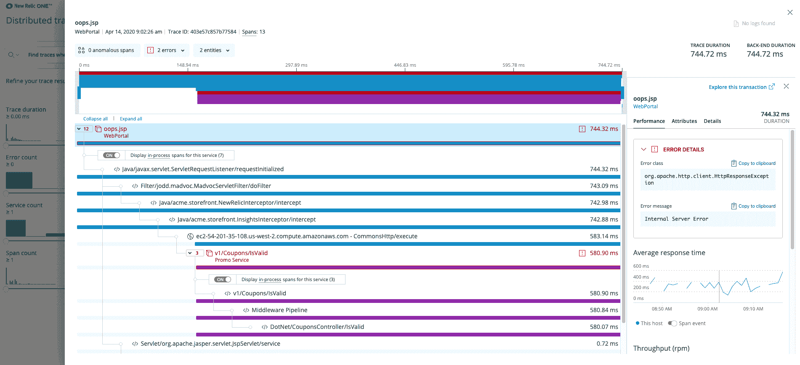

# 新遗迹使分布式追踪民主化

> 原文：<https://devops.com/new-relic-moves-to-democratize-distributed-tracing/>

New Relic 推出了一项服务，该服务利用云资源使基于分布式跟踪的分析更易于开发运维团队使用。

New Relic 无服务器和新兴云服务总经理 Andrew Tunall 表示，[New Relic Edge with Infinite Tracing](https://www.businesswire.com/news/home/20200505005368/en/New-Relic-Introduces-New-Distributed-Tracing-Solution)服务通过完全由 New Relic 管理的软件即服务(SaaS)应用程序提供访问，使分布式跟踪分析的访问民主化。Tunall 表示，新的 Relic Edge with Infinite Tracing 服务提供长达八天的可观测性分析，而不是必须建立一个平台来分析分布式轨迹。

Tunall 说，该服务可以观察分布式系统中的所有应用程序跟踪，从而更容易识别可操作的问题。分布式系统发射的遥测数据量很容易涉及每分钟数千万甚至数亿个跨度。通过将分布式跟踪数据保存在公共云上，New Relic 还将从云中流出的数据量降至最低，他指出，鉴于云服务提供商对将数据移出其平台收取的费用，这有助于大幅降低潜在的云计算成本。

Tunall 说，采用分布式跟踪比依赖采样更加可行，因为现代应用程序的工具化程度更高。DevOps 团队已经意识到，在 DevOps 最佳实践的[背景下，访问遥测数据是实现可观测性的任何努力的核心。挑战在于，设置工具以实现可观测性目标需要相当于现场可靠性工程师的专业知识。](https://devops.com/new-relic-doubles-down-on-devops/)

他说，相比之下，新的 Relic Edge with Infinite Tracing service 为 DevOps 团队的任何成员提供了更容易访问基于分布式跟踪的可观测性工具。这种方法意味着，在许多情况下，开发人员和 IT 运营团队成员将首次能够使用一套通用的工具，至少能够发现应用程序问题的根本原因。事实上，这种工具的存在可能对促进最佳 DevOps 实践的采用大有帮助。

现在还不清楚分布式跟踪的兴起会在多大程度上影响使用采样来监控 It 平台。在大多数情况下，依靠采样来识别潜在的问题，而分布式跟踪提供了一种方法来深入到任何问题的根本原因都很容易识别的点。然而，随着用于捕获应用程序指标的开源代理变得越来越普遍，并且分布式跟踪的成本持续下降，对传统采样技术的依赖可能会下降。然而，在这个阶段，许多组织还没有完全意识到能够完全观察应用程序和简单地监视它之间的区别，所以在分布式跟踪被广泛应用之前可能还需要一段时间。

与此同时，在应用程序变得越来越复杂的时候，幸运的是，管理它们所需的工具变得越来越容易获得。