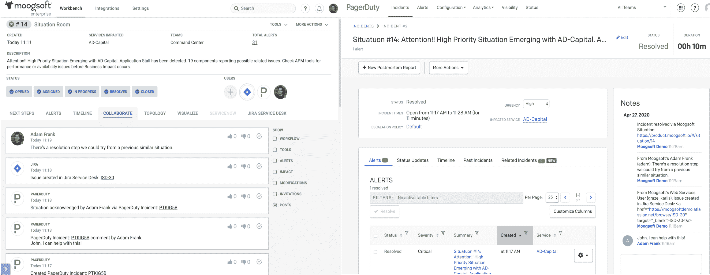

# moonsoft 扩大 aiops 平台的覆盖范围

> 原文：<https://devops.com/moogsoft-expands-reach-of-aiops-platform/>

Moogsoft 本周更新了其 AIOps 平台，使 IT 组织能够构建一个虚拟网络运营中心(NOC ),从事件管理和 DevOps 平台获取数据，用于远程 IT 管理。

Moogsoft 产品和设计副总裁亚当·弗兰克(Adam Frank)表示，Moogsoft Enterprise 的[8.0 版本使 IT 团队能够聚集来自多个平台的警报，使机器学习算法能够识别需要立即关注的高优先级问题。](https://www.businesswire.com/news/home/20200428005338/en/Moogsoft-Expands-AIOps-Platform-Deliver-Customers-“Virtual)

他说，Moogsoft 通过降噪分析来更好地确定警报的优先顺序，从而实现了这一目标，然后通过自动化拓扑可视化工具浮出水面，从而更容易确定任何问题的根本原因。

moog soft Enterprise 8.0 版本增加了与 Amazon Web Services (AWS) Firelens 服务的集成，以接收 EC2 日志文件、[page duty 事件管理平台](https://www.moogsoft.com/pressroom/pagerduty-integration)和 Atlassian 的 Opsgenie 事件管理平台。

Moogsoft 还改进了其用户界面并增强了其工作流引擎(WE ),以简化从各种 IT 管理平台聚合数据的过程。

甚至在新冠肺炎疫情开始之前，IT 组织就已经开始采用机器学习算法和其他形式的 AIOps 来帮助管理日益复杂的 IT 环境。在疫情之后，Frank 说很明显 it 团队将更加依赖 AIOps 平台。Frank 指出，许多组织根本无力维持当前的 IT 团队规模。与此同时，采用人工智能来管理 IT 的阻力可能会下降，因为 IT 人员根本没有时间像今天这样手动执行大量机械任务。

与此同时，关于 AIOps 的争论持续升温。IT 管理平台的现有提供商声称，他们已经收集了相关数据，因此对已经存在的数据应用算法是有意义的。Moogsoft 等 AIOps 平台的提供商认为，为了让人工智能在大规模上有效，机器学习算法需要应用于目前驻留在多个 IT 平台上的数据。因此，将机器学习算法应用于已经聚集在单个存储库中的数据更有意义。

当然，机器学习算法将很快在整个 IT 领域得到广泛应用。IT 团队需要做出的决定是，哪个平台最终将作为管理企业 IT 的主要控制点。

虽然在新冠肺炎疫情之后，一些 IT 组织可能会试图推迟这一决定，但 Frank 指出，疫情也强调了对日益需要远程访问的 IT 管理平台进行现代化的需求。传统的 IT 管理平台通常假设 IT 人员将在现场工作。Moogsoft 旨在使组织能够采用虚拟 NOC，从任何地方都可以更方便地访问。

在接下来的几周和几个月里，It 管理将如何发展，还有待观察。有一件事是肯定的，那就是它的管理方式再也不会和以前一样了。