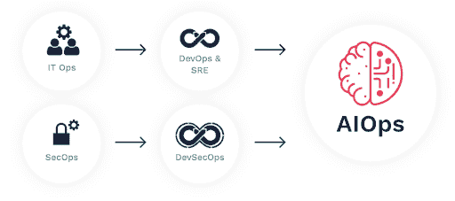
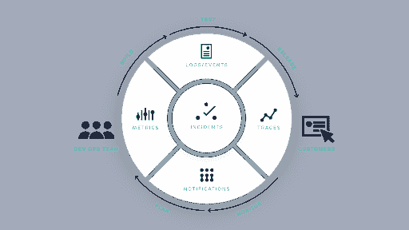

# DevOps 和 AIOps:一起更好

> 原文：<https://devops.com/devops-and-aiops-better-together/>

DevOps 是对人类技术的一次尝试，但 AIOps 是最终的答案。

在当今世界，如此多的基本业务任务已经数字化，IT 团队必须应对不断的变化，同时确保零停机。

具有讽刺意味的是，尽管 IT 变得对业务至关重要，但构建和支持客户体验的人员的生产力和敏捷性却直线下降。这对企业造成了严重的后果。当你的应用和服务出现故障时，你会失去客户，收入也会下降。当 IT 团队主要关注解决紧急情况时，敏捷性受到影响，创新萎缩。为了发展、竞争和繁荣，您需要无缝运营。

从历史上看，IT 团队是随着技术一起成长的，从大型机开始，一直到分布式计算。但是，虚拟计算的出现带来了一个微服务和短暂逻辑的世界。现在，公司只是产生了太多的数据，人类无法通过手动和传统工具来监控和理解。

这为人工智能主导的运营发展打开了闸门，被称为 IT 运营人工智能(AIOps)。通过简化和自动化 IT 监控，AIOps 帮助 IT 运营团队重新获得对 IT 环境的控制，快速检测和修复问题，并防止停机。

## **DevOps:回到未来？**

然而，最近技术运营发生了转变，再次尝试将技术应用于人类。DevOps 运动将他们服务的所有权、支持和成功放在了编写代码的开发人员身上。这分散了主要在很少的上下文和不清楚的升级路径下操作的技术操作团队，创建了几个更小的 DevOps 工程师团队。

DevOps 团队齐心协力，各自开发自己的微服务，努力实现公司期望的客户体验和业务目标。根据运营模式，DevOps 团队中还可能有一个专门的现场可靠性工程(SRE)团队或个人，其主要 SRE 角色是监控可观测性数据以发现潜在问题。在这个场景中，sre 将他们发现的见解反馈到开发周期中，以纠正和加强 DevOps 团队服务的可靠性和可伸缩性。

但是，由于事件是实时发生的，SREs 和 DevOps 团队面临的挑战仍然是获得对其应用程序、基础架构以及最终业务服务的洞察和认识。要了解事故发生在哪里，以及它们对服务和客户有什么影响，有必要从噪音中发现重要事件，了解警报之间的关系，并获得参与正确团队和人员所需的背景。

这又带来了另一个挑战:在事件对业务造成影响之前，让合适的人来响应和解决事件。每个 DevOps 团队都有自己的职责和工具。通常，DevOps 团队除了通过他们的 API 之外不进行交流。当发生需要来自多个地理位置分散的团队的多人立即关注的事件时，考虑到他们有复杂和不同的待命时间表和上报流程，您如何联系他们并让他们合作？

随着公司继续以客户体验为中心和数字优先的理念进行转型，他们意识到这些挑战的严重性、监控数据的规模及其对业务的负面影响。转变其业务的一部分是转变其技术运营:进入 AIOps，让阳光照耀 DevOps 流程，实现可管理、高效和盈利的未来。

## 【AIOps 给 DevOps 团队带来了什么

AIOps 提供独特的解决方案来应对运营挑战，并涵盖您的服务保障战略和业务的方方面面。  

底线:你需要解放人们，让他们专注于任务关键型任务，让他们能够为更好的客户体验构建更好的服务——而不是为了操作它而将他们与技术一起扩展。

AIOps 允许您通过集成您多年来投资的工具和基础设施以及添加 AIOps(智能)的关键层来进行扩展。通过将获得专利的人工智能和机器学习算法应用于您的可观察性和监控数据，AIOps 可以学习您环境的正常行为，并相应地生成警报。这必须在边缘完成，靠近数字服务产生大量数据的地方。

根据本地和环境产生的异常情况，AIOps 会将所有来源的重要警报浮出水面并关联成可操作的上下文洞察。一个真正全面的 AIOps 解决方案还可以确定根本原因和影响，并根据之前的解决步骤和反馈提出潜在的解决方案。这一切都发生在虚拟工作空间中，团队成员可以在这里协作、可视化并提供反馈。

AIOps 通知并授权适当的人采取适当的行动。它简化并理解复杂的团队结构、参与方式、随叫随到计划和上报途径，确保合适的人员参与并协作，即使他们位于全球各地。

当情况或事件浮出水面时，会实时发送给用户。基于从底层数据和应用的机器学习中得出的见解，AIOps 知道需要采取行动的确切团队和人员，以及需要通知的人。这些用户拥有响应所需的环境，共享一致的视图，并在事件的整个生命周期中保持同步。一旦事件得到解决，简化的事后分析将通过使用类似事件和预测性分析来发现重复性和未来的问题，从而加快未来的响应。

## **AIOps:有效开发的关键要素**

DevOps 团队在当今和未来的世界中开发技术的唯一途径是利用人工智能。它将人们解放出来，专注于创造和改善客户体验，从而为您的企业带来最大利润。