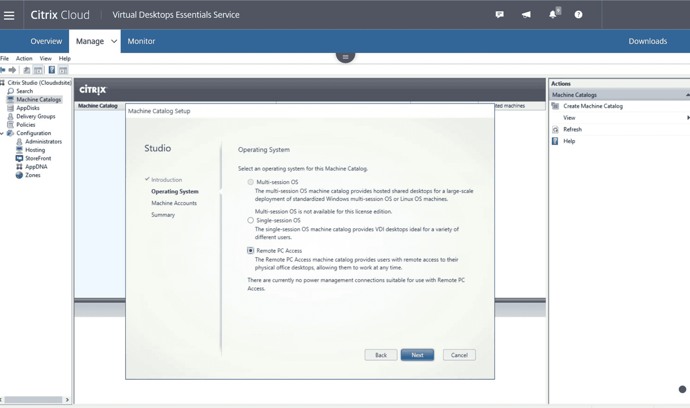

# Citrix 为 VPN 替代方案提供了理由

> 原文：<https://devops.com/citrix-makes-case-for-vpn-alternative/>

Citrix 本周宣布，它将通过云更广泛地提供其远程访问工具，使用户能够有效地访问他们的桌面 PC[。](https://www.businesswire.com/news/home/20200506005193/en/Citrix-Expands-Remote-PC-Access-Offerings)

Citrix 高级项目经理 Gabe Carrejo 表示，远程 PC 访问为虚拟专用网络(VPN)提供了一种更高效的替代方案，目前大多数组织都依赖虚拟专用网络来支持员工远程访问他们的桌面。

要使用远程 PC 访问，IT 管理员需要在远程系统上安装一个小型客户端。客户端提供对一系列网络服务的访问，Citrix 在其独立计算架构(ICA)远程协议的基础上提供这些服务，以创建安全套接字层(SSL)隧道，Citrix 将其统称为高清体验(HDX)技术。

Carrejo 说，为了使远程访问台式机变得更加容易，Remote PC Access 安装了代理软件，it 团队现在可以将这些软件推送到一个端点，只要他们拥有几项 Citrix 服务中的任何一项的许可。在大多数情况下，IT 团队会采用 Microsoft System Center 等平台在终端上部署代理软件。

为了帮助抗击新冠肺炎疫情病毒，许多组织几乎在一夜之间就为员工提供了远程访问，他们转而使用 VPN 产品为少量员工提供远程访问。然而，由于几乎每个员工都试图访问同一个 VPN，许多 IT 团队都遇到了网络带宽问题。此外，办公室中安装的许多桌面应用程序对 VPN 增加的延迟并不特别容忍。

Citrix 一直认为 ICA 是提供远程桌面访问的更有效的协议。现在，作为对新冠肺炎疫情的回应，该公司正在让 it 团队更容易地将 HDX 代理软件分布到 IT 组织需要支持的尽可能多的远程终端上。最终用户可以通过任何兼容 HTML5 的浏览器或 Citrix 提供的虚拟桌面软件远程访问他们办公室桌面上的应用程序。

Carrejo 说，越来越多的组织正在重新评估他们对 VPN 的依赖，因为很明显，曾经被视为业务中断的事情已经成为“新常态”许多组织正在密切关注当他们的工作角色可能不需要时，他们需要多少员工进入办公室。远程计算现在是更大的业务连续性战略的核心要素。因此，Carrejo 表示，许多组织正在寻求一种方法来提供对基于办公室的桌面系统的更高效的远程访问，同时考虑向部署在本地数据中心或云中的虚拟桌面基础架构(VDI)平台进行过渡。

现在说 Windows 桌面将在多大程度上迁移到 VDI 平台还为时过早。然而，与此同时，IT 团队所依赖的远程访问协议突然变得更加重要。