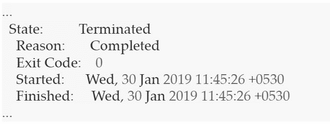
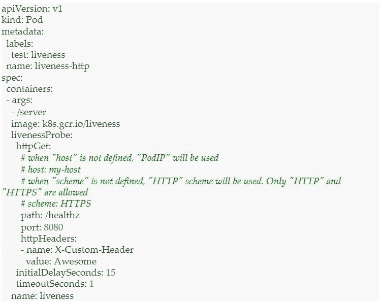
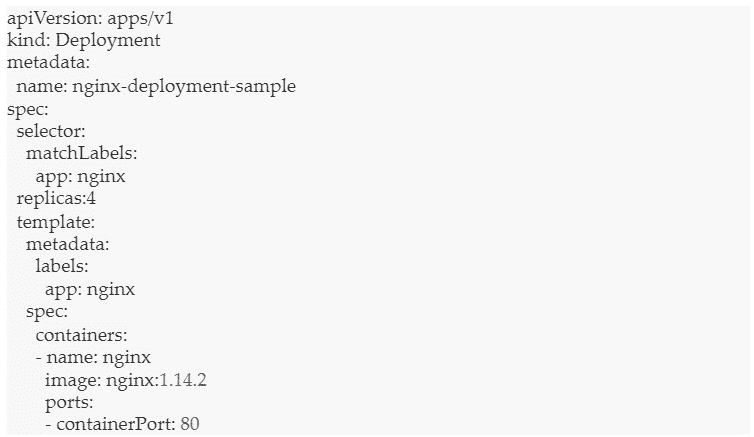
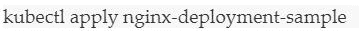
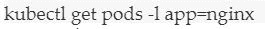
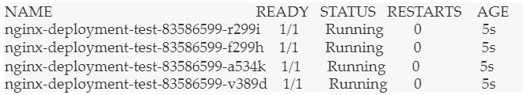
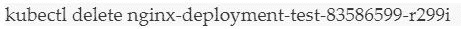
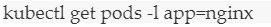
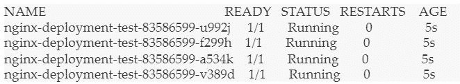

# 解码自我修复的库伯内特

> 原文：<https://devops.com/decoding-the-self-healing-kubernetes/>

一个无法全天候运行的 业务应用在市场上被认为是低效的。其理念是应用程序不间断地运行，不管是技术故障、功能更新还是自然灾害。在当今的异构环境中，基础架构错综复杂地分层，通过自我修复，应用程序的连续工作流是可能的。

Kubernetes 是一个容器编排工具，它通过对机器进行物理抽象来促进应用程序的平稳运行。此外，Kubernetes 中的豆荚和容器可以自愈。

在《复仇者联盟》这部电影中，美国队长让布鲁斯·班纳发怒，这样他就可以变成绿巨人。布鲁斯回答:“那是我的秘密队长。我总是很生气。”你一定理解这里的类比。我们来简化一下: 每当系统受到影响，Kubernetes 就会有机地自愈。

Kubernetes 的自我修复特性确保集群始终以最佳状态运行。[Kubernetes](https://kubernetes.io/)可以有效自检两类对象 — podstatus 和 container status。Kubernetes 的编排功能可以根据需要的配置监控和替换不正常的容器。同样，Kubernetes 可以固定 pod，这是包含单个或多个容器的最小单元。

## **三种容器状态包括**

1.  **等待** :已创建但未运行。处于等待阶段的容器仍将运行诸如提取图像或应用秘密等操作。要检查等待 pod 状态，请使用以下命令: 
    除了该状态，还会显示关于该状态的消息和原因，以提供更多信息。
    
2.  **正在运行的容器:** 正在运行而没有问题的容器。在吊舱进入运行状态前执行以下命令: 
    运行吊舱将显示集装箱入口的时间。
    
3.  **终止容器:** 执行失败或完成的容器。在 pod 移动到终止前执行以下命令: 
    终止的 pod 将显示集装箱入口的时间。
    

## **Kubernetes 的自我修复概念——Pod 的阶段、探测和重启策略**

Kubernetes 中的 pod 阶段提供了对 pod 位置的洞察。我们可以拥有:

*   待定窗格–已创建但未运行。
*   运行容器–运行所有容器。
*   Succeeded Pods–成功完成集装箱生命周期。
*   失败的容器–至少一个容器失败，所有容器终止。
*   未知豆荚。

Kubernetes 对 pod 执行活性和就绪性探测，以检查它们是否按照期望的状态运行。活性探测器将检查容器的运行状态。如果容器探测失败，Kubernetes 将终止它，并根据重启策略创建一个新的容器。准备就绪探测器将检查容器的服务请求服务能力。如果一个容器探测失败，那么 Kubernetes 将删除相关 pod 的 IP 地址。

活性探针示例:

探头包括:

*   执行动作——在容器中执行命令。
*   对容器的 IP 地址进行 TCP 检查。
*   对容器的 IP 地址执行 HTTP Get 检查。

每个探针给出三个结果之一:

*   成功:容器通过了诊断。
*   失败:容器诊断失败。
*   未知:诊断失败，因此不应采取任何措施。

## **自我修复 Kubernetes 的演示描述**

我们需要设置代码复制来触发 Kubernetes 的自愈能力。

让我们看一个 Nginx 文件的例子:

在上面的代码中，我们看到集群中的 pod 总数必须是 4。

接下来，我们来部署文件。

让我们使用:列出 pod

下面是输出:

正如您在上面看到的，我们已经创建了四个 pod。

现在，让我们删除其中一个 pod。

pod 现已删除。我们得到以下输出:

我们再来列举一下豆荚。

我们得到以下输出:

尽管删除了一个，我们又有了四个 pod。Kubernetes 已经自我修复，创建了一个新的节点，并保持计数为 4。

## **结论**

Kubernetes 可以自我修复应用程序和容器，但是当节点停机时如何自我修复呢？为了让 Kubernetes 继续自我修复，它需要一套专用的基础设施，可以随时访问自我修复节点。基础架构必须由自动化驱动，并由预测性分析提供支持，以预先抢占和修复问题。底线是，在任何给定的时间点，基础设施节点都应该保持 不间断服务 所需的数量。