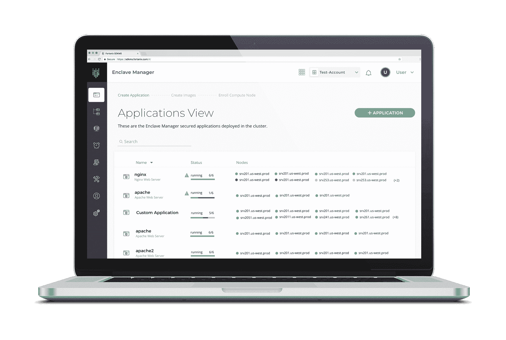

# Fortanix 增加平台来管理 Azure 上的机密计算

> 原文：<https://devops.com/fortanix-adds-platform-to-manage-confidential-computing-on-azure/>

Fortanix 今天宣布，用于管理微软 Azure cloud 上的机密计算实例的[软件即服务(SaaS)平台现已正式推出。](https://www.businesswire.com/news/home/20200518005097/en/Fortanix-Enclave-Manager-Enables-Apps-Run-Secure)

机密计算是一种在内存中运行时加密数据的新兴方法。如今，加密仅适用于静态数据。机密计算使得在内存中建立处理加密数据的安全区域成为可能，这已成为 it 环境中漏洞的一个越来越令人担忧的来源。

Fortanix 首席产品和战略官 Faiyaz Shahpurwala 表示，Confidential Computing Enclave Manager 为 IT 团队提供了一个 SaaS 平台，使他们能够供应机密计算环境，验证这些环境的完整性，并管理安全飞地的应用生命周期。在安全区域上运行的应用程序是使用 Docker 容器和映像构建的。

Fortanix 与阿里巴巴、Arm、百度、谷歌云、华为、英特尔、微软、红帽、瑞士电信和 VMware 一道，是 Linux 基金会的一个分支“机密计算联盟”的成员。机密计算联盟项目包括英特尔的软件保护扩展(SGX)软件开发套件(SDK ),这是一个开源的 Open Enclave 框架，允许开发人员使用单个 enclaving 抽象构建可信执行环境(TEE)应用，以及 Enarx，这是一个为使用 TEE 保护应用提供硬件独立性的项目。

本月早些时候，微软推出了一款 DCsv2 系列虚拟机(VM ),可以访问基于 SGX 的 TEE。就 Fortanix 而言，它已经在 Azure 上提供了 Fortanix 自我保护密钥管理服务。

Shahpurwala 说，随着时间的推移，大多数应用程序将利用可信计算环境。他说，大多数初始用例将专注于数据隐私和保护个人身份信息(PII)至关重要的应用。

与此同时，云服务提供商正在竞相为构建和部署 TEE 应用提供可用的平台。尚不清楚这些环境将在多大程度上与 DevOps 平台集成。机密计算飞地管理器提供了一个管理框架，从这个框架开始这一过程。机密计算飞地管理器还提供工具来转换应用程序，使它们能够在 SGX 上运行。

总有一天，保密计算会让安全性成为任何开发运维流程的核心要素。因此，随着安全性成为一系列以编程方式调用的基础设施功能，需要一种不同的 DevSecOps 方法的想法可能会逐渐消失。随着这种方法的成熟，应用程序安全性将同时发展成为任何质量保证过程的自然延伸。

当然，保密计算的普及可能还需要一段时间。并不是每个 IT 团队都转而使用容器来构建应用程序。然而，考虑到目前对数据隐私法规的关注，it 环境中保护数据的要求显然变得日益严格。现在的挑战是找到一种方法，在整个应用程序生命周期管理过程中解决这些问题，同时不降低应用程序的构建和部署速度。