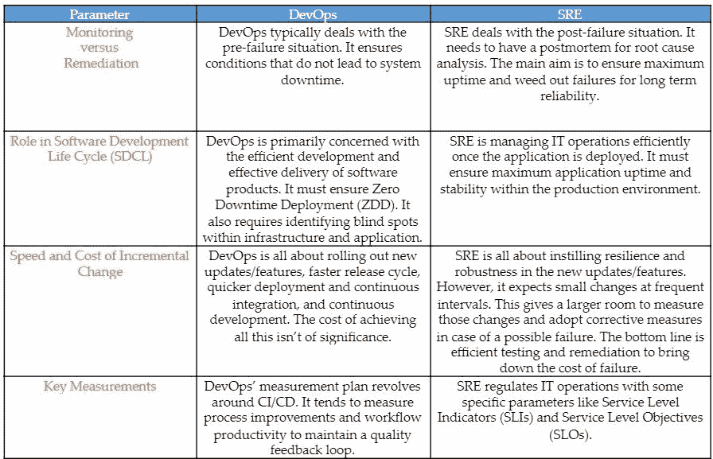
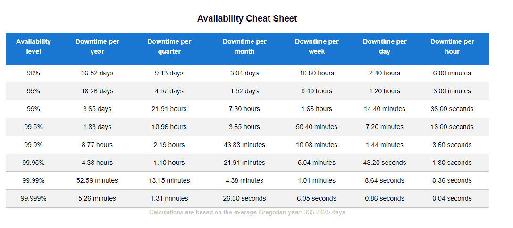
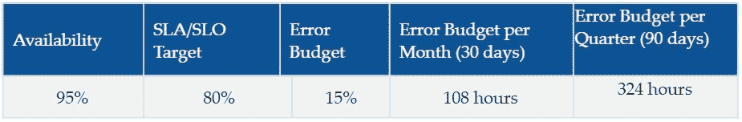
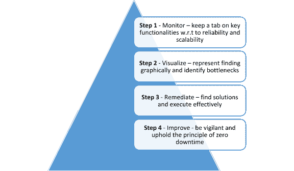

# 站点可靠性工程 101: DevOps 对 SRE

> 原文：<https://devops.com/site-reliability-engineering-101-devops-versus-sre/>

考虑以下场景。

一家独立软件提供商(ISV)为一家全球投资公司开发了一款金融应用程序，该公司为全球企业集团、领先的中央银行、资产管理公司、经纪公司和政府机构提供服务。该应用程序的开发策略包含了一个贯穿 DevOps 计划的思想，其中包含了尖端的敏捷工具。这确保了在最大生产效率下的零停机部署。该应用程序现在可以实时处理大规模的金融交易，同时保护敏感的客户数据并促进不间断的工作流程。不幸的一天，应用程序崩溃了，这家投资公司遭到了客户的强烈反对(金钱上和道德上的)。

背景故事是这样的:应用程序的工作流交换已经超出了其事务阈值限制，并且缺乏响应性的补救措施削弱了基础架构。DevOps 带来的智能自动化主要局限于开发和部署环境。因此，IT 运营仍然容易受到挑战。

## **解耦 DevOps 和 run ops——现场可靠性工程的起源(SRE)**

十几二十年前，公司都是以传统的 IT 思维方式运营的。IT 运营主要由没有自动化的管理工作组成。那时，代码编写、应用程序测试和部署都是手工完成的。大约在 2008 年到 2010 年，自动化开始变得突出。现在，在敏捷软件运动的支持下，开发人员和运营团队同时致力于持续集成和持续部署。生产团队主要负责运行时环境。但是，他们缺乏管理 IT 运营的技能，这导致了应用程序的不稳定性，如上面的场景所示。

因此，DevOps 和 RunOps 被分离，为 SRE 铺平了道路，这是一种为 IT 运营注入稳定性的预防性技术。

## **软件优先的方法:SRE 的脑干**

谷歌工程副总裁本杰明·特雷诺·斯洛斯说:“当你让一个软件工程师设计一个运营团队时，就会发生 SRE 现象。”。

这意味着 SRE 功能是由编码的 IT 运营专家运行的。这些工程师实施了软件优先的方法来自动化 IT 运营和预防故障。他们应用先进的软件实践将 dev 和 Oops 集成在一个平台上，并在连续的环境中执行测试代码。因此，他们拥有高级软件技能，包括 DNS 配置、修复服务器、网络和基础设施问题，以及修复应用程序故障。

软件方法整理了 IT 运营的各个方面，以在基础设施和应用程序中构建弹性。因此，变更通过版本控制工具进行管理，并利用测试框架检查问题，同时遵循可观察性原则。

## **误差预算的原理**

SRE 的工程师要求开发团队通过自动化测试结果来提供证据，以此来验证应用程序中代码质量的变化。SRE 管理人员可以确定服务级别目标(SLO)来衡量应用程序变化的性能。他们应该为允许的最小应用程序停机时间设置一个阈值，也称为错误预算。如果应用程序任何更改期间的停机时间在误差预算范围内，那么 SRE 团队可以批准。如果不是，那么应该回滚这些更改，以便在误差预算公式范围内进行改进。

**计算误差预算**

计算误差预算的简单公式是:(系统可用性百分比)减去(SLO 基准百分比)。请参考下面的 [系统可用性计算器](https://availability.sre.xyz/) 备忘单。

  假设系统可用性为 95%，您的 SLO 阈值为 80%。

**误差预算**:95%–80% = 15%

**误差预算/月** : 108 小时。(按 5%停机时间计算，每天停机时间为 1.2 小时。因此，对于 15%，它是 1.2 x 3 = 3.6。所以，30 天就是 30 x 3.6 = 108 小时)。

**误差预算/季度** : 108*3 = 324 小时。

小知识:打破单一应用程序让我们在粒度级别上获得 SLO。

## **文化转变:迈向可靠性和可扩展性的正确一步**

流行的 SRE 参与模式，如厨房水槽(又名 SRE 一切)、基础设施团队和嵌入式 SRE，往往会建立专门的团队，导致“筒仓”SRE 环境。筒仓环境的问题在于它提倡放手的方法，这导致团队之间缺乏标准化和协调。因此，明智的做法是搁置面向项目的思维模式，让 SRE 在整个组织内有机地成长。它首先评估客户原则团队，并灌输一种数据驱动的方法来确保应用程序的可靠性和可伸缩性。

组织必须确定一个变革代理人，他将创造和促进最大系统可用性的文化。代理可以通过实践可观察性原则来支持这种变化，其中监控是一个子集。可观察性本质上要求工程团队对阻碍应用程序可靠性和可伸缩性的常见和复杂问题保持警惕。参见下面的可观察性原理。

可观察性的原则遵循循环方法，这确保了应用程序的最大正常运行时间。

**第 0 步:释放可观察金字塔的潜能**

零步骤是让员工了解端到端的产品细节——技术和功能。除非操作专家知道观察什么，否则观察金字塔中的后续步骤都是徒劳的。

另外，记住这种文化转变不是一夜之间就能实现的。经过几个月的真诚练习，它将会成功。

## **德沃普斯对 SRE**

人们经常把 SRE 和德沃普斯搞混。SRE 和 DevOps 是互补的实践，它们提高了软件开发过程的质量并维护了应用程序的稳定性。

让我们分析一下 DevOps 和 SRE 之间的四个关键的根本区别。

## **结论——SRE 团队作为价值中心**

软件产品应该能够提供不间断的服务。理想和最佳状态是 24/7 服务可用性的最大正常运行时间。这需要无与伦比的可靠性和超可扩展性。

因此，正确的思维方式是将 SRE 团队视为一个价值中心，它结合了面向客户的技能和敏锐的技术洞察力。最后，SRE 要取得成功，就必须创建 SLI 驱动的 SLO，增强云基础架构的能力，实现团队间的顺畅协调，并在 it 运营中推动自动化和人工智能。