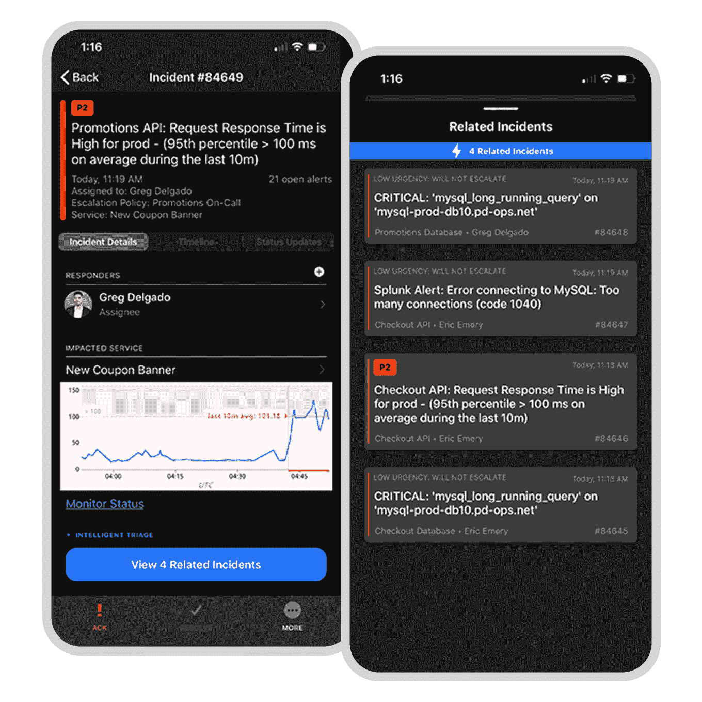

# PagerDuty 希望简化 IT 事件管理

> 原文：<https://devops.com/pagerduty-looks-to-streamline-it-incident-management/>

在组织寻求大幅降低 IT 总成本之际，PagerDuty】在其事件管理工具组合中增加了更多自动化和分析功能。

PagerDuty 产品高级副总裁 Jonathan Rende 表示，智能分流[的全面发布通过消除大量手动任务，提高了可应用于事件管理的 AIOps](https://devops.com/pagerduty-focuses-incident-response-efforts-on-the-cloud/) 的水平。

智能分类汇总来自超过 375 个监控、观察和标签工具的信号，然后根据关系进行分组，并根据对业务的影响进行提升。Rende 说，这种水平的上下文数据使 it 团队有可能提高生产率，同时大大减少警报疲劳。

与此同时，除了对 Slack 的现有支持之外，PagerDuty 还增加了对与微软团队集成的支持。他指出，IT 团队越来越依赖这些协作工具来处理最终用户的帮助请求。

在某些情况下，IT 团队通过这些媒体或使用嵌入在 PagerDuty 事件管理平台中的内置工具来相互沟通。Rende 说，无论是哪种情况，跨 IT 团队的工作流现在都是近乎实时的。

最后，PagerDuty 增加了一个动态服务目录，为 DevOps 团队提供了一个中央知识库，可识别每项服务的所有者和专家及其相关操作手册，此外还提供了一个移动状态仪表板，允许远程团队在发生事故时更有效地协作。Rende 说，在许多 IT 人员继续在家工作以对抗新冠肺炎疫情病毒的时候，这种能力尤其重要。

一般来说，IT 组织希望尽可能自动化事件响应，以最大限度地降低成本和潜在的中断。企业比以往任何时候都更加依赖 IT 服务。然而，随着越来越多的应用程序被部署，IT 环境变得越来越糟糕。随着组织在经济不确定性普遍存在的时期限制员工数量，甚至寻求裁员，辨别哪些警报源于同一根本原因问题变得更加重要。

当然，不管经济状况如何，大多数 IT 专业人员都不愿意将时间浪费在不会给企业增加很多价值的手动任务上。大多数 IT 专业人员需要腾出更多时间来实现更紧迫的目标。每花一分钟去追踪一个最终成为又一次徒劳无功的警报，只会增加更多的压力。

在过去的几年里，自动化和 AIOps 的发展一直在稳步前进。采用这些新功能来管理事件的情况充其量也只是参差不齐。随着疫情带来的经济衰退，现在更大的问题是 it 组织将多快利用这些能力来简化 IT 管理。毕竟，许多 IT 经理会得出结论，让一个好的危机白白浪费是没有意义的。